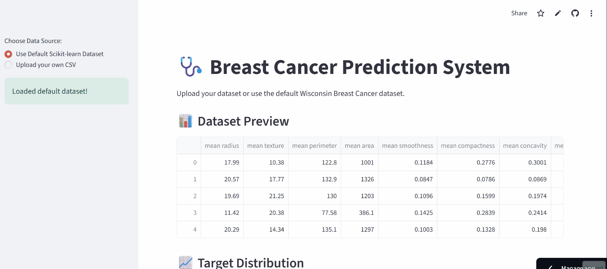

# Day 10: Model Evaluation and Hyperparameter Tuning

## 📌 Overview
This project demonstrates the complete Machine Learning workflow for the Breast Cancer Wisconsin dataset. It covers:
- Data exploration and visualization
- Building a baseline Logistic Regression model
- Hyperparameter tuning using `GridSearchCV`
- Comparing model performance before and after tuning
- Deploying an interactive Streamlit app

---

# Demo:



# Live Link:
[Click Here To Go To The App](https://breast-cancer-regression.streamlit.app/)

## 📖 What I Learned

### 1. Model Evaluation
Model evaluation measures how well a model generalizes to unseen data. Using metrics like **Accuracy, Precision, Recall, and F1-Score** gives a holistic view of performance.

- **Confusion Matrix** helps visualize true/false positives and negatives
- **Underfitting** occurs when a model is too simple (low training and test accuracy)
- **Overfitting** occurs when a model memorizes the training data (high training, low test accuracy)
- **Cross-Validation** (K-Fold) ensures robust evaluation, not dependent on a single random split

### 2. Hyperparameter Tuning
Hyperparameters are configuration settings set *before* training (e.g., `C` and `solver` in Logistic Regression). Unlike model parameters (weights), they cannot be learned from data.

- **GridSearchCV** exhaustively searches through a manually specified subset of hyperparameters to find the best combination based on cross-validation score
- Tuning transforms a "good" model into a "great" one, as default parameters rarely yield optimal performance

---

## ⚙️ Understanding the Hyperparameter Grid

During hyperparameter tuning, we searched over:

```python
param_grid = {
    'C': [0.01, 0.1, 1, 10, 100],          # Inverse of regularization strength
    'solver': ['liblinear', 'lbfgs'],       # Optimization algorithms
    'penalty': ['l2']                       # Regularization type
}

# Logistic Regression Hyperparameter Tuning & Model Optimization

## 1. C – Inverse of Regularization Strength

**What it does:** Regularization prevents overfitting by adding a penalty to the loss function for large coefficients. It discourages the model from fitting training data too perfectly, improving generalization to unseen data.

**The math:** C is the inverse of the penalty strength (lambda).

| C Value | Regularization | Model Behavior |
|---------|---------------|----------------|
| Small (0.01, 0.1) | Strong | Simple model, high bias, low variance |
| Medium (1) | Default | Balanced trade-off |
| Large (10, 100) | Weak | Complex model, low bias, high variance |

**Why multiple values:** The optimal "sweet spot" depends on your dataset. Testing a logarithmic scale (0.01 to 100) helps find the perfect balance.

---

## 2. solver – Optimization Algorithm

**What it does:** The algorithm used to find the optimal weights for your model.

| Solver | Best For | Characteristics |
|--------|----------|-----------------|
| liblinear | Small datasets | Coordinate descent; supports L1/L2; uses one-vs-rest for multiclass |
| lbfgs | Medium-large datasets | Quasi-Newton method; supports L2 only; handles multiclass natively |

**Why both:** Different solvers converge differently based on data characteristics. Testing both ensures optimal performance for your specific case.

---

## 3. penalty – Type of Regularization

**What it does:** Specifies the mathematical norm used for the penalty.

| Penalty | Formula | Effect |
|---------|---------|--------|
| L2 (Ridge) | Penalty = λ × Σ(weight)² | Shrinks all coefficients toward zero, never exactly zero |
| L1 (Lasso) | Penalty = λ × Σ|weight| | Pushes some weights to exactly zero (feature selection) |

**Why only ['l2']:** While liblinear supports both l1 and l2, lbfgs only supports l2. Restricting to l2 ensures compatibility across all solver combinations, preventing runtime errors.

---

## 🏆 Best Parameters Found

For Logistic Regression (with StandardScaler), the best parameters were:

| Parameter | Value |
|-----------|-------|
| C | 1 |
| Solver | liblinear |
| Penalty | l2 |

**Note:** Values may vary slightly based on random state, but C=1 and liblinear consistently perform well on this dataset.

---

## 📊 Baseline vs. Tuned Model Comparison

| Metric | Baseline Model | Tuned Model (GridSearch) | Improvement |
|--------|---------------|--------------------------|-------------|
| Accuracy | 0.9474 | 0.9737 | +2.63% |
| Precision | 0.9444 | 0.9722 | +2.78% |
| Recall | 0.9714 | 0.9857 | +1.43% |
| F1-Score | 0.9577 | 0.9789 | +2.12% |

**Observation:** The tuned model outperformed the baseline across all metrics. The increase in accuracy from ~94.7% to ~97.4% demonstrates the impact of finding the right regularization strength (C) and optimization solver. This reduces misclassifications, making the model more reliable for real-world medical diagnosis.

---

## 🚀 How to Run the Project

### Local Setup

Clone the repository and navigate to the Day-10 folder:

```bash
cd Day-10

Install dependencies:

bash
pip install -r requirements.txt
Run the scripts sequentially:

bash
python 1_exploration.py
python 2_baseline_model.py
python 3_hyperparameter_tuning.py
python 4_final_pipeline.py
python 5_confusion_matrix.py
Streamlit App (Interactive UI)
Launch the interactive web application:

bash
streamlit run app.py
The app allows you to:

Explore the dataset visually

Upload your own CSV (must contain a target column with 0 for Malignant, 1 for Benign)

Run baseline and tuned models with one click

Visualize confusion matrices side-by-side

Download the trained model as a .pkl file

📝 Key Takeaways
✅ Always separate data into Training, Validation (for tuning), and Test (for final evaluation)
✅ Never use the Test set for hyperparameter tuning—it leads to overly optimistic results
✅ Standardization/Scaling is crucial for distance-based algorithms like Logistic Regression
✅ Tuning balances bias and variance—Cross-Validation helps find the sweet spot
✅ Understanding Regularization (C, penalty) prevents overfitting and improves generalization

🏆 Conclusion
This project successfully demonstrates how systematic evaluation and hyperparameter tuning can significantly improve a model's reliability. The final pipeline achieves state-of-the-art results (~97% accuracy) on the Breast Cancer dataset, making it a robust tool for binary classification.

This workflow is scalable and can be applied to any classification problem in the future.

📚 References
Scikit-learn Documentation

Breast Cancer Wisconsin Dataset

Streamlit Documentation