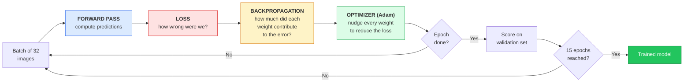
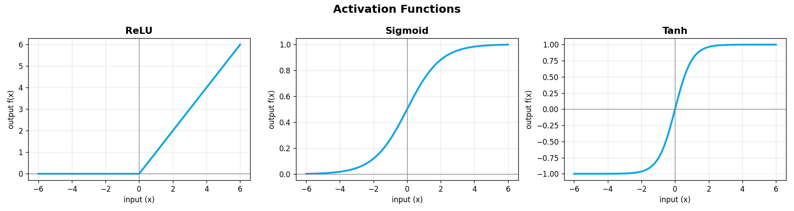
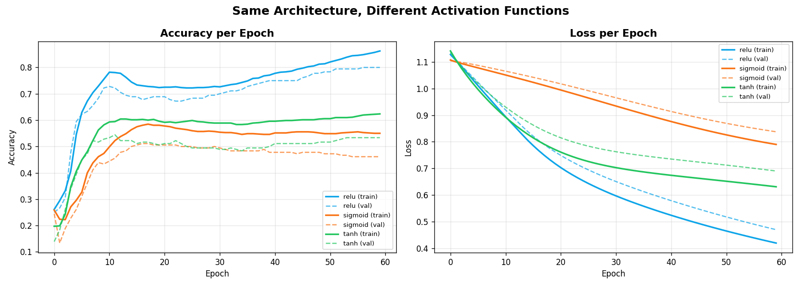
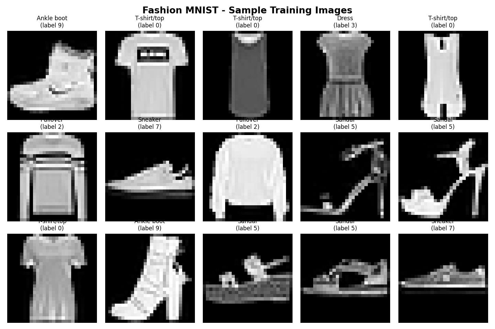
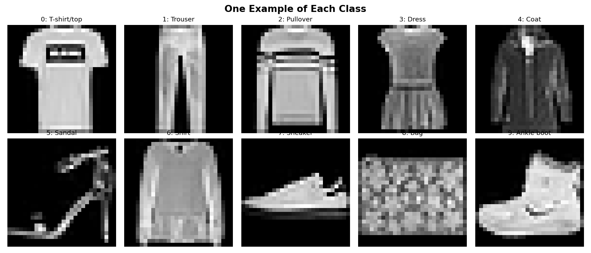
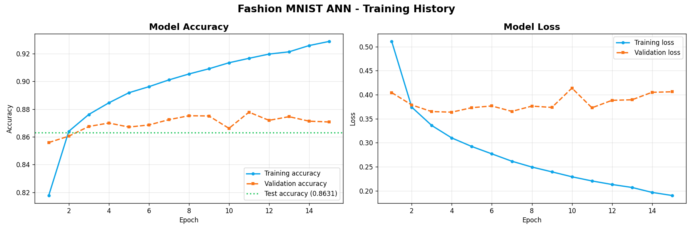
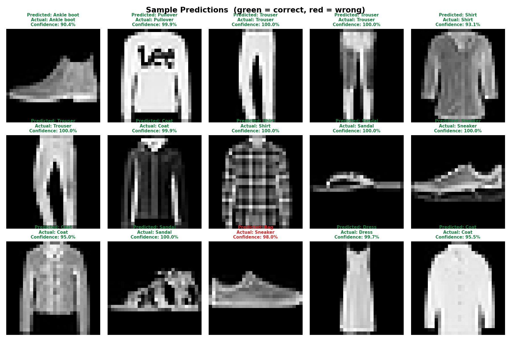
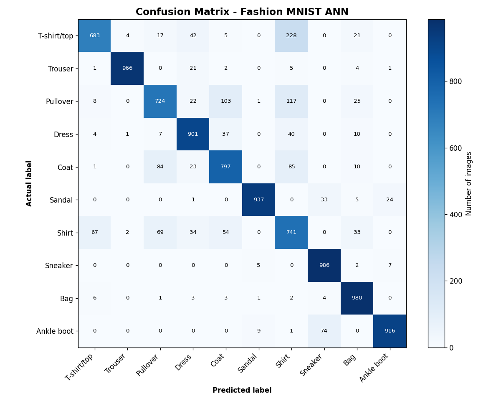
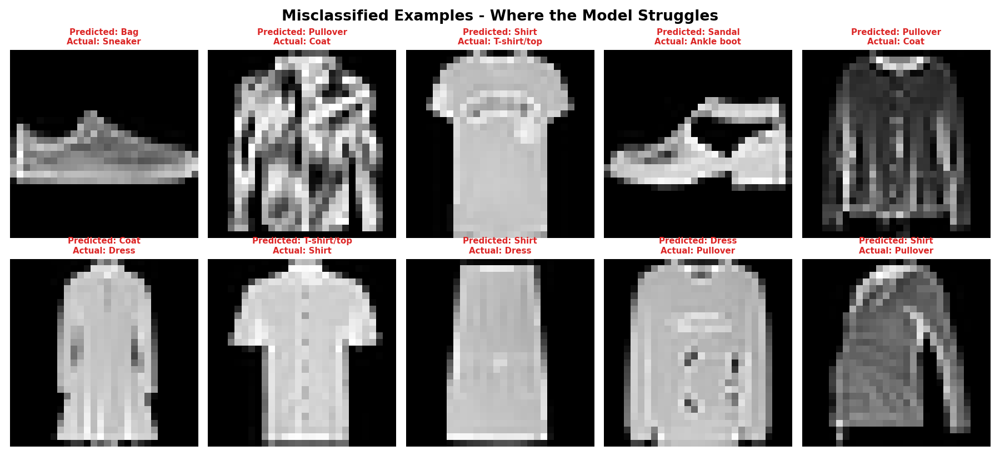

# Day 12 — Deep Learning Fundamentals & Your First Artificial Neural Network

## 📋 Overview

This project is the entry point into **Deep Learning**. It covers installing and verifying TensorFlow, building a neural network layer by layer, understanding what every number in `model.summary()` actually means, experimenting with activation functions, and finally training a real **Artificial Neural Network (ANN)** to classify clothing images from the **Fashion MNIST** dataset.

Everything here was built from scratch with **TensorFlow 2.21.0 / Keras 3.15.1** and runs on CPU in under two minutes.

---

## 🎯 Objectives

- Install and verify TensorFlow/Keras on a fresh machine
- Build a neural network with one input, one hidden and one output layer
- Read and explain `model.summary()` line by line, including the parameter maths
- Compare ReLU, Sigmoid and Tanh activation functions experimentally
- Load and explore a built-in TensorFlow dataset
- Normalize image data and understand *why* it matters
- Train, evaluate and interpret an ANN on Fashion MNIST
- Plot accuracy/loss curves and diagnose overfitting from their shape
- Make predictions and inspect where the model fails

---

## 🔄 Project Workflow

```mermaid
flowchart TD
    A([START]) --> B["<b>Practice 1</b><br/>pip install tensorflow"]
    B --> C{Import<br/>succeeds?}
    C -- No --> B
    C -- Yes --> D["Verify: version, devices,<br/>tensor math, gradients"]

    D --> E["<b>Practice 2</b><br/>Build Input → Hidden → Output"]
    E --> F["model.summary()<br/>explain every parameter"]

    F --> G["<b>Practice 3</b><br/>Swap activation function"]
    G --> H["ReLU / Sigmoid / Tanh"]
    H --> I{Structure<br/>changed?}
    I -- "No — same 67 params" --> J["Train all three<br/>to compare LEARNING"]

    J --> K([MINI PROJECT])

    K --> L["<b>1. LOAD</b><br/>fashion_mnist.load_data()<br/>60,000 train + 10,000 test"]
    L --> M["<b>2. EXPLORE</b><br/>shapes, class balance,<br/>sample images"]
    M --> N["<b>3. NORMALIZE</b><br/>pixels ÷ 255 → 0.0-1.0"]

    N --> O["<b>4. BUILD ANN</b><br/>Flatten 784<br/>Dense 128 ReLU<br/>Dense 64 ReLU<br/>Dense 10 Softmax"]
    O --> P["<b>compile</b><br/>Adam + sparse categorical<br/>crossentropy"]

    P --> Q["<b>5. TRAIN</b><br/>15 epochs, batch 32<br/>validation_split 0.2"]

    Q --> R["forward pass → loss →<br/>backprop → update weights"]
    R --> S{More<br/>epochs?}
    S -- Yes --> R
    S -- No --> T["<b>6. EVALUATE</b><br/>on 10,000 unseen<br/>test images"]

    T --> U["<b>7. PLOT</b><br/>accuracy &amp; loss curves"]
    U --> V["<b>8. PREDICT</b><br/>10 probabilities per image<br/>argmax → class"]
    V --> W["<b>9. DIAGNOSE</b><br/>per-class accuracy<br/>+ confusion matrix"]
    W --> X["<b>10. SAVE</b><br/>.keras model<br/>+ results summary"]
    X --> Y([DONE — 86.31% test accuracy])

    style A fill:#0ea5e9,stroke:#0369a1,color:#fff
    style K fill:#8b5cf6,stroke:#6d28d9,color:#fff
    style Y fill:#22c55e,stroke:#15803d,color:#fff
    style C fill:#fef3c7,stroke:#d97706
    style I fill:#fef3c7,stroke:#d97706
    style S fill:#fef3c7,stroke:#d97706
```



### The training loop, in detail



---

## 📚 Theoretical Background

### What is Deep Learning?

**Deep Learning** is a subset of Machine Learning that uses **artificial neural networks with many layers** ("deep" = many layers stacked) to learn patterns directly from raw data.

The defining idea is **automatic feature learning**. In traditional Machine Learning, a human decides which features matter — "measure the petal length, count the corners, compute the colour histogram" — and the algorithm learns from those hand-picked features. In Deep Learning you hand the network raw pixels and it *discovers* the useful features itself, layer by layer:

```
Layer 1  →  learns edges and simple gradients
Layer 2  →  combines edges into corners, curves, textures
Layer 3  →  combines those into shapes: sleeves, collars, soles
Layer 4  →  combines shapes into whole objects: "this is a sneaker"
```

Nobody programmed "a sneaker has a sole." The network worked it out from 60,000 examples.

**Key characteristics:**

| Characteristic | Detail |
|---|---|
| Feature engineering | Automatic — learned from data |
| Data appetite | Large. Thousands to millions of samples |
| Compute appetite | High. GPUs/TPUs for anything serious |
| Interpretability | Low. Hard to explain *why* a prediction was made |
| Best at | Images, audio, video, text, unstructured data |

**Where it's used:** image recognition, speech-to-text, machine translation, ChatGPT and other LLMs, self-driving cars, medical imaging, recommendation engines, protein folding.

---

### Difference between Machine Learning and Deep Learning

Deep Learning **is** Machine Learning — it's a subset, not a rival:

```
Artificial Intelligence
 └── Machine Learning
      └── Deep Learning
```

| Aspect | Machine Learning | Deep Learning |
|---|---|---|
| **Feature extraction** | Manual — a human engineers the features | Automatic — the network learns them |
| **Data required** | Works well on hundreds–thousands of rows | Usually needs tens of thousands+ |
| **Training time** | Seconds to minutes | Minutes to weeks |
| **Hardware** | CPU is usually fine | GPU/TPU strongly preferred |
| **Data type** | Shines on structured/tabular data | Shines on images, audio, text |
| **Interpretability** | High — you can inspect a decision tree | Low — a "black box" of millions of weights |
| **Performance ceiling** | Plateaus as data grows | Keeps improving with more data |
| **Typical algorithms** | Linear/Logistic Regression, SVM, Random Forest, K-Means | ANN, CNN, RNN, LSTM, Transformer |
| **Problem size** | Small to medium | Medium to very large |

**The practical rule:** for a spreadsheet of 5,000 rows predicting customer churn, use Random Forest — it'll be faster, more accurate and explainable. For 60,000 photos, use Deep Learning. Choosing Deep Learning for a small tabular problem is a common beginner mistake.

**Concretely, on this project:** a classical ML approach to Fashion MNIST would mean hand-writing features — edge counts, aspect ratio, dark-pixel ratio — then feeding those to an SVM. Our ANN skips all of that and reads the 784 raw pixels directly.

---

### What is a Perceptron?

The **Perceptron** is the single artificial neuron — the atom that every neural network is built from. Frank Rosenblatt invented it in 1958, modelled loosely on a biological neuron.

**What it does:** takes several numbers in, produces one number out.

```
   x1 ──w1──┐
   x2 ──w2──┤
   x3 ──w3──┼──►  Σ (weighted sum) ──► + bias ──► activation ──► output
   x4 ──w4──┘
```

**The maths:**

```
Step 1 — Weighted sum:     z = (w₁x₁ + w₂x₂ + ... + wₙxₙ) + b
Step 2 — Activation:       output = f(z)
```

Where:
- **x** = inputs (the data)
- **w** = weights — *learned*. How much each input matters.
- **b** = bias — *learned*. Shifts the threshold, letting the neuron fire even when all inputs are 0.
- **f** = activation function — introduces non-linearity

**A worked example.** Should I go outside? Inputs: is it sunny (1/0), is it warm (1/0), do I have free time (1/0).

```
weights = [0.6, 0.3, 0.8]     bias = -0.5
inputs  = [1,   0,   1]        (sunny, cold, free)

z = (0.6×1) + (0.3×0) + (0.8×1) - 0.5 = 0.9
output = step(0.9) = 1  →  YES, go outside
```

The network learns those weights by itself. It discovered that "free time" (0.8) matters more than "warm" (0.3).

#### Single Perceptron vs Multi-Layer

The original perceptron has a fatal limitation, proved by Minsky and Papert in 1969: **it can only learn linearly separable problems.** It can draw one straight line. It famously cannot learn XOR:

| x₁ | x₂ | XOR |
|---|---|---|
| 0 | 0 | 0 |
| 0 | 1 | 1 |
| 1 | 0 | 1 |
| 1 | 1 | 0 |

No single straight line separates the 1s from the 0s. This limitation triggered the first "AI winter."

**The fix: stack them.** A **Multi-Layer Perceptron (MLP)** — layers of perceptrons feeding into each other — can learn any continuous function, given enough neurons (the Universal Approximation Theorem). That's exactly what we built:

```
784 perceptrons of input  →  128 perceptrons  →  64 perceptrons  →  10 perceptrons
```

**Our model contains 202 perceptrons** (128 + 64 + 10) with 109,386 learned weights and biases between them.

| | Single Perceptron | Multi-Layer Perceptron (our ANN) |
|---|---|---|
| Layers | 1 | 3+ |
| Decision boundary | One straight line | Arbitrary curved regions |
| Can learn XOR | ❌ No | ✅ Yes |
| Training method | Perceptron rule | Backpropagation + gradient descent |
| Activation | Step function | ReLU, Sigmoid, Tanh, Softmax |

---

### Activation Functions Explored

An activation function is applied to every neuron's output. **Without one, depth is worthless** — a chain of linear operations collapses algebraically into a single linear operation, so a 50-layer network with no activations has exactly the expressive power of one layer. The non-linearity is what makes depth worth having.



#### 1. ReLU — Rectified Linear Unit

```
f(x) = max(0, x)
```

| | |
|---|---|
| **Range** | [0, ∞) |
| **Shape** | Flat at zero for negatives, then a straight 45° line |
| **Derivative** | 1 if x > 0, else 0 |

**Advantages:** computationally trivial (one comparison — no exponentials), no vanishing gradient for positive inputs, produces sparse activations (many neurons output exactly 0, which is efficient), converges much faster than sigmoid/tanh in practice.

**Disadvantage — "dying ReLU":** a neuron whose weights push it permanently negative outputs 0 forever, has zero gradient, and can never recover. Leaky ReLU (`max(0.01x, x)`) exists to fix this.

**Commonly used in:** hidden layers of almost every modern network — CNNs, MLPs, Transformers. **This is the default. Start here.**

#### 2. Sigmoid — Logistic Function

```
f(x) = 1 / (1 + e^(-x))
```

| | |
|---|---|
| **Range** | (0, 1) |
| **Shape** | Smooth S-curve |
| **Derivative** | f(x)(1 − f(x)), **max value 0.25** |

**Advantages:** output reads directly as a probability, smooth and differentiable everywhere.

**Disadvantages:** **vanishing gradient** — the gradient maxes out at 0.25, so after backpropagating through a few layers the signal is multiplied down to nearly nothing and early layers stop learning. Output is not zero-centred, which makes gradient updates zig-zag. Computing `e^x` is slow.

**Commonly used in:** the **output layer for binary classification** (spam / not spam), gates inside LSTM and GRU cells, multi-label problems where each class is independently yes/no. **Rarely used in hidden layers any more** — ReLU replaced it.

#### 3. Tanh — Hyperbolic Tangent

```
f(x) = (e^x − e^(−x)) / (e^x + e^(−x))
```

| | |
|---|---|
| **Range** | (−1, 1) |
| **Shape** | S-curve like sigmoid, but centred on 0 |
| **Derivative** | 1 − f(x)², **max value 1.0** |

**Advantages:** zero-centred output (a genuine advantage over sigmoid — gradients don't all push the same direction), a steeper gradient than sigmoid so it learns faster.

**Disadvantages:** still saturates at the extremes, so the vanishing gradient problem remains — just less severe.

**Commonly used in:** RNN and LSTM hidden states, and as the go-to hidden-layer activation *before* ReLU took over.

#### 4. Softmax — used on our output layer

```
softmax(zᵢ) = e^(zᵢ) / Σⱼ e^(zⱼ)
```

Converts a vector of arbitrary real numbers into probabilities that **sum to exactly 1.0**. Applied across the whole layer, not element-wise. Used on the **output layer for multi-class classification** — which is exactly why our model ends with `Dense(10, activation='softmax')`. Output `[0.02, 0.91, 0.07]` reads as "91% confident it's class 1."

#### Quick reference

| Function | Range | Use it for | Avoid when |
|---|---|---|---|
| **ReLU** | [0, ∞) | Hidden layers — the default | You're seeing many dead neurons |
| **Leaky ReLU** | (−∞, ∞) | Hidden layers, when ReLU dies | — |
| **Sigmoid** | (0, 1) | Binary classification output | Hidden layers (vanishing gradient) |
| **Tanh** | (−1, 1) | RNN/LSTM hidden states | Very deep networks |
| **Softmax** | (0, 1), sums to 1 | Multi-class output layer | Hidden layers, or binary problems |
| **Linear** (none) | (−∞, ∞) | Regression output | Anywhere you need non-linearity |

---

### Experiment: Does the Activation Function Change the Model Structure?

This was Practice 3's core question. Three models were built with **identical architectures**, changing only the hidden layer's activation.

**Structural comparison:**

| Activation | Layers | Total Parameters | Output Shape |
|---|---|---|---|
| ReLU | 2 | 67 | (None, 3) |
| Sigmoid | 2 | 67 | (None, 3) |
| Tanh | 2 | 67 | (None, 3) |

**Answer: no. The structure is completely unaffected.** Same layer count, same 67 parameters, same output shape.

**Why?** An activation function has **no weights of its own**. It's a fixed mathematical function applied element-wise to the Dense layer's output. Swapping `max(0,x)` for `1/(1+e⁻ˣ)` doesn't add or remove a single learnable number. So `model.summary()` looks byte-for-byte identical.

**But the *behaviour* changes enormously.** Training all three for 60 epochs on the same non-linear synthetic dataset, from the same random seed:

| Activation | Params | Train Accuracy | **Validation Accuracy** | Validation Loss |
|---|---|---|---|---|
| **ReLU** | 67 | 0.8625 | **0.8000** ✅ | 0.4695 |
| **Tanh** | 67 | 0.6236 | **0.5333** | 0.6900 |
| **Sigmoid** | 67 | 0.5500 | **0.4611** ❌ | 0.8375 |



ReLU beat sigmoid by **34 percentage points** on architecturally identical models. The ordering exactly matches the theory: ReLU (no saturation) > Tanh (zero-centred, mild saturation) > Sigmoid (not zero-centred, worst saturation, gradient capped at 0.25).

**The takeaway:** activation choice affects **behaviour**, not **architecture**. `model.summary()` can never show you this — you have to actually train.

---

## 🧠 The Mini Project — Fashion MNIST ANN

### The Dataset

**Fashion MNIST** is a drop-in replacement for the classic handwritten-digit MNIST, created by Zalando Research because MNIST had become too easy (a basic model scores 99%+). Same format, harder problem.

| Property | Value |
|---|---|
| Training images | 60,000 |
| Test images | 10,000 |
| Image size | 28 × 28 pixels |
| Colour | Greyscale (0–255) |
| Classes | 10, perfectly balanced at 6,000 each |
| Download size | ~30 MB |

| Label | Class | Label | Class |
|---|---|---|---|
| 0 | T-shirt/top | 5 | Sandal |
| 1 | Trouser | 6 | Shirt |
| 2 | Pullover | 7 | Sneaker |
| 3 | Dress | 8 | Bag |
| 4 | Coat | 9 | Ankle boot |





### Why Normalize?

Pixels arrive as integers 0–255. We divide by 255 to get floats 0.0–1.0.

1. **Gradient descent misbehaves with large inputs.** Weights multiplied by values in the hundreds produce huge activations and huge gradients, so the optimizer overshoots and the loss oscillates or explodes.
2. **Keras initialises weights assuming inputs are roughly in the −1…1 range.** Feed it 0–255 and those carefully-chosen defaults are badly calibrated.
3. **It converges faster** — same model, same epochs, typically several percentage points better.

⚠️ The test set is divided by the **same 255**. Whatever transform you apply to training data must be applied identically at inference time.

### The Architecture

```
Input (28 × 28)
    ↓
Flatten            → 784 values          0 params
    ↓
Dense(128, ReLU)   → 784×128 + 128 = 100,480 params
    ↓
Dense(64,  ReLU)   → 128×64  + 64  =   8,256 params
    ↓
Dense(10, Softmax) → 64×10   + 10  =     650 params
    ↓
10 probabilities summing to 1.0
```

| Layer | Output Shape | Params | Purpose |
|---|---|---|---|
| `Flatten` | (None, 784) | 0 | Unrolls the 28×28 grid into a flat vector. Dense layers can't accept a 2D grid. |
| `Dense(128, relu)` | (None, 128) | 100,480 | Learns low-level pixel patterns — edges, blobs, textures |
| `Dense(64, relu)` | (None, 64) | 8,256 | Combines those into higher-level shape concepts |
| `Dense(10, softmax)` | (None, 10) | 650 | One neuron per class; softmax makes them probabilities |
| **Total** | | **109,386** | |

Nearly **92% of all parameters live in the first Dense layer.** That's typical — the layer touching the raw high-dimensional input is always the heaviest.

**The parameter formula for any Dense layer:**
```
params = (inputs × neurons) + neurons
          └── weights ──┘    └ biases ┘
```

> **A note on the Flatten layer:** flattening throws away spatial structure. The network has no idea that pixel 5 sits next to pixel 6 — it sees 784 unrelated numbers. This is the fundamental limitation of an ANN on images, and precisely what CNNs fix.

### Training Configuration

| Setting | Value | Why |
|---|---|---|
| Optimizer | Adam (lr = 0.001) | Adaptive learning rate per weight; the sensible modern default |
| Loss | `sparse_categorical_crossentropy` | Correct choice when labels are plain integers 0–9 (use `categorical_crossentropy` for one-hot labels) |
| Metric | `accuracy` | Reported for us — but *not* what the optimizer minimises. It minimises the loss. |
| Epochs | 15 | Full passes over the training data |
| Batch size | 32 | Samples per weight update |
| Validation split | 0.2 | 12,000 images held back from training to watch for overfitting |

---

## 📊 Results

### Final Accuracy

| Metric | Value |
|---|---|
| **Training accuracy** | **92.89%** |
| **Validation accuracy** | **87.08%** |
| **Test accuracy** | **86.31%** |
| Training loss | 0.1901 |
| Validation loss | 0.4061 |
| Test loss | 0.4189 |

Random guessing across 10 balanced classes scores 10%. **We scored 86.31% on 10,000 images the model had never seen** — not during training, not even as validation data. That's the honest number.

### Training Curves



**Reading these curves honestly:** training accuracy climbs steadily to 92.89%, but validation accuracy flattens around 87% after roughly epoch 4. Look at the loss plot — **validation loss bottoms out at about epoch 4 and then drifts upward** while training loss keeps falling.

That is textbook **overfitting**. The model has started memorising the training set instead of learning generalisable patterns. The **6.58-point gap** between training and test accuracy is the measurable cost.

| Pattern | Meaning |
|---|---|
| Both curves improving together | Healthy learning |
| Train improves, validation flattens | Overfitting — memorising |
| Validation loss turning **upward** | Stop training. The model is now getting *worse* on new data. |

This isn't a failure — it's the single most useful diagnostic in the project, and it points directly at the fixes listed below.

### Sample Predictions



Green border = correct, red = wrong. Each title shows the predicted class, the actual class, and the model's confidence.

**First test image, full probability breakdown** — `predict()` returns 10 probabilities per image, and `argmax` picks the winner:

```
0 T-shirt/top     0.000000
1 Trouser         0.000000
2 Pullover        0.000000
3 Dress           0.000000
4 Coat            0.000000
5 Sandal          0.000083
6 Shirt           0.000030
7 Sneaker         0.096341  ###
8 Bag             0.000000
9 Ankle boot      0.903545  ####################################  <-- highest

Predicted : Ankle boot     Actual : Ankle boot     Correct : YES
```

The model is 90.4% confident it's an Ankle boot, with 9.6% leaking to Sneaker — a sensible uncertainty, since both are footwear. Every non-shoe class is effectively zero.

### Per-Class Accuracy

| Class | Test Accuracy | | Class | Test Accuracy |
|---|---|---|---|---|
| Sneaker | **98.60%** 🥇 | | Ankle boot | 91.60% |
| Bag | 98.00% | | Coat | 79.70% |
| Trouser | 96.60% | | Shirt | 74.10% |
| Sandal | 93.70% | | Pullover | 72.40% |
| Dress | 90.10% | | T-shirt/top | **68.30%** ⚠️ |

### Confusion Matrix



The diagonal is correct predictions; everything off it is a confusion.

The heavy off-diagonal cells cluster tightly among **T-shirt / Pullover / Coat / Shirt** — all upper-body garments with near-identical silhouettes at 28×28 resolution. Even a human would struggle to separate a low-res shirt from a low-res T-shirt. Meanwhile Trouser, Sneaker and Bag all score above 96% because their shapes are unmistakable.

**A 30-percentage-point spread between the best and worst class** is why overall accuracy alone is a misleading metric.

### Where the Model Fails



The model got **1,369 of 10,000** test images wrong (13.69%). Inspecting the failures is far more informative than celebrating the successes.

---

## 📁 Project Structure

```
Day12/
├── README.md                          # This file
├── requirements.txt                   # Python dependencies
│
├── 1_tensorflow_setup.py              # Practice 1: install + verify TF/Keras
├── 2_simple_neural_network.py         # Practice 2: Input→Hidden→Output + summary
├── 3_activation_experiments.py        # Practice 3: ReLU vs Sigmoid vs Tanh
├── 4_ann_fashion_mnist.py             # Mini project: full ANN pipeline
├── Day12_Fashion_MNIST_ANN.ipynb      # Mini project as a notebook
├── app.py                             # Interactive simulation UI (Streamlit)
│
├── images/
│   ├── activation_functions.png       # The three curves plotted
│   ├── activation_comparison.png      # Learning curves per activation
│   ├── sample_images.png              # 15 training samples
│   ├── one_per_class.png              # One example of each class
│   ├── training_history.png           # Accuracy + loss curves
│   ├── sample_predictions.png         # 15 predictions, colour-coded
│   ├── misclassified.png              # 10 failures
│   └── confusion_matrix.png           # 10×10 confusion matrix
│
└── outputs/
    ├── fashion_mnist_ann.keras        # Trained model
    └── results_summary.txt            # All metrics in plain text
```

---

## 🚀 How to Run

**Install dependencies:**

```bash
pip install -r requirements.txt
```

**Run the practices in order:**

```bash
python 1_tensorflow_setup.py
```

```bash
python 2_simple_neural_network.py
```

```bash
python 3_activation_experiments.py
```

**Run the mini project:**

```bash
python 4_ann_fashion_mnist.py
```

**Or open the notebook:**

```bash
jupyter notebook Day12_Fashion_MNIST_ANN.ipynb
```

Everything runs on CPU. The full mini project trains in about 90 seconds.

---

## 🎮 The Simulation UI

`app.py` is an interactive Streamlit app that shows the **trained model actually running** — one image at a time, layer by layer. It loads `outputs/fashion_mnist_ann.keras`, so run `4_ann_fashion_mnist.py` first.

```bash
streamlit run app.py
```

### What it shows

The screen follows a single image through the whole forward pass:

| Panel | What it displays |
|---|---|
| **1️⃣ Input image** | The 28 × 28 picture, plus its true label |
| **2️⃣ Signal through the layers** | The **live activations** for this specific image — `Flatten`'s 784 values, then hidden layer 1's 128 ReLU neurons, then hidden layer 2's 64. Brighter blocks = more strongly activated. Dark blocks are neurons where ReLU output exactly zero, and the "*n* firing" count changes with every image. |
| **3️⃣ Output probabilities** | All 10 softmax bars, filling in as an animation. 🟢 green = predicted correctly · 🔴 red = predicted wrongly · 🔵 blue = the answer it *should* have given |

### Controls

- **Image pool** — all 10,000 test images, only the ones it got **wrong**, only the ones it got **right**, or a single class
- **Animate** the probability bars, at slow / medium / fast speed
- **Auto-play** — run 2–50 random images back to back with a live-updating scoreboard
- **Recent predictions** strip showing the last 12 results with ✅/❌

### Why it's worth demoing

Set the pool to **"Only ones it got WRONG"** (1,369 images) and step through. Nearly every failure is between **T-shirt, Pullover, Coat and Shirt**. Watch the blue bar sitting right beside the red one — the model was usually a hair away from being right, not wildly confused. That makes the confusion matrix's story visible one image at a time, rather than as a grid of numbers.

---

## 💡 Key Insights

1. **An ANN reads an image as 784 unrelated numbers.** `Flatten` destroys the spatial relationship between neighbouring pixels. The network never learns that pixel 5 sits beside pixel 6. This is *the* structural limitation of an ANN on image data.

2. **Normalization isn't housekeeping — it's load-bearing.** Dividing by 255 materially changes convergence speed and final accuracy.

3. **Activation functions change behaviour, not architecture.** Identical 67-parameter models scored 80% vs 46% depending purely on whether the hidden layer used ReLU or Sigmoid. `model.summary()` cannot reveal this.

4. **The train/test gap is the honest measure of overfitting.** Ours is 6.58 points, and the validation loss curve pinpoints epoch ~4 as the moment it began.

5. **Overall accuracy hides the interesting story.** 86.31% overall conceals a range from 68.30% (T-shirt) to 98.60% (Sneaker). The confusion matrix is where the real diagnosis lives.

6. **Similar-looking classes are genuinely hard.** Every significant confusion is between upper-body garments. The model isn't broken — it's hitting a real limit of 28×28 greyscale resolution combined with an architecture that ignores spatial structure.

---

## 🔮 What I'd Try Next

**To close the overfitting gap:**
- `Dropout(0.2)` after each hidden layer — randomly zeroes neurons during training, forcing redundant representations
- `EarlyStopping(patience=3, restore_best_weights=True)` — stops at the validation-loss minimum instead of blowing past it
- L2 weight regularisation to penalise large weights
- Data augmentation (small rotations, horizontal flips) to synthesise more training variety

**To raise the ceiling:**
- **Swap to a CNN.** `Conv2D` layers preserve the spatial structure `Flatten` throws away, and typically push Fashion MNIST past 92–93%. This is the single biggest available win.
- Batch normalisation between layers for faster, more stable training
- A learning-rate schedule that decays as training progresses

**To understand it better:**
- Visualise what the first hidden layer's 128 neurons actually learned
- Plot a precision/recall breakdown per class rather than accuracy alone
- Test how far accuracy degrades when the model is shown deliberately noisy images

---

## ✅ Expected Outcome — Checklist

- [x] Understand the fundamentals of Deep Learning
- [x] Explain how Artificial Neural Networks work
- [x] Build and train a neural network using TensorFlow/Keras
- [x] Use a built-in TensorFlow dataset (Fashion MNIST)
- [x] Interpret model accuracy and prediction results

---

**🎯 Project Status:** Complete ✅
**🏆 Key Achievement:** Built and trained a 109,386-parameter ANN from scratch reaching **86.31% test accuracy** on 10,000 unseen Fashion MNIST images, and diagnosed its overfitting behaviour from the loss curves.

**Built with:** TensorFlow 2.21.0 · Keras 3.15.1 · Python 3.13.2 · NumPy · Matplotlib
