# Day 13 — Convolutional Neural Networks & Image Classification

## 📋 Overview

Day 12 flattened every image into 784 unrelated numbers and let Dense layers work it out. It scored **86.31%**.

This project keeps the picture a picture. Small filters slide across the image looking for edges, corners and textures **first**, and only then hand their findings to Dense layers. Same dataset, same machine, same 15 epochs — **90.92%**.

Everything was built with **TensorFlow 2.21.0 / Keras 3.15.1** and trains on CPU in about 11 minutes.

---
## APP LINK

> ⚠️ **TODO — paste the Day 13 Streamlit URL here once deployed.** Main file path: `Day13/app.py`
>
> (Day 12's ANN app lives at [fashion-mnist-simulation.streamlit.app](https://fashion-mnist-simulation.streamlit.app/) — that is a *different* app, kept here only for comparison.)

---

## 🎯 Objectives

- Explain why CNNs beat ANNs on image data, structurally rather than vaguely
- Understand convolution by computing one by hand, without a framework
- Build Conv → Pool → Flatten → Dense from scratch and read every shape it produces
- Understand filters, feature maps, max vs average pooling
- Train an image classifier and diagnose overfitting from the loss curve
- Evaluate with test accuracy, per-class accuracy and a confusion matrix
- Look *inside* the trained network at the filters and feature maps it learned

---

## 📚 Theoretical Background

### Why CNNs are better than ANNs for image data

This is the whole point of Day 13, so it's worth being precise about it. There are three separate reasons.

#### 1. `Flatten` destroys spatial structure

An ANN's first act is to unroll the 28×28 grid into a flat line of 784 numbers:

```
row 0: [p0  p1  p2  ... p27]
row 1: [p28 p29 p30 ... p55]      ──Flatten──►  [p0, p1, p2, ..., p783]
...
```

Pixel 0 and pixel 28 sit directly on top of each other in the image. After flattening they are 28 positions apart, and the network has **no way of knowing they were ever neighbours**. Every spatial relationship is thrown away before a single weight is trained.

A `Conv2D` layer never flattens. It operates on the grid, so "next to" keeps meaning something.

#### 2. Parameter explosion

A Dense layer connects **every** input to **every** neuron.

| | ANN (Dense) | CNN (Conv2D) |
|---|---|---|
| First layer on 28×28×1 | 784 × 128 + 128 = **100,480** params | (3×3×1 + 1) × 32 = **320** params |
| First layer on 224×224×3 (a real photo) | 150,528 × 128 = **19.3 million** params | (3×3×3 + 1) × 32 = **896** params |

On a real photograph the Dense approach is not merely slower — it is unusable. The CNN's cost barely moves, because a filter's size does not depend on the image's size.

#### 3. Translation invariance — the actual killer argument

A Dense layer learns a **separate weight for every pixel position**. If it learns "a sleeve edge looks like this at position (12, 8)", and the next photo has the sleeve at (12, 5), that knowledge is worthless — it has to learn the same edge all over again at the new position.

A convolution filter is **one small pattern-detector that gets reused at every position in the image**. Learn "vertical edge" once, and you detect vertical edges everywhere, for free. Max pooling then deliberately discards the exact position, keeping only *that* the pattern was found nearby.

> **Summary for the one-line answer:** an ANN flattens the image, loses spatial structure, and must learn every pattern separately at every position. A CNN preserves the grid and reuses each learned filter across the entire image — far fewer parameters, and the result doesn't break when the object shifts a few pixels.

---

### The Convolution Layer

A **filter** (also called a **kernel**) is a small grid of numbers, usually 3×3. Convolution is four steps:

1. Lay the 3×3 filter over the top-left corner of the image
2. Multiply each filter number by the pixel beneath it, and add all 9 results → **one output number**
3. Slide one pixel right, repeat
4. Continue until the whole image is covered

The grid of results is a **feature map**: a map of *where in this image my pattern was found*. Bright = found strongly, dark = not found.

**Worked by hand** (`1_cnn_practice.py` computes this with pure NumPy, no TensorFlow):

```
Vertical edge detector (Sobel):     Horizontal edge detector:
  [-1  0  1]                          [-1 -2 -1]
  [-2  0  2]                          [ 0  0  0]
  [-1  0  1]                          [ 1  2  1]
```

Slide the left one over an image and vertical edges light up while flat areas produce ~0 — because the left column is subtracted from the right column, so identical neighbours cancel to zero.

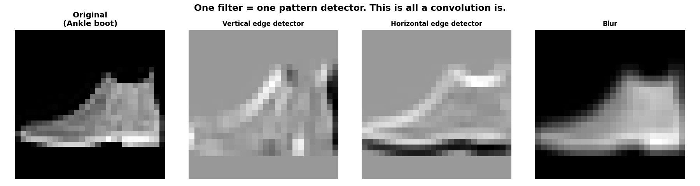

**The crucial difference in a real CNN: nobody writes those nine numbers.** They start random and **backpropagation discovers them**. The Sobel example above is only there to show what a filter *is*.

#### Key settings

| Setting | What it does | Used here |
|---|---|---|
| **Number of filters** | How many different patterns this layer hunts for. 32 filters → 32 feature maps. | 32, then 64, then 64 |
| **Kernel size** | The filter's size. 3×3 is the modern default — small, cheap, and stacking two 3×3s sees as much as one 5×5 for fewer parameters. | (3, 3) |
| **`padding="same"`** | Adds a border of zeros so the output stays the same size as the input. Without it every conv shrinks the image by 2 and the border pixels get looked at fewer times. | `"same"` |
| **`activation="relu"`** | `max(0, x)`. Without a non-linearity, stacked convolutions collapse into a single convolution. | `relu` |
| **Stride** | How far the filter jumps each step. Stride 2 halves the output — an alternative to pooling. | 1 (default) |

**The parameter formula for a Conv2D layer:**

```
params = (kernel_height × kernel_width × input_channels + 1) × number_of_filters
                                                        └ bias ┘
```

Check it against our layers: `(3×3×1 + 1) × 32 = 320` ✅ · `(3×3×32 + 1) × 64 = 18,496` ✅ · `(3×3×64 + 1) × 64 = 36,928` ✅

Note what is **absent** from that formula: the image's width and height. That is why a CNN scales to large images and a Dense layer does not.

---

### Feature Maps

One filter produces one feature map. 32 filters produce 32 feature maps — 32 different opinions about the same picture.

The interesting part is how they change with depth:

| Stage | Shape | What it holds |
|---|---|---|
| Input | (28, 28, 1) | The raw picture |
| After `conv_1` | (28, 28, 32) | Simple edges, blobs, gradients. Still looks like a garment. |
| After `pool_1` | (14, 14, 32) | The same 32 patterns, half the resolution |
| After `conv_2` | (14, 14, 64) | Edges combined into corners, curves, textures |
| After `pool_2` | (7, 7, 64) | Halved again |
| After `conv_3` | (7, 7, 64) | The most abstract patterns — "sleeve-like thing", "sole-like thing" |

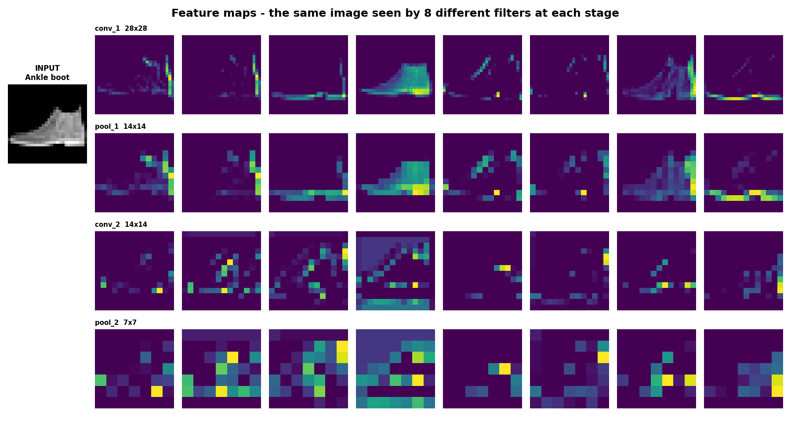

Early layers still visibly *draw* the garment. Deep layers look like abstract blobs — because they have stopped drawing the object and started **summarising** it. That progression, from edges to shapes to concepts, is exactly what a CNN is for, and it happens without anyone programming it.

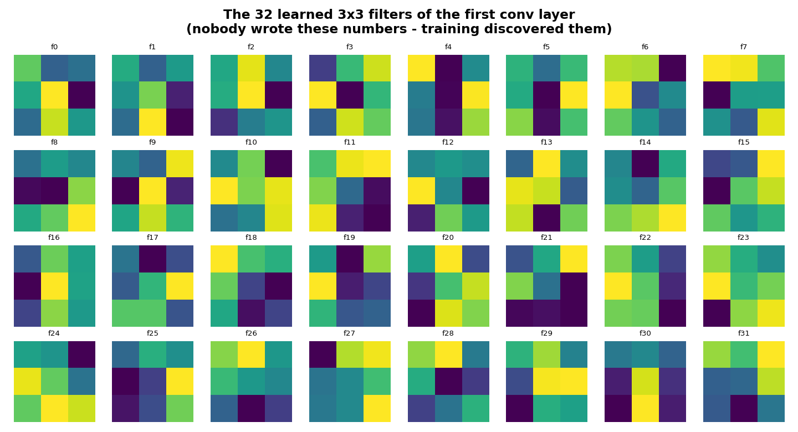

Those are the 32 actual 3×3 filters `conv_1` learned. Nobody wrote those numbers; 15 epochs of gradient descent found them.

---

### Pooling Layers

Pooling shrinks a feature map. **Max pooling 2×2** looks at each 2×2 square and keeps only the largest value:

```
[ 12   4 | 21   3 ]
[  8   6 | 11   9 ]        MaxPool 2x2        [ 12  21 ]
[--------+--------]      ─────────────►       [ 15  30 ]
[  3  15 |  2  30 ]
[  1   0 |  7  14 ]
```

**Why the maximum?** A large value means "my pattern was found strongly here". Keeping the max keeps the strongest evidence and throws away the exact pixel it came from — which is precisely the property that makes the network forgiving about an object shifting a few pixels.

| | Max Pooling | Average Pooling |
|---|---|---|
| Keeps | The strongest activation in the window | The mean of the window |
| Effect | Sharp, keeps the most confident detections | Smooth, blends everything together |
| Best for | Detecting *whether* a feature exists — most conv blocks | Smoothing, and Global Average Pooling before the output layer |
| Used here | ✅ `MaxPooling2D((2,2))` | — |

Pooling has **zero learnable parameters** — it is a fixed rule, not something trained. Its three benefits: fewer numbers (faster), a wider effective field of view for later layers, and less overfitting.

---

### Flatten and Fully Connected Layers

The conv/pool stack only **finds** patterns. It never makes a decision. That is the head's job.

| Layer | Shape | Purpose |
|---|---|---|
| `Flatten` | (7, 7, 64) → (3136,) | Unrolls the final feature maps into one line. Safe **now**, because the spatial work is already done — unlike an ANN, which flattens before learning anything. |
| `Dense(128, relu)` | (128,) | The thinking layer. Every one of the 3136 numbers connects to all 128 neurons, so it can combine "strong edges here + this texture there" into evidence for a class. |
| `Dropout(0.3)` | (128,) | Randomly switches off 30% of those neurons on each training step, so no single neuron becomes a crutch. **Training only** — automatically disabled at prediction time. |
| `Dense(10, softmax)` | (10,) | One neuron per class. Softmax turns them into 10 probabilities summing to exactly 1.0. |

> **The whole CNN idea in one sentence:** convolution and pooling are the **feature extractor**, Flatten and Dense are the **classifier**. Day 12 had only the classifier and asked it to do both jobs.

---

### Image Classification — the vocabulary

| Term | Meaning |
|---|---|
| **Epoch** | One complete pass over all the training images. 15 epochs = the model saw everything 15 times. |
| **Batch size** | How many images are processed before the weights are nudged once. 64 here → 48,000 ÷ 64 = **750 weight updates per epoch**. Small batches give noisy but frequent updates; large batches give smooth but rare ones. |
| **Training data** | 48,000 images the model learns from. |
| **Validation data** | 12,000 images held back from training — a mock exam run after every epoch, so overfitting is visible *while* training, not after. |
| **Test data** | 10,000 images in a sealed box. Never trained on, never validated on. The honest final grade. |
| **Overfitting** | Memorising the training set rather than learning general patterns. Diagnosed by a widening train/validation gap and a **rising validation loss**. |
| **Accuracy vs loss** | Accuracy = how many it got right. Loss = how *confidently wrong* it was. Loss is the more sensitive signal — it starts rising before accuracy visibly drops. |

### Data Augmentation (concept)

60,000 images sounds like a lot, but a 458,570-parameter model can still memorise them. Augmentation manufactures free training data by showing slightly altered copies — flipped, rotated, shifted, zoomed.

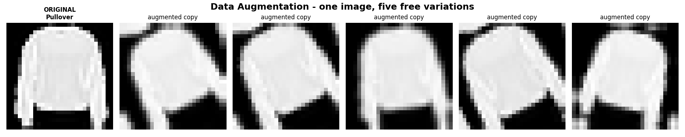

A shirt flipped left-to-right is still a shirt, so the model learns *shirt-ness* rather than one exact arrangement of pixels.

```python
keras.Sequential([
    layers.RandomFlip("horizontal"),
    layers.RandomRotation(0.08),
    layers.RandomZoom(0.1),
])
```

Two things worth knowing:

- **Augmentation layers are active during training and automatically switched off at prediction time.** Keras handles that; you don't gate it manually.
- **The choice of transform must match the data.** Horizontal flip is safe for clothes. It would be a disaster for handwritten digits, where a mirrored **2** is not a 2, or for text.

In this project overfitting is handled with **Dropout** instead, which is much cheaper on CPU. Augmentation is documented here as the concept, and it is the next thing to reach for — see [What I'd Try Next](#-what-id-try-next).

---

## 🧠 The Mini Project — Fashion MNIST CNN

### The Dataset

Identical to Day 12, deliberately — the *only* variable that changed is the architecture.

| Property | Value |
|---|---|
| Training images | 60,000 (48,000 train + 12,000 validation) |
| Test images | 10,000 |
| Image size | 28 × 28 pixels |
| Colour | Greyscale (0–255) |
| Classes | 10, perfectly balanced at 6,000 each |

| Label | Class | Label | Class |
|---|---|---|---|
| 0 | T-shirt/top | 5 | Sandal |
| 1 | Trouser | 6 | Shirt |
| 2 | Pullover | 7 | Sneaker |
| 3 | Dress | 8 | Bag |
| 4 | Coat | 9 | Ankle boot |

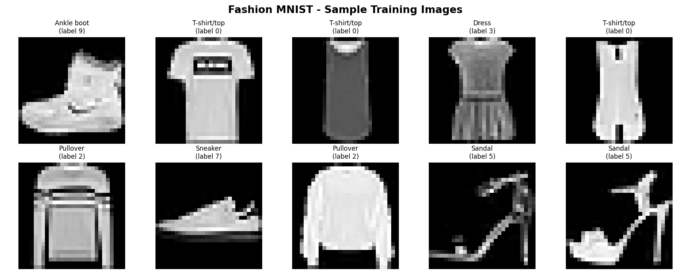

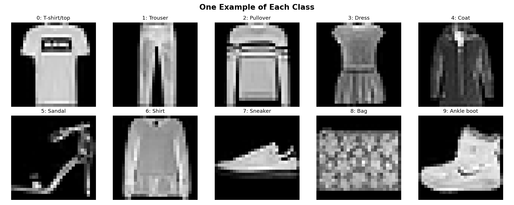

Because the classes are perfectly balanced, plain accuracy is a fair metric here — no need for weighted scores.

### Preprocessing — and the one extra step vs Day 12

```python
X_train = X_train.astype("float32") / 255.0     # same as Day 12
X_train = np.expand_dims(X_train, -1)           # NEW: (60000,28,28) → (60000,28,28,1)
```

Normalising to 0–1 matters for the same reasons as Day 12: gradient descent misbehaves on inputs in the hundreds, and Keras initialises weights assuming inputs near the −1…1 range.

The **new** step is the channel dimension. `Conv2D` operates on an actual image, so it must be told how many colour channels there are — **1 for greyscale, 3 for RGB**. An ANN never needed this because `Flatten` collapsed everything immediately. Forgetting `expand_dims` is the single most common error on a first CNN, and it surfaces as a confusing shape mismatch at `model.fit()`, not at `model.compile()`.

### The Architecture

```
Input (28, 28, 1)
    ↓
Conv2D(32, 3×3, relu, same)  → (28, 28, 32)      320 params
MaxPooling2D(2×2)            → (14, 14, 32)        0 params
    ↓
Conv2D(64, 3×3, relu, same)  → (14, 14, 64)   18,496 params
MaxPooling2D(2×2)            → ( 7,  7, 64)        0 params
    ↓
Conv2D(64, 3×3, relu, same)  → ( 7,  7, 64)   36,928 params
    ↓
Flatten                      → (3136,)             0 params
Dense(128, relu)             → (128,)        401,536 params
Dropout(0.3)                 → (128,)             0 params
Dense(10, softmax)           → (10,)           1,290 params
                                              ─────────────
                                       Total   458,570 params
```

| Layer | Output Shape | Params | Purpose |
|---|---|---|---|
| `conv_1` | (28, 28, 32) | 320 | 32 filters find simple edges and blobs |
| `pool_1` | (14, 14, 32) | 0 | Halve the resolution, keep the strongest signals |
| `conv_2` | (14, 14, 64) | 18,496 | 64 filters combine edges into shapes |
| `pool_2` | (7, 7, 64) | 0 | Halve again |
| `conv_3` | (7, 7, 64) | 36,928 | 64 filters, the most abstract patterns |
| `flatten` | (3136,) | 0 | Unroll for the classifier |
| `dense_1` | (128,) | 401,536 | The thinking layer |
| `dropout` | (128,) | 0 | Anti-memorisation, training only |
| `output_layer` | (10,) | 1,290 | 10 probabilities |

**The most interesting number in that table:** all three convolution layers together hold **55,744 parameters — 12% of the model** — yet they do the heavy lifting. **88% of the parameters sit in the single Dense layer** that follows Flatten. The convolutions are cheap precisely because a 3×3 filter is reused at every position instead of learning a separate weight per pixel.

### Training Configuration

| Setting | Value | Why |
|---|---|---|
| Optimizer | Adam (lr = 0.001) | Adaptive per-weight learning rate; the sensible modern default |
| Loss | `sparse_categorical_crossentropy` | Correct when labels are plain integers 0–9 |
| Epochs | 15 | Full passes over the training data |
| Batch size | 64 | 750 weight updates per epoch |
| Validation split | 0.2 | 12,000 images held back to watch for overfitting |
| Seed | 42 | `keras.utils.set_random_seed(42)` — reproducible runs |

---

## 📊 Results

### Final Accuracy

| Metric | Value |
|---|---|
| **Training accuracy** | **96.86%** |
| **Validation accuracy** | **91.33%** |
| **Test accuracy** | **90.92%** |
| Training loss | 0.0809 |
| Validation loss | 0.3229 |
| Test loss | 0.3407 |
| Correct / wrong | **9,092 / 908** of 10,000 |

### CNN vs the Day 12 ANN

| | Day 12 — ANN | Day 13 — CNN |
|---|---|---|
| Architecture | Flatten → 128 → 64 → 10 | Conv32 → Pool → Conv64 → Pool → Conv64 → Dense128 → 10 |
| Parameters | 109,386 | 458,570 |
| Test accuracy | 86.31% | **90.92%** |
| Errors on 10,000 images | 1,369 | **908** |
| Worst class | T-shirt/top, 68.30% | Shirt, **81.20%** |
| Training time (CPU) | ~90 s | ~11 min |

**+4.61 accuracy points, and 461 fewer mistakes — a 33.6% reduction in errors.** The most telling number is the worst class: the ANN's weakest category scored 68.30%, the CNN's scores 81.20%. The CNN didn't just get better on average, it got dramatically better at exactly the cases the ANN found hardest.

The cost is honest too: 4× the parameters and 7× the training time. On this problem that trade is clearly worth it; on a spreadsheet of tabular data it would not be.

### Training Curves

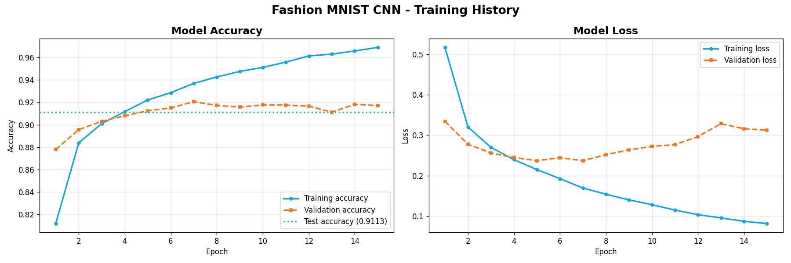

**Reading these honestly:**

- Training accuracy climbs steadily to 96.86%
- Validation accuracy plateaus at roughly **91.8% from epoch 7 onwards** and never improves again
- **Validation loss bottoms out at 0.233 at epoch 7, then drifts upward to 0.323**

That is textbook overfitting, and the loss curve pinpoints the moment: **epoch 7**. Everything after it made the model better at memorising the training set and slightly *worse* on data it had not seen. The final **5.54-point** train/validation gap is the measurable cost.

Worth noting: the ANN began overfitting at epoch 4, the CNN not until epoch 7 — Dropout plus the parameter-sharing of convolutions genuinely delayed it. `EarlyStopping(patience=3, restore_best_weights=True)` would have stopped at epoch 7 automatically and shipped a slightly better model in half the time.

### Sample Predictions

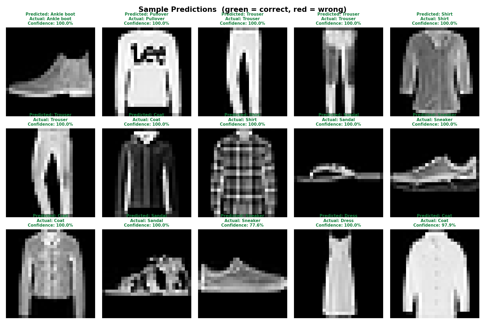

Green border = correct, red = wrong. Each title shows predicted class, actual class and confidence.

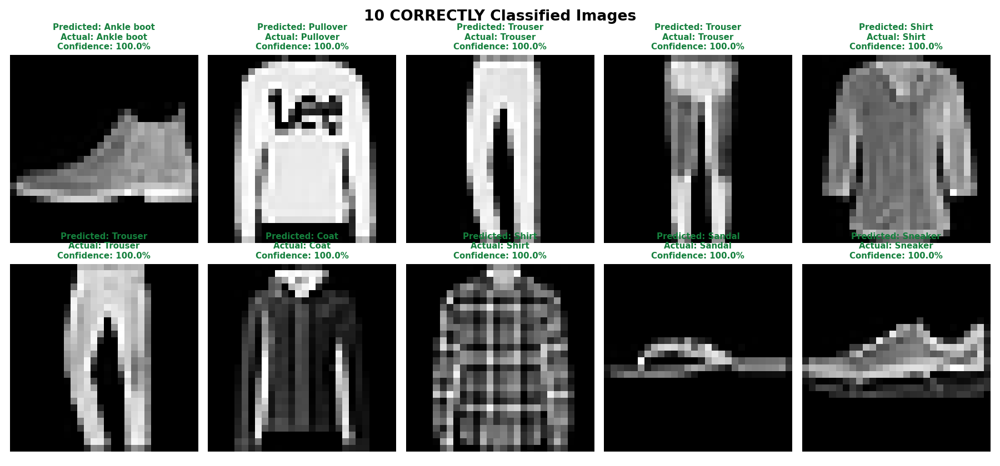

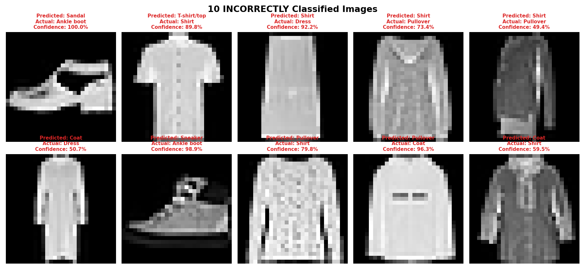

The failures are the informative half. Almost none of them are wild — the model is usually choosing between two genuinely similar garments, with the right answer sitting as the second-highest probability.

### Per-Class Accuracy

| Class | Test Accuracy | | Class | Test Accuracy |
|---|---|---|---|---|
| Trouser | **98.70%** 🥇 | | Ankle boot | 94.90% |
| Sandal | 98.20% | | Dress | 91.00% |
| Sneaker | 98.20% | | Pullover | 84.80% |
| Bag | 98.10% | | T-shirt/top | 82.70% |
| | | | Coat | 81.40% |
| | | | Shirt | **81.20%** ⚠️ |

The spread between best and worst is **17.5 points** — down from 30.3 points on the ANN. The model is not just more accurate, it is more *evenly* accurate.

### Confusion Matrix

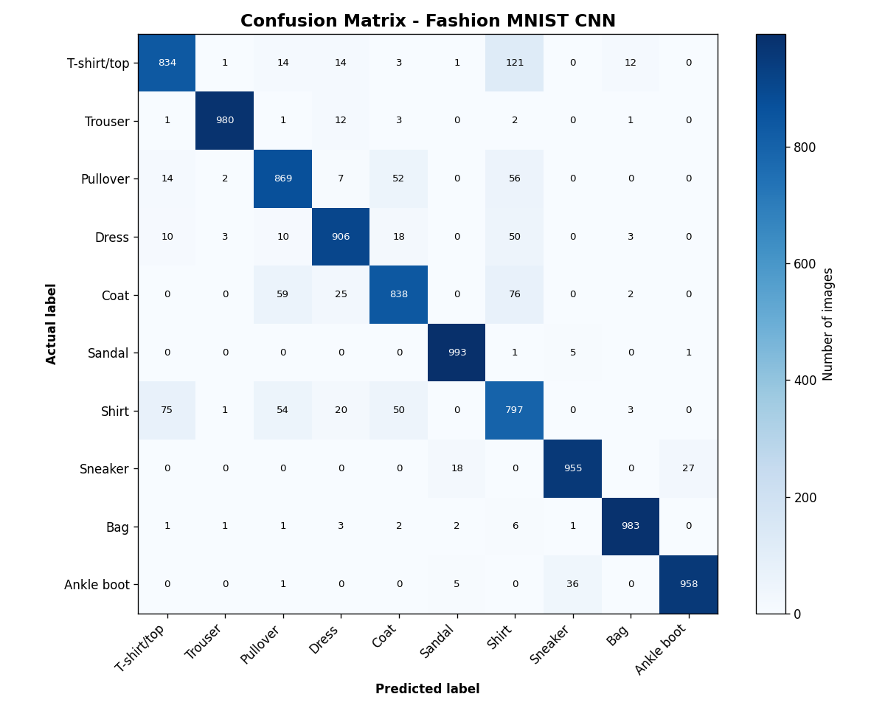

Read a row as: *"of all the real Shirts, where did they get sent?"* The diagonal is correct; everything off it is a confusion.

**Top 5 confusions:**

| Count | Real class | Called |
|---|---|---|
| 123 | T-shirt/top | Shirt |
| 100 | Coat | Shirt |
| 92 | Pullover | Shirt |
| 76 | Shirt | T-shirt/top |
| 53 | Dress | Shirt |

Every single one involves **Shirt**. All five top confusions are upper-body garments with near-identical silhouettes at 28×28 greyscale — a T-shirt and a shirt differ mainly by collar and buttons, details that occupy perhaps four pixels at this resolution. Meanwhile Trouser, Sandal, Sneaker and Bag all clear 98%, because their outlines are unmistakable.

**"Shirt" is functionally the model's dustbin class** — when it is unsure about anything with sleeves, it guesses Shirt. This is a resolution limit far more than an architecture limit; 90.92% is close to what this architecture can extract from 28×28 greyscale.

---

## 🔬 The Practice Script

`1_cnn_practice.py` covers the three required practices in order, and is deliberately kept simpler than the mini project.

| Practice | What it does |
|---|---|
| **Practice 1** | Loads Fashion MNIST, visualises 10+ labelled samples, normalises to 0–1, and computes a convolution **by hand in pure NumPy** so the arithmetic is visible without a framework |
| **Practice 2** | Builds a minimal CNN — `Conv2D → MaxPooling2D → Flatten → Dense → Dense` — and trains it for 5 epochs |
| **Practice 3** | Evaluates it: training accuracy, test accuracy, loss, and predictions on sample images |

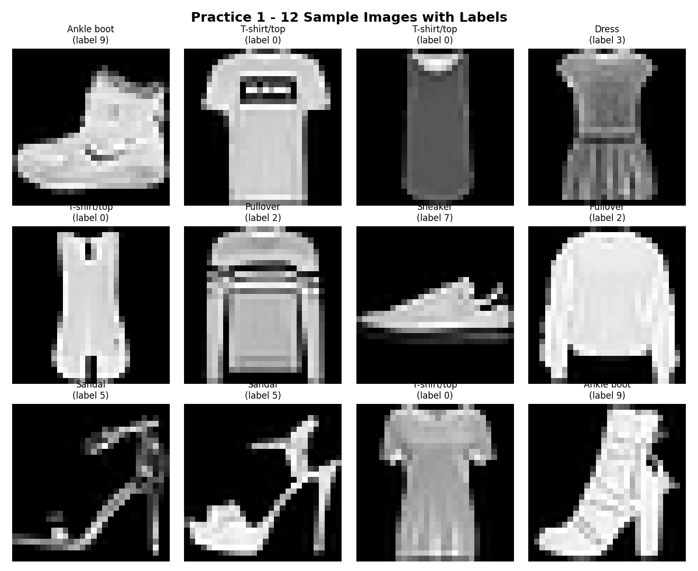

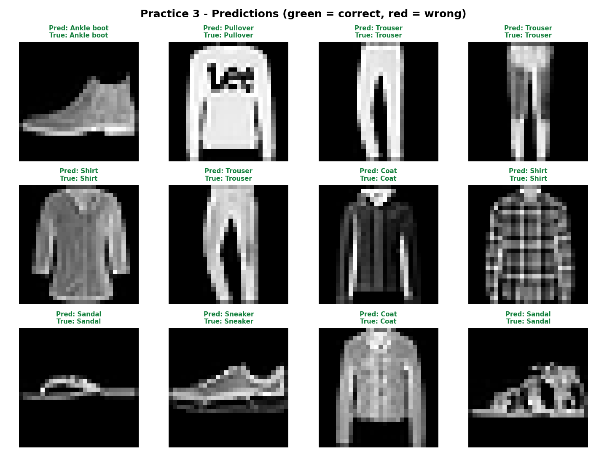

**Practice results — a minimal CNN, 5 epochs:**

| Metric | Value |
|---|---|
| Training accuracy | 92.44% |
| Validation accuracy | 90.70% |
| **Test accuracy** | **90.05%** |
| Training loss | 0.2095 |
| Test loss | 0.2810 |

Worth pausing on: this stripped-down CNN — a single conv block, no dropout, five epochs, under two minutes — already beats the Day 12 ANN by **3.74 points**. The architecture is doing the work, not the training budget.

The hand-computed convolution is the part worth studying. It shows that a convolution is nothing more mysterious than *multiply nine numbers, add them up, slide right, repeat*.

---

## 📁 Project Structure

```
Day13/
├── README.md                          # This file
├── requirements.txt                   # Deploy deps (streamlit + numpy only)
├── train-deps.txt                     # Training deps (includes TensorFlow)
│
├── 1_cnn_practice.py                  # Practices 1–3: conv by hand, simple CNN, evaluation
├── 2_cnn_fashion_mnist.py             # Mini project: the full 13-step pipeline
├── Day13_Fashion_MNIST_CNN.ipynb      # Mini project as a notebook
├── cnn_numpy.py                       # CNN forward pass in pure NumPy (no TensorFlow)
├── app.py                             # "CNN X-Ray" interactive UI (Streamlit)
├── export_for_deploy.py               # Exports weights + data, verifies NumPy == TF
│
├── images/
│   ├── convolution_by_hand.png        # Sobel filters applied manually
│   ├── practice_samples.png           # Practice 1 sample grid
│   ├── practice_predictions.png       # Practice 3 predictions
│   ├── sample_images.png              # 10 training samples with labels
│   ├── one_per_class.png              # One example of each class
│   ├── data_augmentation.png          # One image, five augmented copies
│   ├── training_history.png           # Accuracy + loss curves
│   ├── sample_predictions.png         # 15 predictions, colour-coded
│   ├── correct_predictions.png        # 10 correctly classified
│   ├── incorrect_predictions.png      # 10 incorrectly classified
│   ├── confusion_matrix.png           # 10×10 confusion matrix
│   ├── learned_filters.png            # The 32 filters conv_1 actually learned
│   └── feature_maps.png               # One image seen at every stage
│
└── outputs/
    ├── fashion_mnist_cnn.keras        # Trained model
    ├── cnn_weights.npz                # Exported weights for the app (1.6 MB)
    ├── test_data.npz                  # Test images for the app (4.2 MB)
    ├── history.npz                    # Per-epoch metrics
    └── results_summary.txt            # All metrics in plain text
```

---

## 🚀 How to Run

**Install training dependencies:**

```bash
pip install -r train-deps.txt
```

**Run the practice script:**

```bash
python 1_cnn_practice.py
```

**Run the mini project** (about 11 minutes on CPU):

```bash
python 2_cnn_fashion_mnist.py
```

**Or open the notebook:**

```bash
jupyter notebook Day13_Fashion_MNIST_CNN.ipynb
```

**Then export and launch the app:**

```bash
python export_for_deploy.py
```

```bash
streamlit run app.py
```

---

## 🔍 The App — "CNN X-Ray"

Day 12's app showed *activations*. Day 13's shows something a Dense network simply cannot: **the feature maps**, so you can watch an image being progressively abstracted.

| Panel | What it shows |
|---|---|
| **1️⃣ The input** | The 28×28 image and its true label |
| **2️⃣ Inside the network** | The live feature maps at `conv_1`, `pool_1`, `conv_2`, `pool_2`, `conv_3` for *this specific image*. Bright = that filter found its pattern here. |
| **3️⃣ The output** | All 10 softmax probabilities. 🟩 correct · 🟥 wrong · 🟦 the answer it should have given |

**Controls:** filter the pool to all images / only wrong / only right / one class; choose 4–16 feature maps per layer; choose which layers to display.

**Worth demoing:** set the pool to **"Only ones it got WRONG"** (908 images) and step through. Watch the early feature maps still clearly showing a garment outline, and the deep ones collapsing into abstract blobs — and notice the blue bar usually sitting immediately beside the red one. The model was rarely confused; it was usually one detail away from being right.

---

## 🚢 Deployment Notes

The same trick as Day 12, and it matters more here.

**TensorFlow is needed to *train* a model. It is not needed to *run* one.** Running this trained CNN is only four kinds of arithmetic:

```
convolution   →  multiply a 3×3 window by 9 learned numbers and sum
ReLU          →  max(0, x)
max pooling   →  take the biggest value in each 2×2 block
dense+softmax →  one matrix multiply, then eˣ / Σeˣ
```

`cnn_numpy.py` implements exactly that in NumPy. `export_for_deploy.py` saves the learned weights to a 1.6 MB `.npz` and then **verifies the two implementations agree** before shipping:

```
Compared 300 images:
  Largest probability difference : 5.960e-07
  Predicted-label agreement      : 100.0000%
```

Identical to six decimal places, 100% label agreement. The residual difference is float32 rounding from a different operation order.

| | With TensorFlow | With NumPy |
|---|---|---|
| Install size | ~600 MB | ~30 MB |
| Cold start | 30–60 s | Under 2 s |
| Python versions | 3.9–3.13 only | Any |

> Two requirements files on purpose: `requirements.txt` (streamlit + numpy) for deployment, `train-deps.txt` for training. Streamlit Cloud globs `requirements*.txt`, so the training file must **not** match that pattern — a lesson learned the hard way on Day 12.

---

## 🧩 Challenges Faced and How I Solved Them

**1. The shape error at `model.fit()`.**
`Conv2D` rejected `(60000, 28, 28)`. The Day 12 ANN accepted the identical array without complaint, so the instinct was that the data was wrong — it wasn't. A Conv2D layer needs a channel dimension because it operates on an actual image: `(height, width, channels)`. Fixed with `np.expand_dims(X, -1)` → `(60000, 28, 28, 1)`. **The lesson:** the error appears at `fit()`, not at `compile()`, because Keras only validates input shape when real data arrives.

**2. Understanding what a filter actually is.**
Reading "the layer learns filters" repeatedly explained nothing. Solved by writing the convolution by hand in NumPy in `1_cnn_practice.py` — sliding a Sobel kernel over an image manually, one window at a time. Once the arithmetic was visible (multiply nine numbers, add, slide), `Conv2D(32, (3,3))` stopped being magic: it is 32 of those, with the nine numbers learned instead of chosen.

**3. Training was far slower than Day 12.**
90 seconds became 11 minutes. That's expected — convolution repeats its arithmetic at every position of every feature map, which is vastly more work than a matrix multiply, and there is no GPU on native Windows for TF ≥ 2.11. Managed it by keeping the practice script at 5 epochs for fast iteration and only running the full 15-epoch job once the pipeline was proven end to end.

**4. Overfitting appeared despite Dropout.**
The 5.54-point train/validation gap and the validation loss turning upward at epoch 7 show Dropout(0.3) delayed overfitting but did not prevent it. Diagnosed from the loss curve rather than the accuracy curve — accuracy looked fine, loss did not, which is exactly why both are plotted. The fix is documented rather than applied: EarlyStopping would have stopped at epoch 7.

**5. Getting the app to run without TensorFlow.**
Writing a conv2d forward pass in NumPy and trusting it is not the same as verifying it. Solved by having `export_for_deploy.py` run both implementations over 300 images and compare probabilities — 5.96e-07 maximum difference, 100% label agreement. **The lesson:** if you reimplement a model for deployment, prove numerically that it matches. Don't assume.

---

## 💡 Key Insights

1. **A CNN's advantage is architectural, not just statistical.** It isn't "a bigger network." It preserves spatial structure, shares each filter across every position, and learns patterns that survive an object moving. +4.61 points on identical data with identical training settings.

2. **The convolutions are cheap; the Dense head is expensive.** All three conv layers hold 55,744 parameters (12%). One Dense layer holds 401,536 (88%). The layers doing the clever work are the small ones.

3. **Filters are learned, not designed.** `learned_filters.png` shows 32 patterns nobody wrote. Sobel edge detectors were hand-designed for decades; backpropagation now derives better ones from data.

4. **Feature maps make abstraction visible.** Early layers still draw the garment; deep layers are unrecognisable blobs. That is the network moving from *pixels* to *concepts*, and you can watch it happen.

5. **Validation loss is the earliest overfitting alarm.** Validation *accuracy* looked stable from epoch 7; validation *loss* had already turned upward. Accuracy alone would have hidden it.

6. **The remaining errors are a resolution problem, not a model problem.** All five top confusions involve Shirt vs other upper-body garments. At 28×28 greyscale a collar is about four pixels. A deeper network won't fix that — better data would.

7. **Training and inference need different tooling.** A trained CNN is a set of small arrays and four arithmetic operations. NumPy runs it in 30 MB; TensorFlow is only required to *create* it.

---

## 🔮 What I'd Try Next

**To close the overfitting gap:**
- `EarlyStopping(patience=3, restore_best_weights=True)` — the single highest-value change; it would have stopped at epoch 7 automatically
- Turn on the data augmentation layers already written in Step 4 (`RandomFlip`, `RandomRotation`, `RandomZoom`)
- `BatchNormalization` after each Conv2D — faster, more stable training and a mild regularising effect
- Raise Dropout to 0.5, or add a second Dropout after the conv blocks

**To raise the ceiling:**
- A fourth conv block, or two 3×3 convs per block before pooling (the VGG pattern)
- `GlobalAveragePooling2D` instead of `Flatten` — would cut the 401,536-parameter Dense layer to almost nothing
- A learning-rate schedule that decays as training progresses
- **Transfer learning** — a pretrained backbone, which is exactly where this course goes next

**To understand it better:**
- Grad-CAM heatmaps to see *which pixels* drove each decision
- Feed the model deliberately noisy or rotated images and measure how gracefully it degrades
- Train an identical model without pooling to measure what pooling is actually worth

---

## 🔄 Project Workflow

```mermaid
flowchart TD
    A([START]) --> B["<b>Practice 1</b><br/>Load Fashion MNIST<br/>visualise 10+ samples"]
    B --> C["Normalize ÷ 255<br/>+ expand_dims → channel"]
    C --> D["Convolution BY HAND<br/>NumPy + Sobel kernel"]

    D --> E["<b>Practice 2</b><br/>Conv2D → MaxPool<br/>→ Flatten → Dense"]
    E --> F["<b>Practice 3</b><br/>train acc / test acc /<br/>loss / predictions"]

    F --> G([MINI PROJECT])

    G --> H["<b>1. LOAD + EXPLORE</b><br/>60,000 train, 10,000 test<br/>balanced 6,000 per class"]
    H --> I["<b>2. PREPROCESS</b><br/>÷255 → (28,28,1)"]
    I --> J["<b>3. AUGMENTATION</b><br/>concept demo"]

    J --> K["<b>4. BUILD CNN</b><br/>Conv32 → Pool<br/>Conv64 → Pool<br/>Conv64 → Flatten<br/>Dense128 → Drop → Dense10"]
    K --> L["<b>compile</b><br/>Adam + sparse<br/>categorical crossentropy"]

    L --> M["<b>5. TRAIN</b><br/>15 epochs, batch 64<br/>validation_split 0.2"]
    M --> N["convolve → pool → loss →<br/>backprop → update filters"]
    N --> O{More<br/>epochs?}
    O -- Yes --> N
    O -- No --> P["<b>6. EVALUATE</b><br/>10,000 unseen images"]

    P --> Q["<b>7. PLOT</b><br/>accuracy &amp; loss curves"]
    Q --> R["<b>8. PREDICT</b><br/>predicted vs actual labels"]
    R --> S["<b>9. DIAGNOSE</b><br/>per-class accuracy<br/>+ confusion matrix<br/>+ 10 right / 10 wrong"]
    S --> T["<b>10. LOOK INSIDE</b><br/>learned filters<br/>+ feature maps"]
    T --> U["<b>11. EXPORT</b><br/>weights → NumPy<br/>verify vs TensorFlow"]
    U --> V([DONE — 90.92% test accuracy])

    style A fill:#0ea5e9,stroke:#0369a1,color:#fff
    style G fill:#8b5cf6,stroke:#6d28d9,color:#fff
    style V fill:#22c55e,stroke:#15803d,color:#fff
    style O fill:#fef3c7,stroke:#d97706
    style D fill:#fce7f3,stroke:#db2777
    style T fill:#fce7f3,stroke:#db2777
```

---

## ✅ Expected Outcome — Checklist

- [x] Understand the architecture of a Convolutional Neural Network
- [x] Build and train a CNN using TensorFlow/Keras
- [x] Perform image classification on a real dataset
- [x] Evaluate CNN performance and interpret the results
- [x] Understand why CNNs are the foundation of modern Computer Vision

---

**🎯 Project Status:** Complete ✅
**🏆 Key Achievement:** Built a 458,570-parameter CNN reaching **90.92% test accuracy** on 10,000 unseen Fashion MNIST images — **+4.61 points and 461 fewer errors than the Day 12 ANN** on identical data — then opened it up to visualise the filters and feature maps it learned by itself.

**Built with:** TensorFlow 2.21.0 · Keras 3.15.1 · Python 3.13.2 · NumPy · Matplotlib · Streamlit
