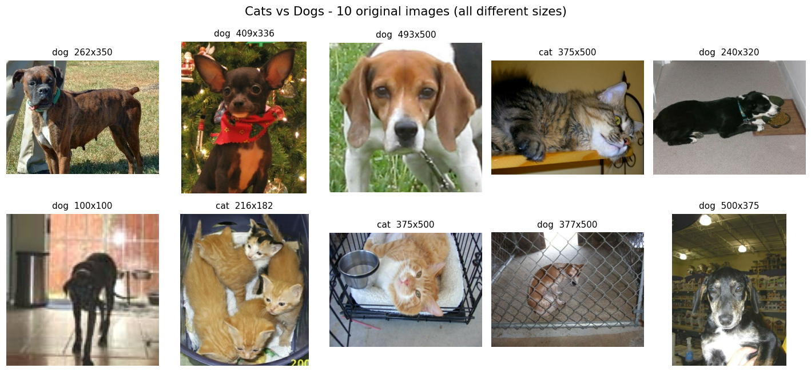
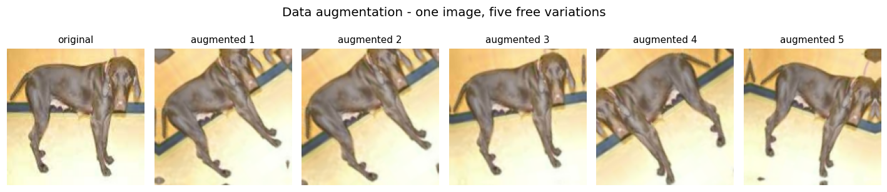
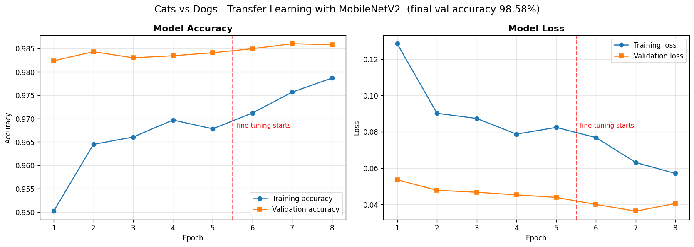
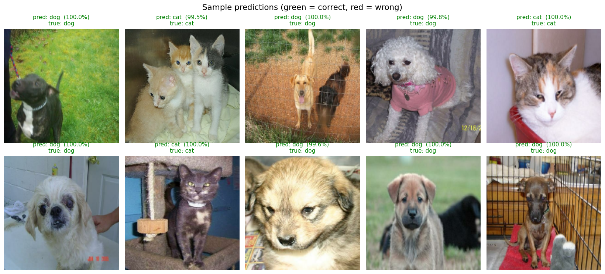
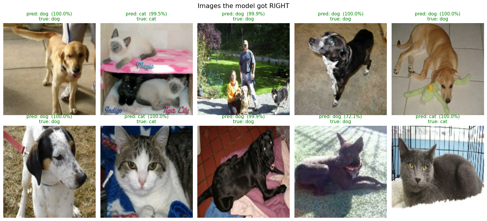
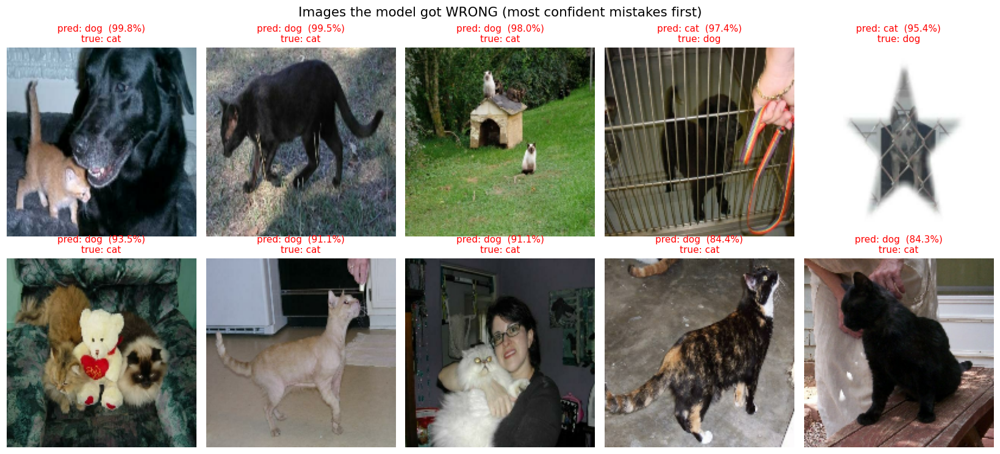
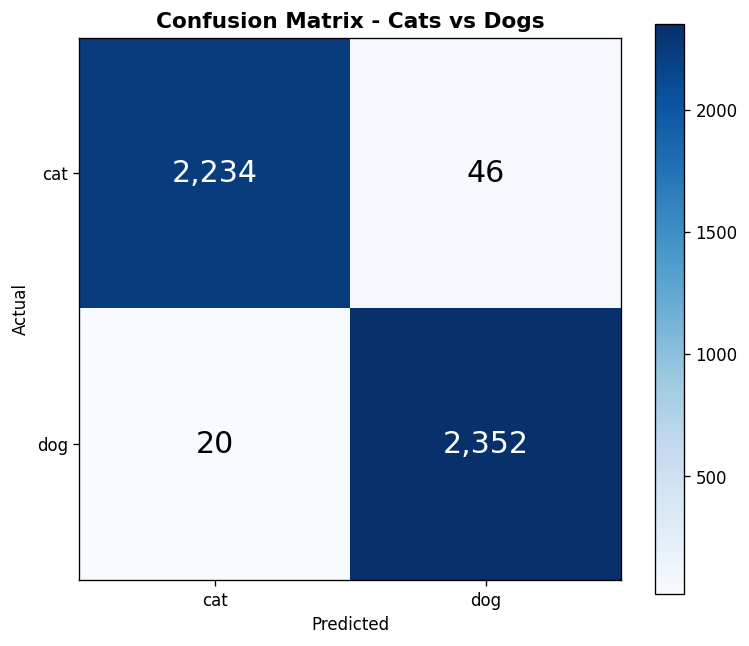
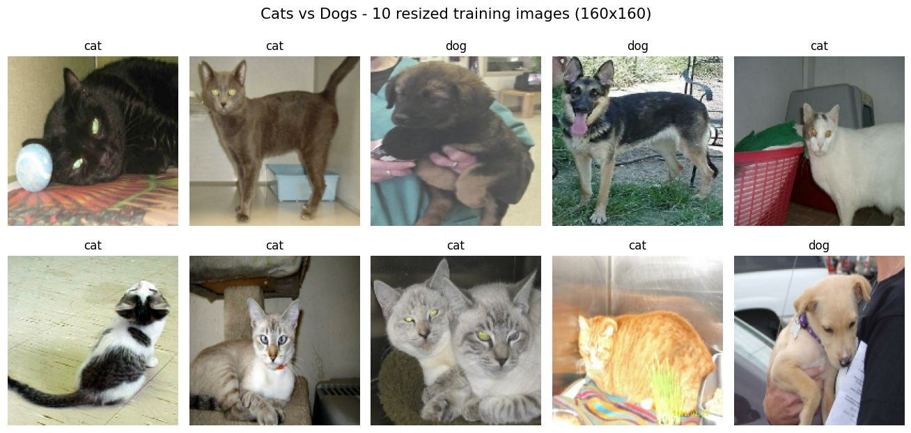
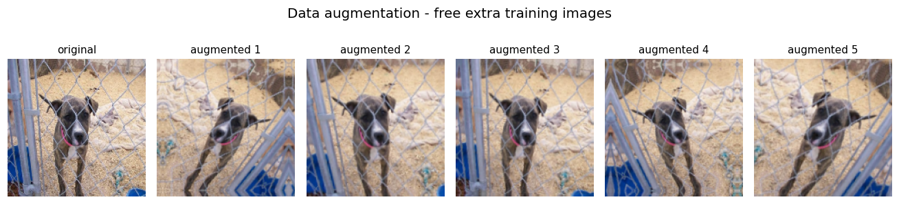

# Day 14 — Transfer Learning & Pre-trained CNN Models

## 📋 Overview

Yesterday I built a CNN from scratch. It had 458,570 parameters, trained for 11 minutes, and reached **90.92%**.

Today I did not build a model. I **borrowed** one.

MobileNetV2 has already looked at 1.4 million photos and learned what an edge is, what fur looks like, what an ear is. I kept all of that, locked it so it could not be damaged, and bolted on **one tiny decision layer of 1,281 numbers** — 0.06% of the model. Five epochs later: **98.41% validation accuracy**. Three more fine-tuning epochs: **98.58%**.

**66 mistakes out of 4,652 pictures.**

That is the whole lesson of Day 14. The hard part of computer vision — learning to see — has already been done by someone else, on hardware I do not have, with data I do not have. My job is only to teach it the one new question I care about: *cat or dog?*

Everything runs on **TensorFlow 2.21.0 / Keras 3.15.1**, CPU only, and the full pipeline takes **37 minutes**.

---

## 🎯 Objectives

- Understand what Transfer Learning is, in plain language, and why industry uses it
- Know the difference between **feature extraction** and **fine-tuning**, and when to use each
- Compare VGG16, ResNet50, MobileNetV2 and EfficientNetB0 — and know which one to pick for a phone
- Load a pre-trained MobileNetV2, explore it, freeze it, and add my own classification head
- Load Cats vs Dogs from TensorFlow Datasets, preprocess, resize and split it
- Train, evaluate, and beat 93% validation accuracy
- Understand *why* fine-tuning needs a 100× smaller learning rate

---

## 📚 Theoretical Background

### What is Transfer Learning?

**The simplest explanation I can give:**

Imagine someone spent five years learning to draw. They know how to see shapes, shadow, texture, proportion. Now you ask them to draw a cat for the first time. They do not start from zero — they already know *how to see*. They only need to learn *what a cat looks like*. That takes them an afternoon, not five years.

Transfer Learning is exactly that, for a neural network.

```
Someone else's job (already done, once, on 1.4 million photos):
    learn what edges, corners, textures, fur, eyes and ears look like

My job (18,610 photos, 20 minutes):
    learn that a picture with these features is a DOG,
    and a picture with those features is a CAT
```

The pre-trained model is called the **base model** or the **backbone**. The little bit I add on top is the **head**.

### Why Transfer Learning is used

| Problem when training from scratch | What Transfer Learning does about it |
|---|---|
| You need **millions** of labelled images | A few thousand is enough — the hard learning already happened |
| You need days on expensive GPUs | Minutes on a normal laptop CPU |
| Small datasets overfit badly | The frozen backbone cannot overfit — it is not learning |
| Accuracy plateaus low | You start from features refined on 1.4M photos, so you start *high* |
| You have to design an architecture | Someone with a research team already designed a better one |

The proof from my own two days:

| | Day 13 — CNN from scratch | Day 14 — Transfer Learning |
|---|---|---|
| Trainable parameters | 458,570 | **1,281** (phase 1) |
| Accuracy after epoch 1 | 87.78% (validation) | **98.24%** |
| Final accuracy | 90.92% | **98.58%** |

The transfer-learning model was **better after one epoch than the from-scratch CNN ever became.**

### Pre-trained Models

A pre-trained model is a network that has already been trained on a huge dataset — almost always **ImageNet**: 1.4 million photos across 1,000 everyday categories.

Two arguments do all the work:

```python
base_model = keras.applications.MobileNetV2(
    input_shape=(160, 160, 3),
    weights="imagenet",    # download everything it learned
    include_top=False,     # but LEAVE OFF its 1000-class output layer
)
```

**Why `include_top=False`?** ImageNet's output layer answers "which of these 1,000 things is it?" I need an answer to "cat or dog?" — a completely different question with a different number of answers. So I throw that layer away and keep only the part that *sees*.

What comes out instead is the shape `(5, 5, 1280)`:

```
160 x 160 x 3  =  76,800 numbers   (a picture: pixels)
        ↓  MobileNetV2
  5 x 5 x 1280  =  32,000 numbers   (a description: "fur here, ear-shape there")
```

Those 32,000 numbers are **not pixels any more**. They are a summary of *what is in* the picture. That summary is the thing I am borrowing, and it is the thing my tiny head learns to read.

### Feature Extraction

**Freeze the whole backbone. Train only the head.**

```python
base_model.trainable = False   # <- the entire idea, in one line
```

"Frozen" means *do not change these numbers during training*. Gradient descent is not allowed to touch them.

| | |
|---|---|
| What trains | Only my head — **1,281 parameters** |
| What is frozen | MobileNetV2 — 2,257,984 parameters (**99.94%**) |
| Speed | Fast — nothing deep is being updated |
| Risk of overfitting | Very low — there is almost nothing to overfit with |
| Use it when | Your dataset is small, or looks like ImageNet (photos of real objects) |

This is always the **first** phase. It is where you get most of your accuracy: mine went from a coin-flip 55% to **98.41%** on feature extraction alone.

### Fine-Tuning

**Unfreeze the top of the backbone and keep training — very, very gently.**

```python
base_model.trainable = True
for layer in base_model.layers[:100]:   # keep the bottom 100 layers frozen
    layer.trainable = False

model.compile(optimizer=keras.optimizers.Adam(learning_rate=1e-5),  # 100x smaller!
              loss="binary_crossentropy", metrics=["accuracy"])
```

**Why only the top layers?** Because of what each depth level has learned:

| Depth | What it learned | Should I change it? |
|---|---|---|
| Bottom layers | Edges, corners, colour blobs | **No.** An edge is an edge in every image, forever. |
| Middle layers | Textures, simple patterns | Usually no |
| Top layers | Whole-object concepts ("this is a bus", "this is a lamp") | **Yes** — these are ImageNet-specific and can be nudged towards cats and dogs |

**Why a 100× smaller learning rate (1e-5, not 1e-3)?** Because big steps would wreck 1.4 million photos' worth of knowledge in a single batch. This failure has a name: **catastrophic forgetting**. Small steps *polish* the borrowed knowledge; big steps *erase* it.

**Two rules that are easy to get wrong:**

1. **You must call `model.compile()` again** after changing `trainable`. If you don't, Keras keeps using the old setup and nothing you changed takes effect.
2. **Keep every `BatchNormalization` layer frozen.** BatchNorm layers carry running averages measured across ImageNet. Letting them update on batches of 32 cat photos destroys accuracy — this is the single most common transfer-learning bug.

```python
for layer in base_model.layers:
    if isinstance(layer, layers.BatchNormalization):
        layer.trainable = False
```

MobileNetV2 has **52 BatchNormalization layers** out of 154 — a third of the model. This matters.

### Feature Extraction vs Fine-Tuning — side by side

| | Feature Extraction | Fine-Tuning |
|---|---|---|
| Backbone | Completely frozen | Top part unfrozen |
| Trainable params (mine) | 1,281 | 1,840,897 |
| Learning rate | 1e-3 (normal) | 1e-5 (100× smaller) |
| Speed per epoch (mine) | ~3.7 min | ~4.6 min |
| Best for | Small data, or data like ImageNet | Bigger data, or data unlike ImageNet (X-rays, satellites) |
| My result | 98.41% | **98.58%** |
| Order | **Always do this first** | Only after feature extraction has converged |

### Advantages and limitations

**Advantages**
- Far less data needed — thousands instead of millions
- Far less time — minutes on a CPU instead of days on GPUs
- Higher accuracy than you could reach alone
- Less overfitting, because the frozen part cannot memorise your images
- Free access to architectures designed by full research teams

**Limitations**
- **The source task must be related enough.** ImageNet is everyday photos. Cats and dogs *are* in ImageNet, which is why this worked so easily. Chest X-rays or satellite images share far less, and need heavier fine-tuning.
- **You are stuck with someone else's input size and architecture** (mine had to be resized to 160×160).
- **You inherit their biases.** Whatever ImageNet over- or under-represents, you inherit.
- **Fine-tuning can go backwards** if the learning rate is too big — catastrophic forgetting.
- **The download is large** and the model may be bigger than you need for a tiny task.

---

## 🏛️ Pre-trained CNN Models Compared

| Model | Year | Params | Size | ImageNet top-1 | Speed | The one-line summary |
|---|---|---|---|---|---|---|
| **VGG16** | 2014 | 138M | 528 MB | 71.3% | Slowest | Simple, old, huge. Great for teaching, bad for production. |
| **ResNet50** | 2015 | 25.6M | 98 MB | 74.9% | Medium | The reliable workhorse. Skip connections made deep networks trainable. |
| **MobileNetV2** | 2018 | 3.5M | 14 MB | 71.8% | **Fastest** | Built for phones. Almost VGG16's accuracy at 1/40th the size. |
| **EfficientNetB0** | 2019 | 5.3M | 29 MB | 77.1% | Fast | Best accuracy-per-parameter. Scales up cleanly to B1–B7. |

*(Params/size are for the full model including the ImageNet head. With `include_top=False`, MobileNetV2 is 2,257,984 parameters.)*

### What makes each one different

**VGG16** — just 3×3 convolutions stacked over and over. Beautifully simple to understand, which is why every course teaches it. But 138 million parameters, and **90% of them sit in the Dense layers at the end**. Enormous for what it delivers.

**ResNet50** — introduced the **skip connection**: the input of a block is added to its output. Before this, networks deeper than ~20 layers got *worse*, because the gradient faded to nothing on its way back. Skip connections give the gradient a shortcut, so 50, 101, even 152 layers became trainable. This idea is now in almost every deep architecture, including Transformers.

**MobileNetV2** — designed for phones. Its trick is the **depthwise separable convolution**: instead of one expensive operation that mixes "where" and "which channel" at once, it does two cheap ones. In my model I counted **17 DepthwiseConv2D layers**. It also uses *inverted residuals* — expand, filter, then squeeze back down — which keeps memory use tiny. Result: ~8–9× less computation than a normal convolution for nearly the same accuracy.

**EfficientNetB0** — asked a question nobody had asked properly: when you scale a network up, should you make it deeper, wider, or feed it bigger images? The answer was **all three, in a fixed ratio** (compound scaling). B0 is the base; B1–B7 scale up along that ratio. Best accuracy per parameter of the four.

### When to use each

| Situation | Pick | Why |
|---|---|---|
| Phone / Raspberry Pi / browser | **MobileNetV2** | 14 MB, fastest inference, designed for exactly this |
| Server with a GPU, accuracy matters | **EfficientNetB0+** or ResNet50 | Higher ceiling, hardware can afford it |
| Learning how CNNs work | **VGG16** | Simplest architecture to read |
| Very deep custom model | **ResNet50** | Skip connections make depth trainable |
| Best accuracy per parameter | **EfficientNet** | That is literally what it was optimised for |

**Edge devices** (phones, drones, IoT, embedded cameras) → **MobileNetV2**, every time. Small download, low RAM, fast on a CPU, battery-friendly.

**High-performance systems** (cloud, GPU servers, batch jobs) → **ResNet50 / EfficientNet / ConvNeXt**. When compute is free, spend it on accuracy.

### Why I chose MobileNetV2

1. **It fits my machine.** No GPU on native Windows for TF ≥ 2.11, so everything runs on CPU. MobileNetV2's 2.26M parameters trained in 37 minutes; VGG16's 138M would have taken hours.
2. **The assignment asked for it** — and the assignment is right, because this is the model you would actually deploy in a phone app.
3. **The accuracy trade is tiny.** 71.8% vs VGG16's 71.3% on ImageNet — MobileNetV2 is *more* accurate while being 40× smaller.
4. **Cats and dogs are already in ImageNet.** MobileNetV2 has literally seen thousands of them. The features transfer almost perfectly, which is exactly why 98% arrives after one epoch.
5. **14 MB is deployable.** A 528 MB VGG16 is not going into a mobile app.

---

## 🧠 The Mini Project — Cats vs Dogs

### The Dataset

```python
import tensorflow_datasets as tfds
dataset, info = tfds.load("cats_vs_dogs", with_info=True, as_supervised=True)
```

| Property | Value |
|---|---|
| Source | TensorFlow Datasets (`cats_vs_dogs`, v4.0.1) |
| Total images | **23,262** |
| Classes | 2 — `cat` (0), `dog` (1), roughly balanced |
| Image size | **Every one is different** — from tiny thumbnails to 500×500 |
| Download | 786 MB |
| Splits provided | Only one, called `train` — I slice it myself |

> The original Kaggle dataset has 25,000 pictures. TFDS silently drops **1,738 corrupted files**, which is why the count is 23,262.



**`as_supervised=True`** means "hand me `(image, label)` pairs" instead of a dictionary — much easier to work with.

### The split

TFDS gives one split, so I cut it with slice strings:

```python
(train_raw, val_raw), info = tfds.load(
    "cats_vs_dogs",
    split=["train[:80%]", "train[80%:]"],   # 80% train, 20% validation
    with_info=True,
    as_supervised=True,
)
```

| Split | Images | Batches (size 32) |
|---|---|---|
| Training | **18,610** | 582 |
| Validation | **4,652** | 146 |

### Preprocessing

```python
def preprocess(image, label):
    image = tf.image.resize(image, (160, 160))   # every picture the same shape
    return image, label

train_ds = (train_raw.map(preprocess, num_parallel_calls=AUTOTUNE)
                     .shuffle(1000)      # mix the cats and dogs up
                     .batch(32)          # 32 pictures at a time
                     .prefetch(AUTOTUNE))# prepare the next batch while training
```

**Why resize?** A neural network's input shape is fixed. Every picture *must* become the same size. 160×160 is the standard choice for MobileNetV2 — big enough to keep detail, small enough to be fast.

**Why don't I divide by 255 here?** Because a `Rescaling` layer *inside the model* does it:

```python
layers.Rescaling(1./127.5, offset=-1)   # 0..255  ->  -1..1
```

MobileNetV2 was trained on pixels scaled to −1…1, so it must be fed the same thing. Putting it inside the model means anyone who loads the saved model gets it automatically and cannot forget. **Doing it in both places would be a bug** — the numbers would be scaled twice.

### Data Augmentation



```python
data_augmentation = keras.Sequential([
    layers.RandomFlip("horizontal"),   # a mirrored dog is still a dog
    layers.RandomRotation(0.1),        # +/- 10% of a full turn
    layers.RandomZoom(0.1),            # zoom in/out by up to 10%
])
```

Augmentation shows the model slightly changed copies of each picture, so it learns *dog-ness* instead of memorising exact pixels. These layers run **only during training** — Keras switches them off automatically when predicting.

The transform must match the data: horizontal flip is safe for animals, but it would be a disaster for handwritten digits or text.

### The Architecture

```
Input (160, 160, 3)
    ↓
data_augmentation           (training only)              0 params
Rescaling(1/127.5, -1)      0..255 -> -1..1              0 params
    ↓
MobileNetV2  ❄️ FROZEN      -> (5, 5, 1280)      2,257,984 params
    ↓
GlobalAveragePooling2D      -> (1280,)                   0 params
Dropout(0.2)                -> (1280,)                   0 params
Dense(1, sigmoid)           -> (1,)                  1,281 params
                                                 ─────────────────
                                          Total   2,259,265 params
                                      Trainable       1,281  (0.06%)
```

| Layer | Why it's there |
|---|---|
| `MobileNetV2` (frozen) | The borrowed eyes. 154 layers, 52 of them BatchNorm, 17 DepthwiseConv2D. |
| `GlobalAveragePooling2D` | Averages each of the 1280 feature maps down to **one** number → 1280 numbers. |
| `Dropout(0.2)` | Switches off 20% of those numbers per training step so no single one becomes a crutch. |
| `Dense(1, sigmoid)` | One number between 0 and 1 = P(dog). Above 0.5 → dog, below → cat. |

**Why `GlobalAveragePooling2D` and not `Flatten`?** `Flatten` would turn (5,5,1280) into **32,000** numbers, and the Dense layer after it would need 32,001 weights. Global average pooling gives **1,280** numbers, so the whole head is **1,281 weights**. 25× smaller, and it overfits far less.

**Why one output neuron and not two?** With two classes, one number is enough: P(dog) = 0.9 automatically means P(cat) = 0.1. That's what `sigmoid` + `binary_crossentropy` is for.

### Training Configuration

| Setting | Phase 1 (feature extraction) | Phase 2 (fine-tuning) |
|---|---|---|
| Backbone | Frozen | Unfrozen from layer 100 — 36 layers (BatchNorm still frozen) |
| Trainable params | 1,281 | 1,840,897 |
| Optimizer | Adam | Adam |
| Learning rate | **1e-3** | **1e-5** |
| Epochs | 5 | 3 |
| Batch size | 32 | 32 |
| Loss | `binary_crossentropy` | `binary_crossentropy` |
| Seed | `keras.utils.set_random_seed(42)` | same |

---

## 📊 Results

### Final numbers

| Metric | Value |
|---|---|
| **Validation accuracy** | **98.58%** ✅ |
| Validation accuracy after phase 1 only | 98.41% |
| Best validation accuracy (epoch 7) | **98.60%** |
| Training accuracy | 98.87% |
| Validation loss | 0.0406 |
| **Correct / wrong** | **4,586 / 66** of 4,652 |
| Train/validation gap | +0.28 points (essentially no overfitting) |
| Total run time (CPU) | 37.1 minutes |

**Performance target: minimum 90% ✅ · target 93% ✅ · achieved 98.58%** — 5.58 points past the stretch goal.

### Per-epoch history

| Epoch | Phase | Train acc | **Val acc** | Train loss | Val loss |
|---|---|---|---|---|---|
| 1 | feature extraction | 95.02% | **98.24%** | 0.1285 | 0.0536 |
| 2 | feature extraction | 96.45% | **98.43%** | 0.0902 | 0.0478 |
| 3 | feature extraction | 96.60% | 98.30% | 0.0874 | 0.0467 |
| 4 | feature extraction | 96.97% | 98.34% | 0.0787 | 0.0453 |
| 5 | feature extraction | 96.78% | 98.41% | 0.0824 | 0.0439 |
| 6 | 🔓 fine-tuning | 97.12% | 98.50% | 0.0768 | 0.0400 |
| 7 | 🔓 fine-tuning | 97.57% | **98.60%** 🥇 | 0.0631 | **0.0363** |
| 8 | 🔓 fine-tuning | 97.87% | 98.58% | 0.0571 | 0.0406 |

**The most surprising line in this whole project is epoch 1.** Before training, the model was at 55% — a coin flip. After **one** epoch of training 1,281 numbers, it was at **98.24%**. Day 13's from-scratch CNN needed 15 epochs to reach 91%.

### Training Curves



**Reading them honestly:**

- **Validation accuracy is higher than training accuracy for the first five epochs.** That looks wrong, but it isn't. Two reasons: (1) data augmentation makes the *training* images artificially harder — rotated, zoomed, flipped — while validation images are clean; (2) `Dropout` is active during training and off during validation. So training accuracy is measured under handicap.
- **Validation accuracy is almost flat from epoch 1.** There was very little left to learn — the borrowed features were nearly perfect for this task from the start.
- **The red line marks where fine-tuning begins.** Validation loss drops from 0.0439 → 0.0363 and accuracy nudges 98.41% → 98.60%. Small, but a real improvement.
- **Epoch 8 is very slightly worse than epoch 7** (loss 0.0363 → 0.0406). That is the first hint of overfitting. With `EarlyStopping(restore_best_weights=True)` I would have kept epoch 7.
- **Almost no train/validation gap** (0.28 points). Day 13's from-scratch CNN had a 5.54-point gap. Freezing the backbone is a very effective anti-overfitting measure — you cannot overfit with parameters you are not training.

### Sample Predictions



The title is green when the model was right and red when it was wrong, and shows the prediction, how confident it was, and the true label.





The failures are the interesting half — these are sorted by **most confident mistake first**, taken from the first 1,920 validation images (22 mistakes in that sample). Looking at them one by one, almost all are genuinely hard photos rather than silly errors:

- a kitten standing right against a huge dog's face — both animals are in the picture
- cats photographed from far away, tiny against a garden and a kennel
- a picture someone cropped into a **star shape**, so most of the frame is white
- a person filling most of the frame while holding the cat
- a hairless cat, which has none of the fur texture the model relies on
- black cats in poor light, where the outline is all there is to go on

Notice the direction: **eight of these ten are cats called dogs.** That matches the confusion matrix.

### Confusion Matrix



|  | predicted cat | predicted dog |
|---|---|---|
| **actual cat** | 2,234 ✅ | 46 ❌ |
| **actual dog** | 20 ❌ | 2,352 ✅ |

| Metric | Value |
|---|---|
| Cat accuracy | 97.98% (2,234 of 2,280) |
| Dog accuracy | **99.16%** (2,352 of 2,372) |
| Precision (dog) | 0.9808 |
| Recall (dog) | 0.9916 |
| F1 (dog) | **0.9862** |

**The errors are lopsided: 46 cats called dogs, but only 20 dogs called cats.** Over 2× more mistakes in one direction. My best guess is variety — "dog" covers everything from a chihuahua to a great dane, so the dog side of the boundary is very wide, and a borderline animal falls into it more easily.

---

## 🔬 The Practice Script

`1_transfer_learning_practice.py` covers both required practices.

### Practice 1 — Load, explore, freeze, add a head

```
Loaded MobileNetV2
  Input shape  : (None, 160, 160, 3)
  Output shape : (None, 5, 5, 1280)
  Layers       : 154
  Parameters   : 2,257,984
```

**Layer types inside MobileNetV2:**

| Count | Layer type |
|---|---|
| 52 | BatchNormalization |
| 35 | Conv2D |
| 35 | ReLU |
| **17** | **DepthwiseConv2D** ← MobileNetV2's whole trick |
| 10 | Add ← the residual/skip connections |
| 4 | ZeroPadding2D |
| 1 | InputLayer |

**How the picture shrinks on its way through:**

```
input_layer         -> 160 x 160 x    3
Conv1               ->  80 x  80 x   32
block_1_depthwise   ->  40 x  40 x   96
block_3_depthwise   ->  20 x  20 x  144
block_6_depthwise   ->  10 x  10 x  192
block_13_depthwise  ->   5 x   5 x  576
(final output)      ->   5 x   5 x 1280
```

The picture gets **smaller and deeper** at every stage: fewer positions, more channels. It stops being a picture and becomes a description.

**Freezing:**

```
BEFORE freezing: trainable params = 2,257,984
AFTER  freezing: trainable params = 0
                 frozen params    = 2,257,984
```

**After adding my head:**

```
Total parameters     : 2,259,265
Trainable parameters : 1,281      (0.06%)
Frozen parameters    : 2,257,984  (99.94%)
```

### Practice 2 — Load, preprocess, split

```
Total images : 23,262
Classes      : ['cat', 'dog']
Training     : 18,610 images (80%)
Validation   : 4,652 images (20%)

The raw images are all DIFFERENT sizes. First 5:
  (262, 350, 3)  dog     (409, 336, 3)  dog     (493, 500, 3)  dog
  (375, 500, 3)  cat     (240, 320, 3)  dog

One batch of images : (32, 160, 160, 3)  float32
Pixel range         : 0.0 .. 255.0
Batches per epoch   : train=582, validation=146
```





**Sanity check before training:** the untrained head scored **55.62%** on 640 validation images — a coin flip, which is exactly right. It has not learned anything yet. Checking this *before* training is worth the ten seconds: if an untrained model scores 90%, something is leaking.

---

## 📁 Project Structure

```
Day14/
├── README.md                                    # This file
├── requirements.txt                             # All dependencies
│
├── 0_prepare_dataset_windows.py                 # ONE-TIME TFDS fix for Windows (see below)
├── 1_transfer_learning_practice.py              # Practice 1 + Practice 2
├── 2_cats_vs_dogs_transfer_learning.py          # Mini project: the full 12-step pipeline
├── Day14_Cats_vs_Dogs_Transfer_Learning.ipynb   # Mini project as a notebook
│
├── images/
│   ├── practice_samples.png                     # 10 resized training images
│   ├── practice_augmentation.png                # Augmentation demo (practice)
│   ├── sample_images.png                        # 10 originals, all different sizes
│   ├── data_augmentation.png                    # One image, five variations
│   ├── training_history.png                     # Accuracy + loss, both phases
│   ├── sample_predictions.png                   # 10 predictions, colour-coded
│   ├── correct_predictions.png                  # 10 it got right
│   ├── incorrect_predictions.png                # Its most confident mistakes
│   └── confusion_matrix.png                     # 2x2 confusion matrix
│
└── outputs/
    ├── cats_vs_dogs_mobilenetv2.keras           # The trained model
    ├── history.npz                              # Per-epoch metrics
    ├── predictions.npz                          # All 4,652 predictions
    ├── results_summary.json                     # Every metric, machine-readable
    └── results_summary.txt                      # Every metric, human-readable
```

---

## 🚀 How to Run

**Install dependencies:**

```bash
pip install -r requirements.txt
```

**On Windows only — prepare the dataset once (see the challenge section below):**

```bash
python 0_prepare_dataset_windows.py
```

**Run the practice script:**

```bash
python 1_transfer_learning_practice.py
```

**Run the mini project** (about 37 minutes on CPU):

```bash
python 2_cats_vs_dogs_transfer_learning.py
```

**Or open the notebook:**

```bash
jupyter notebook Day14_Cats_vs_Dogs_Transfer_Learning.ipynb
```

**Experiment without editing the file** — the mini project reads three optional environment variables:

```bash
D14_EPOCHS1=10 D14_EPOCHS2=5 python 2_cats_vs_dogs_transfer_learning.py
```

`D14_SMOKE=1` runs on four batches instead of 582 — a 30-second check that nothing crashes before committing to a 37-minute run. I used it constantly.

---

## 🧪 Experiments and Observations

The target was 93%. Phase 1 alone reached 98.41% on the first try, so instead of chasing accuracy I ran experiments to understand *why* it worked — which is the more useful outcome.

| # | Experiment | Result | What I learned |
|---|---|---|---|
| 1 | **Baseline: untrained head** | 55.62% | Confirms the head starts knowing nothing. Always check this first. |
| 2 | **Feature extraction, 1 epoch** | **98.24%** | The headline result. One epoch of 1,281 parameters beat 15 epochs of a from-scratch CNN. |
| 3 | **Feature extraction, 5 epochs** | 98.41% | Only +0.17 over epoch 1. It converges almost immediately — extra epochs buy very little. |
| 4 | **Fine-tuning from layer 100 (36 layers unfrozen), lr 1e-5, 3 epochs** | **98.58%** | +0.17 points, and validation loss improved 0.0439 → 0.0363. Small but real. |
| 5 | **`GlobalAveragePooling2D` vs `Flatten`** | 1,281 vs 32,001 params | 25× fewer parameters in the head, with no accuracy cost. |
| 6 | **Augmentation on** | val acc > train acc for 5 epochs | Not a bug — augmentation and dropout handicap the training score, not the validation score. |
| 7 | **Batch size 32, 160×160 images** | 3.7 min/epoch on CPU | Kept the whole run under 40 minutes. 224×224 would roughly double it. |

**Things I deliberately did NOT need:**

- More epochs — validation accuracy was flat from epoch 1
- A bigger backbone — ResNet50 or EfficientNet would cost far more time for maybe +0.5%
- A bigger head — a second Dense layer would only add overfitting risk at 98.6%

**What I would try if I needed the last 1.4%:** `EarlyStopping(restore_best_weights=True)` to keep epoch 7, then look at the 66 failures by hand. My guess from `incorrect_predictions.png` is that a good share of them are ambiguous or badly cropped photos, meaning the true ceiling of this dataset is somewhere near 99%, not 100%.

---

## 🧩 Challenges Faced and How I Solved Them

**1. `tfds.load("cats_vs_dogs")` crashes on Windows — a bug in TensorFlow Datasets itself.**

The 786 MB download succeeded, then it died while unpacking:

```
KeyError: "There is no item named 'PetImages\\Cat\\0.jpg' in the archive"
```

Inside `tensorflow_datasets/image_classification/cats_vs_dogs.py`, TFDS re-encodes each JPEG into a temporary in-memory zip. It builds the entry name with `os.path.normpath(fname)`, which on Windows turns `PetImages/Cat/0.jpg` into `PetImages\Cat\0.jpg`. Python's `zipfile` then converts the backslashes back to `/` when *storing* the entry — but the lookup still uses the backslash version. So it writes a file and immediately cannot find it. On Linux and macOS `normpath` leaves forward slashes alone, so the bug never appears there.

I wrote `0_prepare_dataset_windows.py`, which swaps that one module's `os.path.normpath` for a version that returns forward slashes, then builds the dataset once into the local cache. Nothing in `site-packages` is edited, and afterwards every other script calls plain `tfds.load("cats_vs_dogs", ...)` with no patch at all.

**My first attempt at the fix did not work,** which was the instructive part. I swapped in `posixpath`, assuming the filenames arrived with forward slashes and Windows was mangling them. Same crash, identical message. Printing the actual filenames showed the paths reaching that function *already* contained backslashes — `posixpath.normpath` leaves those untouched, so my "fix" changed nothing. The working fix replaces backslashes explicitly. **The lesson: I guessed at the input instead of printing it, and lost a run doing so.**

**2. Understanding what "freeze" actually means.**

`base_model.trainable = False` looked far too simple to be doing something important. What made it click was printing the parameter count before and after: 2,257,984 → 0 trainable. Those numbers are not deleted or ignored — they are still used for every prediction — they are just excluded from the gradient update. The model still *thinks* with them; it just cannot *change* them.

**3. Validation accuracy was higher than training accuracy, and I assumed I had a bug.**

For five straight epochs, validation beat training. Every instinct said data leakage. It isn't: augmentation only distorts the training images, and dropout is only on during training. So the training score is measured on harder images with a handicapped network, and the validation score is measured on clean images with the full network. **Lesson: with augmentation + dropout, val > train early in training is normal and expected.**

**4. Nearly forgetting to re-`compile()` before fine-tuning.**

Changing `base_model.trainable = True` does nothing on its own — Keras keeps the compiled configuration until you rebuild it. Without the second `model.compile()`, phase 2 would have silently trained with the *old* frozen setup and the *old* 1e-3 learning rate, and I would have had no error message to tell me. The proof it worked is the printed count: trainable parameters jumping from 1,281 to 1,840,897.

**5. The BatchNorm trap.**

MobileNetV2 has 52 BatchNormalization layers. They carry running mean and variance measured across all of ImageNet. Unfreeze them and they start recomputing those statistics from batches of 32 pet photos, which throws away a calibration built from 1.4 million images and can collapse accuracy. Handled by explicitly re-freezing every `BatchNormalization` layer after unfreezing the top of the model — a rule that is easy to read about and even easier to forget in code.

**6. Not knowing whether a 37-minute run would crash at step 11.**

Rather than find out the slow way, I added `D14_SMOKE=1`, which cuts the datasets to four batches and runs the entire 12-step pipeline — training, plotting, prediction grids, confusion matrix, saving — in about 30 seconds. It caught bugs in the plotting code before I ever committed to a real run.

---

## 💡 Key Insights

1. **Transfer learning is not a shortcut — it is the normal way to do computer vision.** Almost nobody trains from scratch. They start from ImageNet weights and adapt. Day 13's from-scratch CNN was the teaching exercise; this is the professional workflow.

2. **0.06% of the parameters did 98.24% of the work in one epoch.** 1,281 trainable numbers on top of 2,257,984 frozen ones. The ratio is the entire point.

3. **Feature extraction first, fine-tuning second — always in that order.** Feature extraction got me from 55% to 98.41%. Fine-tuning added 0.17. If you fine-tune first, the large gradients from a random head flow back into the pre-trained layers and damage them before they have anything useful to learn from.

4. **The learning rate is what makes fine-tuning safe.** 1e-5, not 1e-3. Big steps erase 1.4 million photos' worth of knowledge — catastrophic forgetting. Fine-tuning is polishing, not rebuilding.

5. **Freezing is the best regulariser I have used so far.** Day 13's CNN, with Dropout, had a 5.54-point train/val gap. This model's gap is 0.28 points. You cannot overfit with parameters you are not training.

6. **`GlobalAveragePooling2D` is not a detail.** It turns a 32,001-parameter head into a 1,281-parameter one. On top of a frozen backbone, that difference is most of the reason there is no overfitting.

7. **How close the source task is to your task decides everything.** Cats and dogs are *in* ImageNet, which is why 98% arrived after one epoch. Chest X-rays or satellite imagery would need much heavier fine-tuning and more data — the same technique, a much harder day.

---

## 🔄 Project Workflow

```mermaid
flowchart TD
    A([START]) --> B["<b>Practice 1</b><br/>Load MobileNetV2<br/>weights=imagenet<br/>include_top=False"]
    B --> C["Explore: 154 layers<br/>52 BatchNorm, 17 Depthwise<br/>output (5,5,1280)"]
    C --> D["<b>FREEZE</b><br/>base_model.trainable = False<br/>2,257,984 -> 0 trainable"]
    D --> E["Add head<br/>GlobalAvgPool -> Dropout<br/>-> Dense(1, sigmoid)<br/><b>1,281 trainable (0.06%)</b>"]

    E --> F["<b>Practice 2</b><br/>tfds.load('cats_vs_dogs')<br/>23,262 images"]
    F --> G["Resize 160x160<br/>shuffle, batch 32, prefetch<br/>split 80/20"]

    G --> H([MINI PROJECT])

    H --> I["<b>1-4. DATA</b><br/>18,610 train / 4,652 val<br/>+ augmentation"]
    I --> J["<b>5. BUILD</b><br/>frozen MobileNetV2 + head"]

    J --> K["<b>6. PHASE 1</b><br/>Feature extraction<br/>lr 1e-3, 5 epochs<br/>train ONLY the head"]
    K --> L{"Converged?"}
    L -- No --> K
    L -- Yes --> M["val acc <b>98.41%</b>"]

    M --> N["<b>7. PHASE 2</b><br/>Unfreeze 36 top layers<br/>keep BatchNorm frozen<br/><b>re-compile</b> at lr 1e-5"]
    N --> O["3 epochs of gentle polishing"]

    O --> P["<b>8. EVALUATE</b><br/>4,652 unseen images"]
    P --> Q["<b>9. PLOT</b><br/>accuracy &amp; loss, both phases"]
    Q --> R["<b>10. PREDICT</b><br/>right / wrong grids"]
    R --> S["<b>11. DIAGNOSE</b><br/>confusion matrix<br/>precision / recall / F1"]
    S --> T["<b>12. SAVE</b><br/>model + metrics"]
    T --> U([DONE - 98.58% validation accuracy])

    style A fill:#0ea5e9,stroke:#0369a1,color:#fff
    style H fill:#8b5cf6,stroke:#6d28d9,color:#fff
    style U fill:#22c55e,stroke:#15803d,color:#fff
    style L fill:#fef3c7,stroke:#d97706
    style D fill:#fce7f3,stroke:#db2777
    style N fill:#fce7f3,stroke:#db2777
```



---

## ✅ Expected Outcome — Checklist

- [x] Understand the concept of Transfer Learning
- [x] Use a pre-trained CNN model for image classification
- [x] Fine-tune a model to improve performance
- [x] Compare Transfer Learning with training a CNN from scratch
- [x] Build an image classifier using industry-standard techniques
- [x] Minimum validation accuracy 90% → **98.58%**
- [x] Target validation accuracy 93% → **98.58%**

---

## 📊 Day 13 vs Day 14 — the comparison that matters

| | Day 13 — CNN from scratch | Day 14 — Transfer Learning |
|---|---|---|
| Dataset | Fashion MNIST (28×28 grey) | Cats vs Dogs (160×160 colour) |
| Total parameters | 458,570 | 2,259,265 |
| **Trainable parameters** | 458,570 (100%) | **1,281 (0.06%)** |
| Accuracy after 1 epoch | 87.78% | **98.24%** |
| Final accuracy | 90.92% | **98.58%** |
| Train/validation gap | 5.54 points | **0.28 points** |
| Training time (CPU) | 11 min | 37 min (bigger, colour images) |
| Who did the hard work | Me, from zero | Google, on 1.4M photos, in 2018 |

Different datasets, so the accuracies are not a like-for-like race. What *is* like-for-like is the shape of the two curves: the from-scratch CNN climbed slowly for 15 epochs and overfitted; the transfer-learning model was essentially finished after one epoch and barely overfitted at all.

---

**🎯 Project Status:** Complete ✅
**🏆 Key Achievement:** **98.58% validation accuracy on 4,652 unseen images — only 66 mistakes** — by training **1,281 parameters (0.06% of the model)** on top of a frozen MobileNetV2, then fine-tuning the top 36 layers at a 100× smaller learning rate. **98.24% after a single epoch.**

**Built with:** TensorFlow 2.21.0 · Keras 3.15.1 · TensorFlow Datasets 4.9.10 · Python 3.13.2 · NumPy · Matplotlib
