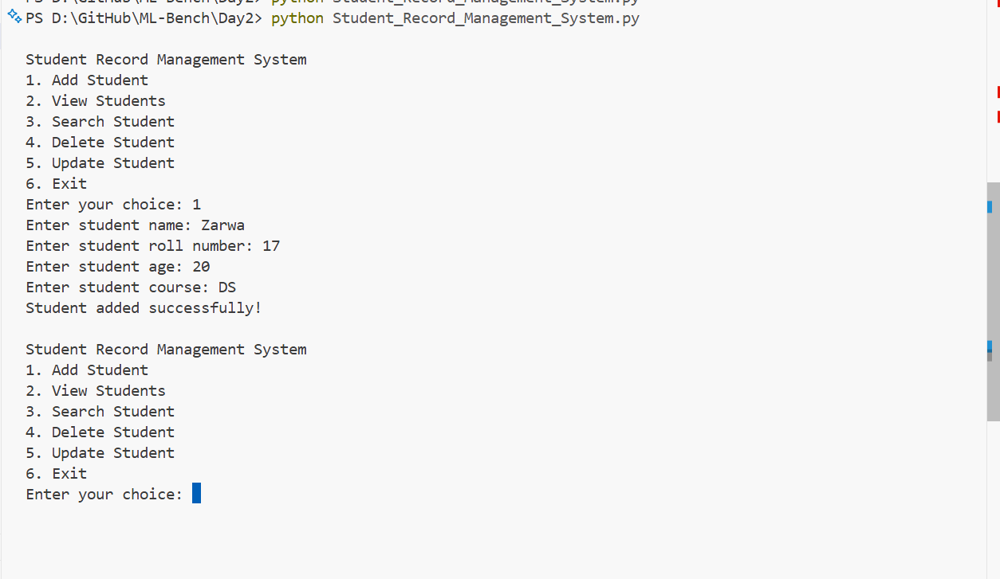
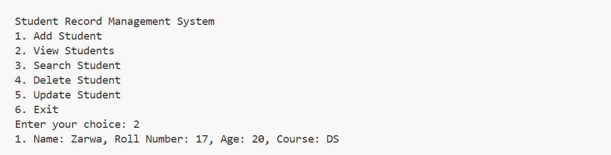
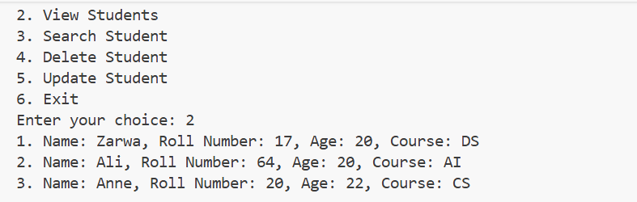
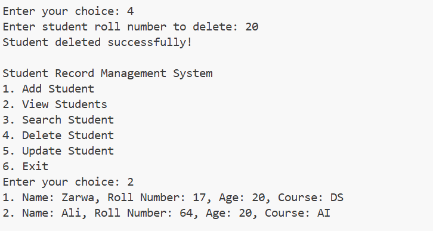
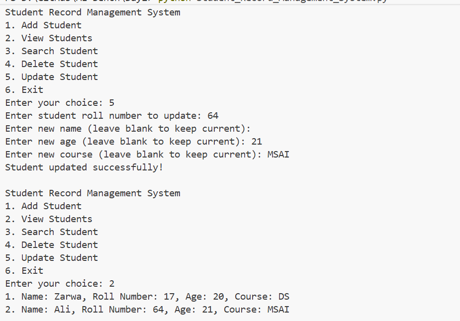
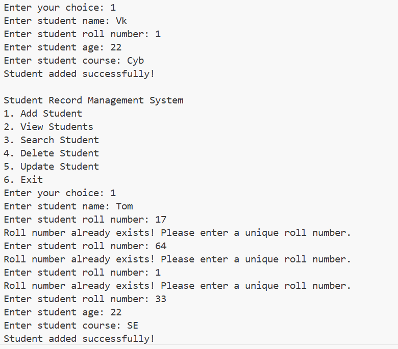
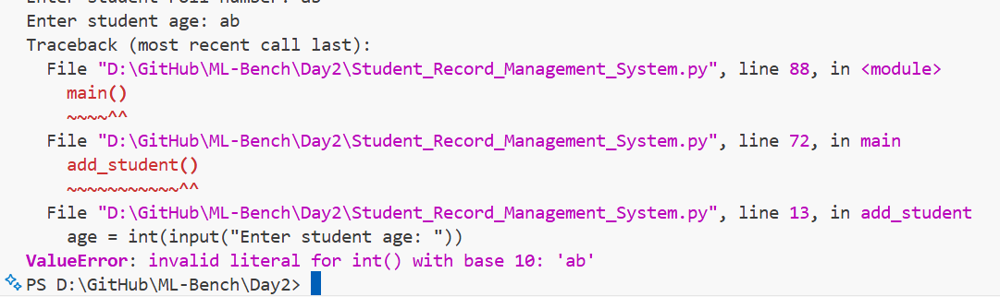

# Student Record Management System

This project is a simple Python console application for managing student records. It allows users to add, view, search, update, and delete student information efficiently while keeping the data in memory during the program session.

## Overview
The Student Record Management System was built as a beginner-friendly project to practice Python fundamentals such as:
- Lists and dictionaries
- User input handling
- Conditional logic
- Loops
- Functions
- Basic data validation

## Features
- Add a new student with name, roll number, age, and course
- View all stored students
- Search for a student by roll number
- Update an existing student record
- Delete a student record
- Prevent duplicate roll numbers
- Validate age input

## How to Run
1. Open the project folder in your terminal.
2. Run the following command:
   ```bash
   python Student_Record_Management_System.py
   ```
3. Use the menu options to manage student records.

## Project Files
- Student_Record_Management_System.py - Main program for the student management system with add, view, search, update, and delete features.
- list.ipynb - Notebook covering Python lists, indexing, slicing, methods, and list comprehensions.
- tuple.ipynb - Notebook covering Python tuples, immutability, indexing, slicing, and tuple operations.
- set.ipynb - Notebook covering Python sets, uniqueness, set operations, and set methods.
- dictionary.ipynb - Notebook covering Python dictionaries, key-value pairs, updates, and nested dictionaries.
- mylearnings.ipynb - Consolidated learning notebook with notes, examples, and practice on Python collections.
- lists.py - Python practice file demonstrating list creation, modification, methods, and basic list operations.
- tupl.py - Python practice file demonstrating tuple creation, indexing, slicing, and tuple-specific behavior.
- sets.py - Python practice file demonstrating set creation, adding/removing elements, and set operations.
- dictionary.py - Python practice file demonstrating dictionary creation, access, updates, and nested dictionary usage.

## Notebook and Python Practice Notes
These notebooks and scripts were created as part of the learning journey and cover core Python collection concepts:
- Lists: ordered, mutable collections
- Tuples: ordered, immutable collections
- Sets: unordered collections with unique values
- Dictionaries: key-value pair data structures

These files complement each other by showing the same concepts in both notebook form and simple Python scripts.

## Screenshots
### Add Student


### Search Student


### View All Students


### Delete a Student


### Update a Student


### Roll Number Uniqueness Check


### Age Validation


## Notes
This project is a great example of how a small Python program can be structured using functions and a simple menu-driven interface. It can be expanded later with features such as saving data to a file, adding a graphical interface, or connecting to a database.
