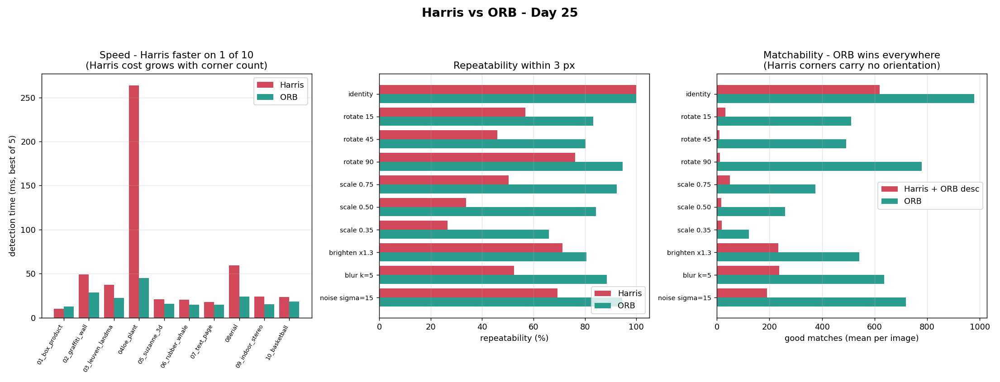
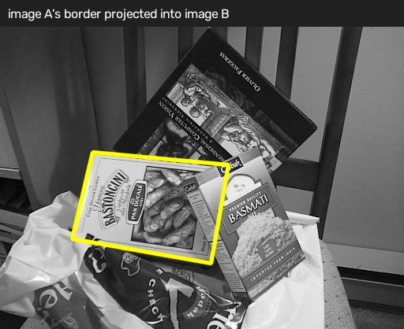
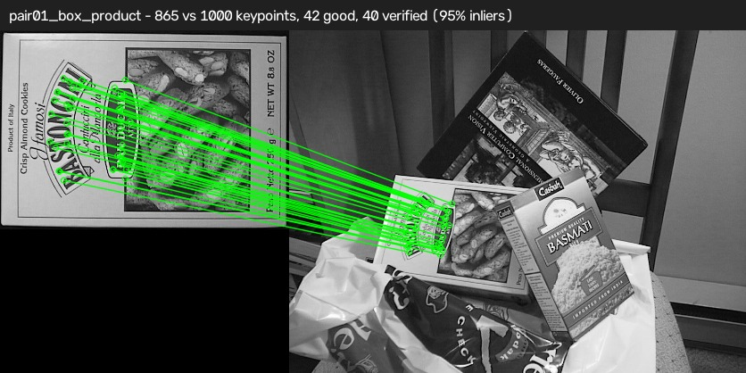

# Day 25 - Image Feature Matching System

Detect keypoints in two images, match them, and say how confident that match
is. Built with OpenCV's Harris corner detector and ORB, matched with a brute
force matcher, wrapped in a Streamlit app.

The short version of what I learned: **the matching is the easy part, and the
filtering is the whole job.** A brute force matcher hands back a nearest
neighbour for every single descriptor, including the ones that have no
counterpart in the other image at all. Left unfiltered it will confidently
tell you two unrelated photographs match. Every useful number in this project
comes from what happens *after* the match.

---

**Status of the two links:**

- **GitHub repository** — 
- **Public app URL** —
- **Screen recording** — 

## What is in here

```
Day25/
├── app.py                       Streamlit application  <- the deployed one
├── gradio_app.py                the same tool as a Gradio app (optional)
├── feature_detection.py         Harris + ORB detection (importable module + CLI)
├── feature_matching.py          ORB + Brute Force matching (importable module + CLI)
├── download_samples.py          Fetches the 10 sample pairs
├── run_all_pairs.py             Runs the pipeline over all 10 pairs, writes the results table
├── requirements.txt
├── README.md
├── HOW_TO_RUN.txt
├── .streamlit/config.toml       upload limit + theme
├── coding_practice/
│   ├── 01_harris_corners.py     Harris detection + threshold sweep + response heat map
│   ├── 02_orb_keypoints.py      ORB detection, what a keypoint actually contains
│   ├── 03_visualize_keypoints.py  Harris vs ORB, side by side
│   ├── 04_orb_bf_matching.py    Matching, and what each filter stage removes
│   └── 05_harris_vs_orb.py      Speed / repeatability / matchability benchmark
├── sample_images/               10 image pairs (20 files)
└── sample_outputs/              34 generated images + benchmark report + results table
```

Run everything in order:

```bash
python download_samples.py && python run_all_pairs.py && streamlit run app.py
```

---

## What are image features?

A **feature** is a small patch of an image you could find again in a different
photograph of the same thing.

That definition is doing more work than it looks. It rules out most of any
image. A patch of clear sky is useless - every other patch of sky looks
identical, so you could never say *which* piece of sky you had found. A patch
along a straight edge is nearly as bad: you can tell you are on the edge, but
you could slide along it forever without noticing, so its position is only
pinned down in one direction. This is the aperture problem, and it is why
corner-like patches are what detectors look for. At a corner, the image
changes in *two* independent directions at once, so the patch has a location
you can actually nail down.

In practice a feature comes in two parts, and they fail independently:

| Part | What it is | Answers |
|---|---|---|
| **Keypoint** | a location, often plus a scale and an angle | *where* is the interesting patch |
| **Descriptor** | a vector or bit string summarising the patch | *what does it look like* |

The detector finds keypoints. The descriptor describes them. You need both to
match anything - and as the benchmark below shows, you can have a detector
that re-finds a point perfectly while the descriptor still fails to recognise
it.

---

## Harris Corner Detection vs ORB

### Harris, in one paragraph

Harris slides a window over the image and asks: if I shift this window a
little, in *any* direction, does the content underneath change a lot? It
builds the structure tensor `M` from the x and y gradients in the window and
scores it:

```
R = det(M) - k * trace(M)^2
```

A large positive `R` means both eigenvalues of `M` are large, which is the
"changes in every direction" case - a corner. Flat regions score near zero,
edges score negative.

One detail most tutorials skip: `cv2.cornerHarris` returns a **response map,
not a list of corners**. A strong corner lights up a small cluster of pixels,
so thresholding alone reports one corner as thirty. This project thresholds
the map and then collapses each blob to a single point with
`connectedComponentsWithStats`, which is the difference between "4000 corners"
and the few hundred real ones. See `detect_harris` in
[feature_detection.py](feature_detection.py).

### ORB, in one paragraph

ORB = **O**riented FAST and **R**otated **B**RIEF. FAST finds candidate corners
cheaply, run once per level of an image pyramid so a corner is found whatever
size it appears at. Each survivor gets an orientation from the intensity
centroid of its patch. BRIEF then describes the patch as 256 binary intensity
comparisons, with the sampling pattern rotated by that orientation so the
description does not change when the image turns.

Worth knowing: ORB ranks its FAST candidates using **the Harris response**.
The two are not rivals so much as Harris wrapped in a pyramid, an angle, and a
descriptor.

### Measured, not asserted

`coding_practice/05_harris_vs_orb.py` benchmarks both over all 10 sample
images against known ground-truth transforms. Full output in
[sample_outputs/practice_05_report.txt](sample_outputs/practice_05_report.txt).



**Repeatability** - does the detector re-find the same physical point (within
3 px) after a known transform?

| Transform | Harris | ORB |
|---|---:|---:|
| identity | 100.0% | 100.0% |
| rotate 15° | 56.9% | 83.2% |
| rotate 45° | 45.9% | 80.2% |
| rotate 90° | 76.2% | 94.7% |
| scale 0.75 | 50.3% | 92.4% |
| scale 0.50 | 33.8% | 84.3% |
| scale 0.35 | 26.5% | 65.9% |
| brighten ×1.3 | 71.3% | 80.7% |
| blur k=5 | 52.3% | 88.5% |
| noise σ=15 | 69.3% | 94.4% |

**Matchability** - mean good matches per image, with ORB's descriptor attached
to *both* detectors' keypoints so only the detector differs:

| Transform | Harris + ORB descriptor | ORB |
|---|---:|---:|
| identity | 618.5 | 978.3 |
| rotate 45° | 10.2 | 491.7 |
| rotate 90° | 11.2 | 779.9 |
| scale 0.50 | 16.0 | 259.7 |
| blur k=5 | 236.8 | 636.0 |

Three findings I did not expect going in:

**1. Harris was not the fast one.** Mean detection time came out around 52 ms
for Harris against 21 ms for ORB - the opposite of what "Harris is the cheap
one" led me to expect. The Harris *response map* alone is genuinely cheap
(18 ms, less than either), but Harris has no feature budget: it returns every
corner above the threshold and then pays connected components and
`cornerSubPix` on all of them. On the aloe image that meant 5066 corners and
264 ms, against ORB's capped 1000 in 45 ms. ORB's `nfeatures=1000` bounds its
work no matter how busy the image is, and predictable cost matters more in
practice than a low best case.

(Timings are wall-clock on one machine and will shift run to run; the
repeatability and matchability figures below are deterministic.)

**2. Rotation invariance is a property of the operator, not the pipeline.**
Harris' `R` is built from eigenvalues, which do not depend on the window's
orientation, so the textbook calls it rotation invariant. Measured, it still
dropped to 45.9% at 45°. The loss comes from everything around the operator: a
square window, discrete Sobel kernels, and interpolation introduced by the
warp itself. Note that rotate 90° scores far better than rotate 45° for both
detectors - a quarter turn needs no interpolation at all.

**3. Detector failure and descriptor failure look nothing alike.** Under
rotate 90°, Harris re-finds 76% of its corners but almost none of them match
(11 against ORB's 780). Those two numbers together locate the fault exactly:
the detector is fine, the *descriptor* is broken. A Harris corner has no
orientation, so BRIEF lays its sampling pattern down at a fixed angle and reads
the rotated patch in the wrong order. Rotating that pattern is the entire
"Rotated BRIEF" half of ORB's name. Only running both experiments tells you
which half you are looking at.

### Summary

| | Harris | ORB |
|---|---|---|
| Output | (x, y) positions | position + scale + angle + 256-bit descriptor |
| Scale invariant | no | yes (image pyramid) |
| Rotation invariant | in theory; degrades in practice | yes, and it holds up |
| Can match on its own | **no** | yes |
| Cost | unbounded, grows with corner count | bounded by `nfeatures` |
| Good for | corners in one image at one scale: tracking, calibration targets, sub-pixel refinement | putting two different images into correspondence |

Harris is a corner detector. ORB is a complete feature pipeline. For this
project only ORB can do the job, which is why the app matches with ORB and
offers Harris purely as a visual comparison.

---

## How feature matching works

Four stages. The last two are where the real work happens.

**1. Describe.** Run ORB on both images. Each gives back N keypoints and an
N×32 matrix of `uint8` - 256 bits per keypoint.

**2. Brute force match.** For every descriptor in image A, find the closest
descriptor in image B. "Closest" here is **Hamming distance** - the number of
differing bits - because ORB descriptors are bit strings, not vectors.
Comparing two is a XOR and a popcount, which is why brute force stays cheap
even at 1000 keypoints each.

The catch: this stage *always* returns a nearest neighbour. Every keypoint
gets a match whether or not it has any counterpart in the other image.

**3. Lowe's ratio test.** For each descriptor find the **two** nearest
neighbours and keep the match only if:

```
best.distance < 0.75 * second_best.distance
```

The reasoning: if the best and second-best candidates are about equally close,
the patch is ambiguous - something repetitive like brickwork or text - and the
"best" one is a coin flip. Only a match that is decisively better than its
runner-up is worth keeping.

This is a precision/recall dial, measured on the box pair
(`coding_practice/04_orb_bf_matching.py`):

| Ratio | Good matches | Verified | Inlier rate |
|---:|---:|---:|---:|
| 0.60 | 13 | 13 | 100.0% |
| 0.70 | 30 | 29 | 96.7% |
| **0.75** | **42** | **40** | **95.2%** |
| 0.80 | 51 | 46 | 90.2% |
| 0.90 | 149 | 67 | 45.0% |

At 0.90 the match count more than triples and over half of them are wrong.
0.75 is the usual default and it holds up here.

**4. RANSAC geometric verification.** Individual descriptor matches can still
be wrong, but wrong matches rarely *agree* with each other. RANSAC repeatedly
fits a homography through a random handful of matches and keeps whichever fit
the most matches support. Matches consistent with that transform are inliers;
the rest are discarded.

On the box pair, filtering goes: **865 nearest neighbours → 42 after the ratio
test (4.9%) → 40 after RANSAC.** Over 95% of what brute force produced was
noise.

Once you have a homography you can use it. This is the step behind panorama
stitching, planar AR overlays and "find this product on the shelf" - projecting
image A's border through it lands the outline on the object in image B:



A caveat I hit: a homography only models a plane or a pure camera rotation.
For the stereo pairs here (`pair04`, `pair09`) the scene has real depth, so a
single homography cannot fit everything and the inlier rate looks mediocre -
66.9% and 75.0% - even though the matches are fine. A fundamental matrix would
model those correctly. The inlier rate measures *agreement with the assumed
model*, not match quality, and those come apart when the model is wrong.

---

## Results across all 10 pairs

From `python run_all_pairs.py`:

| Pair | Category | Keypoints A | Keypoints B | Good | Verified | Inlier % |
|------|----------|------------:|------------:|-----:|---------:|---------:|
| `pair01_box_product` | Product / object in clutter | 865 | 1000 | 42 | 40 | 95.2% |
| `pair02_graffiti_wall` | Building wall | 1000 | 1000 | 100 | 89 | 89.0% |
| `pair03_leuven_landmark` | Landmark | 1000 | 1000 | 67 | 41 | 61.2% |
| `pair04_aloe_plant` | Object, two angles | 1000 | 1000 | 239 | 160 | 66.9% |
| `pair05_suzanne_3d` | Object, two angles | 1000 | 1000 | 106 | 91 | 85.8% |
| `pair06_rubber_whale` | Product / toys | 948 | 949 | 672 | **666** | **99.1%** |
| `pair07_text_page` | Book cover / text | 972 | 1000 | 137 | 88 | 64.2% |
| `pair08_aerial` | Landmark from the air | 1000 | 1000 | 3 | **0** | **0.0%** |
| `pair09_indoor_stereo` | Indoor scene | 1000 | 1000 | 60 | 45 | 75.0% |
| `pair10_basketball` | Scene, camera motion | 1000 | 1000 | 498 | 471 | 94.6% |

All 20 images come from OpenCV's public `samples/data` folder - real
photographs and renders, not synthetic warps of one image, so these numbers
are honest ones. `download_samples.py` fetches them.

### Which pair matched best, and why

**By raw count: `pair06_rubber_whale`** - 666 verified matches at a 99.1%
inlier rate, the highest in both columns.

But it is worth being precise about *why*, because the reason is slightly
deflating: it is two consecutive frames of a nearly static scene. Objects
shift by a few pixels and nothing else changes. There is no scale change, no
rotation, no lighting change, and no new viewpoint. Every keypoint has an
obvious counterpart a few pixels away, and the descriptors are nearly
identical - mean Hamming distance 18 out of 256. It scores highest because it
is the *easiest*, not because ORB did anything clever. `pair10_basketball`
(471 verified, 94.6%) is the same story.

**The most impressive result is `pair01_box_product`** - 40 verified matches at
95.2%. The count is low, but look at what it had to survive: the cookie box is
photographed flat and alone in image A, then appears in image B rotated,
smaller, partially occluded, and surrounded by three other boxes with similar
packaging. Only ~5% of keypoints found a match, and 95% of those were correct.
That is scale invariance, rotation invariance and descriptor distinctiveness
all working at once, and the homography still lands cleanly on the box.



**`pair02_graffiti_wall`** deserves the same note - 89 verified at 89.0% across
roughly a 40° viewpoint change on a flat wall, which is close to the limit of
what a planar homography can absorb.

So: highest score goes to the easiest pair, and the result worth pointing at is
the hard one that still worked. Raw match count mostly measures how similar the
two images were to begin with.

### The failure: `pair08_aerial`

Two aerial passes over the same city - the same road junction and blue-roofed
complex are visible in both - and ORB found **3** good matches, **0** of which
survived RANSAC. I tried to rescue it:

| Features | Ratio | Good | Verified |
|---:|---:|---:|---:|
| 1000 | 0.75 | 3 | 0 |
| 1000 | 0.85 | 34 | 7 |
| 3000 | 0.75 | 13 | 5 |
| 6000 | 0.85 | 234 | 5 |

Loosening the ratio to 0.85 and raising the budget six-fold takes good matches
from 3 to 234 while verified inliers stay stuck around 5 - below the 10 needed
to trust a homography at all. That flat line is the tell: the extra matches are
all noise. Three things compound here - aerial texture is self-similar (trees
and rooftops look alike everywhere, so the ratio test correctly kills almost
everything), the viewpoint and rotation differ substantially, and the overlap
between the two frames is only partial.

This is the pair I learned the most from. It is what a genuine non-match looks
like from the inside, and it is why the app reports verified matches rather
than good matches: a user tweaking the ratio slider upward would watch "good
matches" climb into the hundreds and conclude it was working.

---

## The Streamlit app

```bash
streamlit run app.py     # http://localhost:8501
```

- Pick one of the 10 built-in sample pairs, or upload two images of your own
- Five headline metrics across the top: keypoints in A, keypoints in B, good
  matches, verified matches, inlier rate - plus a verdict banner that colours
  green / amber / red
- **Matches** tab: matched keypoints drawn as lines between the images
- **Keypoints** tab: what was detected in each image, with a sidebar toggle to
  swap ORB keypoints for Harris corners
- **Location** tab: image A's border projected into image B via the homography
- **Details** tab: image sizes, match rate, timings, Hamming distance spread
  and the estimated homography matrix
- Sidebar settings: ORB budget, Lowe ratio, how many lines to draw

A Gradio version of the same tool is kept in `gradio_app.py` (`python
gradio_app.py`), since the brief originally asked for Gradio. Both front ends
call the identical `feature_detection` / `feature_matching` modules, so they
report the same numbers - only `app.py` is deployed.

Uploads are downscaled to 1000 px on the long side before processing, so
timings stay comparable and large phone photos do not stall the app.

The verdict thresholds mirror what the geometry can actually support: under 10
verified inliers a homography is not identifiable, so the app calls it "no
match" no matter how many good matches the ratio test produced.

---

## Deployment

### Streamlit Community Cloud (the intended target)

The folder deploys as-is - `app.py` at the root with `requirements.txt` beside
it, which is exactly the layout Streamlit Cloud expects.

1. Push this repo to GitHub.
2. Go to [share.streamlit.io](https://share.streamlit.io) and sign in with
   GitHub.
3. **New app** → pick the repo and branch → set **Main file path** to
   `Day25/app.py`.
4. Deploy. The public URL is `https://<app-name>.streamlit.app`.

Because the main file sits in a subfolder, Streamlit Cloud installs from
`Day25/requirements.txt` automatically - no need to move anything to the repo
root.

### Hugging Face Spaces (alternative)

Spaces runs Streamlit too, but it requires a YAML header at the top of the
README rather than reading `requirements.txt` alone:

```yaml
---
title: Image Feature Matching System
emoji: 🔍
colorFrom: indigo
colorTo: green
sdk: streamlit
sdk_version: 1.45.0
app_file: app.py
---
```

```bash
pip install huggingface_hub
huggingface-cli login
huggingface-cli repo create day25-feature-matching --type space --space_sdk streamlit
git clone https://huggingface.co/spaces/<your-username>/day25-feature-matching
cp -r Day25/* day25-feature-matching/     # then add the header above
cd day25-feature-matching && git add . && git commit -m "Day 25" && git push
```

The header is deliberately not in this file, since it would render as a stray
table on GitHub and Streamlit Cloud does not use it.

### Notes that matter for either target

`requirements.txt` pins **`opencv-python-headless`** rather than
`opencv-python`. The full build links against system GUI libraries that are not
installed on either platform's containers, and the import fails at startup with
a `libGL.so` error. Nothing here calls `cv2.imshow`, so headless is the correct
dependency and it avoids needing a `packages.txt` at all.

`sample_images/` is 4.5 MB, comfortably inside both platforms' limits, so the
sample pairs ship with the app instead of being downloaded at startup.

`.streamlit/config.toml` caps uploads at 20 MB. Anything larger is downscaled
to 1000 px on the long side anyway, so a bigger limit would just mean slower
uploads for identical results.


---

## Running the coding practice scripts

```bash
python coding_practice/01_harris_corners.py       # Harris + threshold sweep
python coding_practice/02_orb_keypoints.py        # ORB, keypoint anatomy
python coding_practice/03_visualize_keypoints.py  # Harris vs ORB side by side
python coding_practice/04_orb_bf_matching.py      # matching + filter stages
python coding_practice/05_harris_vs_orb.py        # full benchmark (~2 min)
```

Both modules also work as CLI tools:

```bash
python feature_detection.py sample_images/pair02_graffiti_wall_a.png
python feature_matching.py sample_images/pair01_box_product_a.png sample_images/pair01_box_product_b.png
```

---


