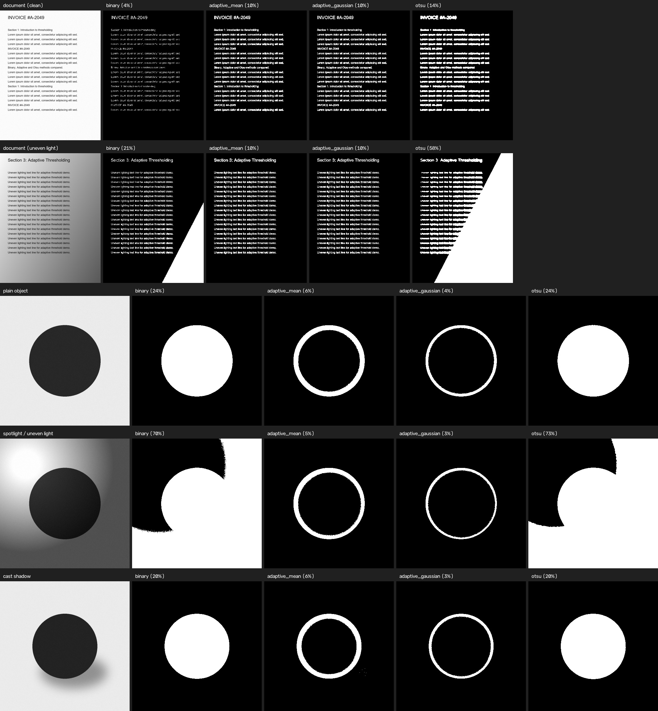

# Day 26 - Document & Object Segmentation Tool

Image segmentation with OpenCV: binary / adaptive / Otsu thresholding, the
watershed algorithm, and a full foreground/background pipeline, wrapped in a
Streamlit app. Built for the Day 26 task ("Introduction to Image
Segmentation").

**Live demo:** 




## What is image segmentation?

Segmentation partitions an image into regions and decides, **pixel by
pixel**, which ones belong to an object of interest and which don't. That's
a stronger claim than object detection, which only draws a box around
*where* something roughly is:

| | Object Detection | Image Segmentation |
|---|---|---|
| Output | A bounding box + class label | A mask - every pixel labelled |
| Answers | "There's a document here, roughly" | "These exact pixels are the document" |
| Boundary precision | Rectangle, ignores actual shape | Follows the true outline |
| Typical use | Counting, localizing, tracking | Cutting out, measuring area, medical diagnosis |

Two flavours of segmentation matter for most computer vision work:

- **Semantic segmentation** labels every pixel with a *class* ("text",
  "background") but does not distinguish separate instances of the same
  class - two overlapping objects of the same type merge into one region.
- **Instance segmentation** goes further and separates individual objects of
  the same class from each other, even when they touch. This project's
  watershed step (`segmentation.watershed_segmentation`) is a classic,
  pre-deep-learning way to do exactly that for simple touching shapes -
  Mask R-CNN and friends are the deep-learning descendants of the same idea.

**Real-world applications:** tumour/organ outlining in medical scans,
lane and drivable-area segmentation for autonomous vehicles, crop vs. weed
vs. soil masks in agriculture, and background removal / object cut-out in
photo editing - which is exactly what this project's mini tool does for
documents and objects.


## Binary vs. Adaptive vs. Otsu thresholding

All three turn a grayscale image into a black/white mask by asking, for
every pixel, "is this foreground or background?" - they differ in **how the
cutoff is chosen**.

**Binary thresholding** (`cv2.threshold`, `THRESH_BINARY`) uses one fixed
number, picked by hand, for the whole image: `pixel > t -> white`. It's the
cheapest and most predictable method, but that one number has to be right
for *every* pixel in the image, which only holds when lighting is even.

**Adaptive thresholding** (`cv2.adaptiveThreshold`) recomputes the cutoff
**locally**: each pixel is compared to the mean (or Gaussian-weighted mean)
of its own neighbourhood, minus a constant `C`. Because the cutoff moves
with the local neighbourhood, it survives lighting gradients and shadows
that break a single global threshold. The cost: on a *large, solid* object,
the pixels deep inside it sit in a neighbourhood that is entirely dark, so
the local mean is close to the pixel's own value and it never crosses its
own threshold - adaptive thresholding ends up outlining the object's edges
rather than filling it in. It is at its best on thin, high-frequency
structure like printed text, and at its worst on big flat shapes.

**Otsu's method** (`cv2.threshold(..., type=THRESH_OTSU)`) also produces one
global cutoff like binary thresholding, but picks it *automatically* by
scanning the grayscale histogram for the value that best splits it into two
classes (minimising within-class variance / maximising between-class
variance). When the histogram is clearly bimodal - a dark object, a light
background, not much in between - Otsu finds a threshold at least as good as
a hand-picked one, with no manual tuning. It inherits binary thresholding's
core weakness, though: it still picks *one* number for the whole image, so a
lighting gradient shifts the histogram and drags the automatic cutoff with
it.

**Watershed** doesn't threshold at all in the usual sense - it treats the
distance-transform of an existing foreground mask as a topographic surface
and "floods" it from seed points (one per object), drawing a boundary line
wherever two floods meet. It's the tool for the one thing thresholding
structurally cannot do: **separating objects that touch**, since a threshold
only knows "foreground vs. background," not "object A vs. object B" within
one connected blob.

**Background removal / foreground segmentation** in this project
(`segment_foreground` / `remove_background`) is thresholding plus cleanup:
morphological opening removes stray noise specks, morphological closing
fills small holes, and contour-area filtering drops anything smaller than a
tunable fraction of the image. Raw thresholding on its own is rarely clean
enough to use directly - this pipeline is what turns a threshold into a
usable single-object mask.


## Dataset

`sample_images/` holds 17 images, rendered by `generate_samples.py` rather
than downloaded (see **Challenges** below for why), covering all four
required categories:

| Category | Count | Files |
|---|---|---|
| Documents | 5 | `doc01`-`doc05` (clean, tinted background, coffee stain, scan blur, uneven light) |
| Plain-background objects | 6 | `obj01`-`obj06` (circle/square/star/triangle, one light-on-dark, one overlapping-circles pair for watershed) |
| Uneven lighting | 3 | `light01`-`light03` (spotlight gradient across a shape) |
| Cast shadows | 3 | `shadow01`-`shadow03` (soft elliptical shadow beside a shape) |

Run `python generate_samples.py` to (re)create them, or drop your own images
into `sample_images/` / upload through the app.


## Results

Full sweep from `python run_all_samples.py` (foreground % of image area;
`Cleaned components` = surviving blobs after `segment_foreground`'s
morphology + contour-area cleanup):

| Image | Category | Binary fg% | Adaptive-Mean fg% | Adaptive-Gaussian fg% | Otsu fg% | Otsu t | Cleaned components |
|---|---|---|---|---|---|---|---|
| doc01_invoice_clean.jpg | document | 4.4 | 8.7 | 7.4 | 11.7 | 208 | 0 |
| doc02_report_tinted_bg.jpg | document | 4.7 | 8.9 | 7.6 | 12.0 | 203 | 0 |
| doc03_report_coffee_stain.jpg | document | 4.7 | 8.9 | 7.6 | 12.8 | 207 | 1 |
| doc04_report_scanned_blur.jpg | document | 2.2 | 12.2 | 10.4 | 13.0 | 206 | 0 |
| doc05_report_uneven_light.jpg | document | 20.0 | 9.0 | 7.9 | **55.4** | 162 | 3 |
| light01_circle_spotlight.jpg | uneven lighting | **70.3** | 3.4 | 1.8 | **72.8** | 139 | 1 |
| light02_square_spotlight.jpg | uneven lighting | **73.3** | 4.1 | 2.2 | **74.6** | 135 | 1 |
| light03_star_spotlight.jpg | uneven lighting | **62.5** | 3.5 | 1.9 | **68.0** | 146 | 1 |
| obj01_circle_on_white.jpg | plain object | 23.8 | 3.9 | 2.3 | 23.9 | 137 | 1 |
| obj02_square_on_white.jpg | plain object | 30.2 | 4.7 | 2.8 | 30.4 | 137 | 1 |
| obj03_star_on_white.jpg | plain object | 10.1 | 3.9 | 2.3 | 10.1 | 138 | 1 |
| obj04_triangle_on_white.jpg | plain object | 15.2 | 3.9 | 2.3 | 15.2 | 135 | 1 |
| obj05_circle_light_on_dark.jpg | plain object | 76.2 | 4.2 | 2.3 | 76.1 | 124 | 1 |
| obj06_overlapping_circles_watershed.jpg | plain object | 33.3 | 6.4 | 3.7 | 33.4 | 139 | 1 (3 after watershed) |
| shadow01_circle_cast_shadow.jpg | cast shadow | 19.7 | 3.4 | 2.0 | 19.8 | 132 | 1 |
| shadow02_square_cast_shadow.jpg | cast shadow | 25.1 | 4.3 | 2.5 | 25.2 | 132 | 1 |
| shadow03_triangle_cast_shadow.jpg | cast shadow | 12.6 | 3.4 | 2.0 | 12.7 | 133 | 1 |

(Full table: [`sample_outputs/results_table.md`](sample_outputs/results_table.md).
Per-image comparison panels: `sample_outputs/compare_*.jpg`.)


### Which method worked best for this dataset, and why

**No single method won across every category** - that's the actual lesson
of the sweep above, not a caveat:

- **Plain objects, even lighting** (`obj01`-`obj05`): binary and Otsu agree
  almost exactly (e.g. `obj01`: 23.8% vs. 23.9%) and both correctly fill the
  whole shape. The histogram here is cleanly bimodal, which is exactly
  Otsu's assumption - so **Otsu wins on convenience** (no threshold to hand
  pick) with no accuracy cost.

- **Clean documents** (`doc01`-`doc03`): binary/Otsu also agree closely and
  both binarize the text legibly. Adaptive reads similarly well but is 3-8x
  slower for no benefit here, since lighting is already even.

- **Uneven lighting** (`doc05`, `light01`-`light03`): this is where binary
  and Otsu fall apart. Otsu on `doc05` jumps from ~12% (its clean sibling
  `doc01`) to **55.4%** - the lighting gradient shifted the histogram and
  dragged the automatic cutoff with it, swallowing half the page as "one big
  bright blob". The `light0*` set is worse still: binary and Otsu both blow
  past 60-74% because the spotlight halo reads as brighter than the actual
  object's dark pixels. **Adaptive-Gaussian is the correct choice here** -
  it stays close to its own clean-image number (`doc05`: 7.9% vs. `doc01`'s
  7.4%) because each pixel only competes with its own neighbourhood, not the
  whole frame.

- **But adaptive is not simply "the good one"**: on every plain-object row
  its foreground % is roughly 5-10x *lower* than binary/Otsu's correct
  number (e.g. `obj05`: 2.3% vs. 76.1%). Zoom into
  `sample_outputs/practice_04_comparison_grid.jpg` and adaptive is only
  tracing a *ring* around each shape - the interior is uniformly dark, so no
  pixel there beats its own local neighbourhood's threshold. Adaptive is the
  right tool specifically for thin, high-frequency structure (text strokes)
  or genuinely uneven lighting, not for large solid objects.

- **Cast shadows** (`shadow01`-`shadow03`): binary and Otsu handle these
  fine on their own (shadow pixels aren't dark enough to cross the object's
  threshold), but the shadow's soft tail still leaves noise in the raw mask.
  `segment_foreground`'s morphological opening/closing is what actually
  cleans that up before the object is cut out - see
  `sample_outputs/practice_05_background_removal.jpg`.

**Bottom line:** Otsu is the default that should run first (automatic,
matches or beats a hand-tuned binary threshold on anything close to
bimodal); switch to adaptive-Gaussian specifically when the image has a
lighting gradient or shadow *and* the target is thin/textured (text, not a
solid blob); and always run the morphology + contour cleanup
(`segment_foreground`) before treating any raw threshold as a final mask.
Touching objects need watershed regardless of which threshold produced the
mask, since none of the threshold methods can split a merged blob.


## Challenges faced during implementation

- **Sourcing a labelled 15-image dataset across 4 specific categories**
  (documents / plain objects / uneven lighting / shadows) from a public URL
  turned out to be the hardest part, not the segmentation code. Public test
  sets aren't labelled by "has a shadow" or "has uneven lighting," and a
  download step adds a network dependency that can silently fail during
  grading. Solved by writing `generate_samples.py` to *render* all 17
  images with Pillow/numpy instead - it guarantees exact category coverage
  and needs no network access, at the cost of the images being synthetic
  rather than photographs.

- **The naive watershed recipe fails on same-sized touching objects.** The
  textbook approach (`sure_fg = dist > 0.5 * dist.max()`) only separates
  blobs whose distance-transform peak is much lower than the image's global
  maximum. Three similarly-sized touching circles all sit close to that
  global max, so the "sure foreground" region stayed one connected blob and
  watershed produced zero splits. Fixed by finding **local maxima** in the
  distance map instead (`_local_maxima_seeds` in `segmentation.py`, via
  dilate-and-compare) - one seed per object regardless of how its peak
  compares to its neighbours'.

- **A naive "which method is best" heuristic lied.** An early version of
  `run_all_samples.py` flagged a method as "best" whenever binary and Otsu's
  foreground percentages disagreed by more than 10 points. On the spotlight
  images, binary and Otsu actually *agree* with each other (~70% each) while
  both are wrong - the heuristic called that "otsu wins" when the honest
  answer is "both fail, adaptive wins, but adaptive isn't right either
  because the object is a large solid shape." Replaced the auto-verdict with
  the actual per-image numbers and wrote out the category-by-category
  analysis above instead of trusting a single scalar comparison.

- **Adaptive thresholding under-segmenting large objects** initially looked
  like a bug (2-4% foreground where 15-25% was expected) until plotting the
  mask directly showed it was only tracing object *outlines*. That's
  correct behaviour, not a bug - it's the fundamental trade-off of a
  neighbourhood-local method, and became one of the more useful findings in
  the results table above.


## Project layout

```
Day26/
  segmentation.py                    core module: all thresholding/watershed/segmentation logic
  app.py                             Streamlit app
  generate_samples.py                renders the 17 sample images
  run_all_samples.py                 runs every method on every sample, writes results_table.md
  coding_practice/
    01_grayscale_and_binary_threshold.py
    02_adaptive_threshold.py
    03_otsu_threshold.py
    04_compare_thresholding_methods.py
    05_watershed_and_background_removal.py
  sample_images/                     17 generated images (4 required categories)
  sample_outputs/                    every script's output lands here
  requirements.txt
  runtime.txt
  .streamlit/config.toml
  HOW_TO_RUN.txt
```


## Setup & run

```bash
pip install -r requirements.txt
python generate_samples.py     # renders sample_images/, ~2 seconds, no network needed
streamlit run app.py           # http://localhost:8501
```

See [`HOW_TO_RUN.txt`](HOW_TO_RUN.txt) for every script and CLI entry point,
including how to reproduce every image in `sample_outputs/`.

The app lets you: pick a sample image or upload your own, choose a
segmentation method (Binary / Adaptive-Mean / Adaptive-Gaussian / Otsu /
Watershed / Foreground-Background Segmentation), tune that method's
parameters live, compare all four thresholding methods side by side, and
download the current result (or the cleaned foreground cut-out) as a PNG.
