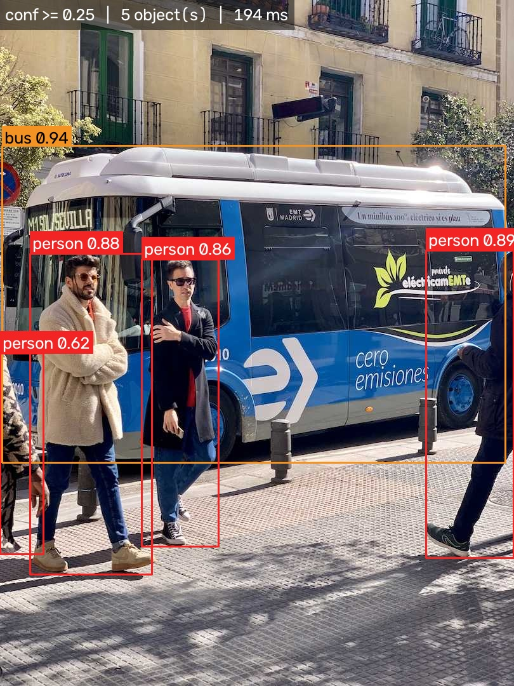

# Day 27 - Smart Object Detection Application (YOLO)

Real-time object detection with a pretrained **YOLO11** model - upload an
image or a short video and get back bounding boxes, class names and
confidence scores, wrapped in a Streamlit app. Built for the Day 27 task
("Introduction to Object Detection").

**Live demo:**


**APP LINK:** _add the Streamlit Community Cloud URL here after deploying_




## What is object detection?

Object detection answers two questions at once for every object in an
image: **what is it, and where is it?** It sits between two other computer
vision tasks:

| | Image Classification | Object Detection | Image Segmentation |
|---|---|---|---|
| Output | One label for the whole image | A box + label per object | A pixel mask per object |
| Answers | "This image contains a dog" | "Dog at (120,50)-(300,400)" | "These exact pixels are the dog" |
| Localizes objects? | No | Yes (rectangle) | Yes (exact shape) |
| Counts multiple objects? | No | Yes | Yes |

Three ideas make up every detection:

- **Bounding box** - the rectangle `(x1, y1, x2, y2)` tightly enclosing an object.
- **Class label** - which of the model's known categories the object belongs to.
- **Confidence score** - a 0-1 number for how sure the model is; detections
  below a chosen threshold are discarded (this app's threshold is a sidebar
  slider, and is also burned into every output image/video as a banner so
  it's visible without the surrounding UI).

**Real-world applications:** self-driving cars (pedestrians/vehicles/signs),
retail shelf and inventory monitoring, security/intrusion detection, medical
imaging (tumour localisation), agriculture (crop/pest counting), sports
analytics (player/ball tracking), manufacturing defect detection.


## How YOLO differs from image classification

A classifier looks at a whole image and outputs one label - it has no idea
*where* the dog is, or whether there's more than one. **YOLO ("You Only
Look Once")** instead does detection in a single forward pass through one
neural network: it looks at the image once and directly predicts every
bounding box, class and confidence score at the same time, rather than
classifying the whole frame or scanning it region-by-region across separate
stages. That single-pass design is what makes it fast enough for real-time
video, which is exactly the video half of this project.

**Pipeline (backbone -> neck -> head -> NMS):**
1. **Backbone** - a CNN extracts feature maps at several scales (small vs.
   large objects need different resolutions).
2. **Neck** - merges those multi-scale features so the model has both fine
   detail and broader context.
3. **Head** - for each location on the feature grid, predicts box
   coordinates, an objectness/confidence score, and class probabilities.
   YOLOv8/YOLO11 are **anchor-free** - they predict box centers/sizes
   directly instead of adjusting a fixed set of predefined anchor shapes.
4. **Non-Maximum Suppression (NMS)** - the raw head produces many
   overlapping boxes per object; NMS keeps only the highest-confidence one
   and drops the redundant duplicates. The sidebar's "IoU threshold"
   controls how aggressive this step is.

**Model variants (n / s / m / l / x):** each YOLO generation ships in
nano -> extra-large sizes. Smaller = fewer parameters = faster but less
accurate; larger = the opposite. `n`/`s` are the only sizes that run
comfortably on CPU in real time, which matters here since Streamlit Cloud's
free tier has no GPU.

| Variant loaded in this project | Parameters | Notes |
|---|---|---|
| YOLOv8n | 3,157,200 | previous generation, still very fast |
| YOLO11n | 2,624,080 | **used by default in this project** - fewer params, comparable/better accuracy |
| YOLO11s | larger | offered in the app as an optional "more accurate, slower" toggle |

**Inference vs. training:** training shows the network thousands of
labelled images and adjusts its weights so its predictions match the
ground-truth boxes. Inference just runs an already-trained model's frozen
weights on new input - no weights change. Everything in this project is
inference: the models are pretrained on **COCO** (80 everyday classes -
person, car, dog, chair, bottle, ...) and never fine-tuned.


## Which YOLO model this project uses

**YOLO11n** (nano) is the default, loaded in `detection.py::load_model()`
and used by `app.py` and every `coding_practice/` script. It's the newest,
smallest, fastest Ultralytics variant - the right choice for a free,
CPU-only, shared Streamlit Cloud host. `coding_practice/01_install_and_load_model.py`
also loads **YOLOv8n** side by side to compare parameter counts (see table
above), and the app's sidebar lets you switch to **YOLO11s** for a
slower-but-more-accurate pass.


## What the application detects

Any of the 80 COCO classes the model was trained on. Across the 12 bundled
sample images at the default 0.25 confidence threshold, it actually found
**18 different classes and 41 total detections**:

`person, teddy bear, cat, potted plant, remote, couch, bed, bottle, chair,
stop sign, truck, refrigerator, oven, tennis racket, skis, sports ball, bus,
tie`

Full per-image breakdown: [`sample_outputs/results_table.md`](sample_outputs/results_table.md).

| Image | Objects found | Classes |
|---|---|---|
| coco_cats_couch.jpg | 4 | cat, couch, remote |
| coco_scene_632.jpg | 5 | bed, bottle, chair, potted plant |
| coco_scene_724.jpg | 2 | stop sign, truck |
| coco_scene_776.jpg | 3 | teddy bear |
| coco_scene_802.jpg | 2 | oven, refrigerator |
| coco_scene_872.jpg | 2 | person |
| coco_scene_885.jpg | 4 | person, tennis racket |
| coco_skier.jpg | 2 | person, skis |
| opencv_basketball.png | 2 | person |
| opencv_messi.jpg | 7 | person, sports ball |
| ultralytics_bus.jpg | 5 | bus, person |
| ultralytics_zidane.jpg | 3 | person, tie |

**Videos:** a 15s clip of real CCTV pedestrian footage (`vtest_pedestrians.mp4`,
trimmed from OpenCV's public sample data) detected `person`, `car`, `truck`
and (a few misclassified) `dog` across its 150 frames; a 15s slideshow built
from the sample photos above (`coco_slideshow.mp4`) detected `person`,
`cat`, `potted plant`, `refrigerator`, `book`, `remote`, `skis` and `sports
ball` as each photo panned into frame. Full stats: run
`python coding_practice/03_detect_videos.py`.


## Dataset

`sample_images/` holds 12 real photographs (not synthetic renders - a
COCO-trained model won't recognize drawn shapes the way it recognizes real
photos), from three sources:

| Source | Count | How |
|---|---|---|
| Bundled with the `ultralytics` package | 2 | copied locally, zero network dependency |
| COCO val2017 (`images.cocodataset.org`) | 8 | the exact dataset the pretrained weights were trained on |
| OpenCV's public `samples/data` | 2 | extra class variety (sports ball / court scene) |

`sample_videos/` holds 2 short (~15s) clips: `vtest_pedestrians.mp4` (real
CCTV footage, trimmed from OpenCV's sample data) and `coco_slideshow.mp4`
(assembled from the photos above - see **Challenges** for why).

Run `python download_samples.py` to (re)fetch everything, or drop your own
images/videos into `sample_images/` / `sample_videos/`, or just upload
through the app.


## Challenges faced during implementation

- **Sourcing >=10 real, COCO-detectable photos** was the actual hard part,
  not the detection code. Day 26's approach (render synthetic shapes with
  Pillow, for zero network dependency) doesn't work here - YOLO's COCO
  weights recognize real photographs, not drawn circles/squares. Solved
  with three stable sources instead of guessing random URLs: the two demo
  images bundled inside the installed `ultralytics` package itself (no
  network needed at all), eight photos from COCO's own val2017 hosting
  (verified reachable before committing to the list, since it's literally
  the training distribution), and three from OpenCV's long-standing public
  `samples/data` folder (already proven reliable by Day 25's own
  `download_samples.py`).

- **`curl` over HTTPS to `images.cocodataset.org` failed locally** with a
  schannel/SNI error (`SEC_E_WRONG_PRINCIPAL`) specific to this Windows
  sandbox's TLS stack, even though the exact same URL over plain HTTP
  worked fine. Verified every candidate URL with `curl -o /dev/null -w
  "%{http_code}"` over HTTP first, then had `download_samples.py` use HTTP
  throughout - acceptable here since these are public, non-sensitive test
  images, not anything user-specific.

- **OpenCV's own video writer can't produce a browser-playable file.**
  `cv2.VideoWriter` with `opencv-python-headless` has no licensed H.264
  encoder, so its ".mp4" output plays in almost nothing but OpenCV itself -
  it silently "works" (no error, file gets written) but looks broken to
  anyone testing it in a `<video>` tag or Streamlit's `st.video`. Fixed by
  writing annotated frames through `imageio`'s bundled-ffmpeg backend
  (`imageio[ffmpeg]`, `codec="libx264"`) instead of `cv2.VideoWriter` -
  see `detection.py::detect_video`.

- **The brief asks for "short" videos, but the only reliable real
  pedestrian test clip is ~80 seconds** (`vtest.avi`). Rather than hunting
  for a second fragile video host, `download_samples.py` trims it to the
  first 15 seconds after downloading, and builds a second 15s clip itself
  by panning across several of the already-downloaded real photos
  (`make_slideshow_video`) - both source videos stay honest (real
  photographic content), and neither depends on a video-hosting service
  that might rot before grading.

- **Keeping labels/boxes readable across wildly different image sizes**
  (375px to 1280px in this sample set). Fixed box thickness/font size
  looked fine on one image and unreadable or oversized on another - both
  are now scaled relative to the image's shorter side in
  `detection.py::_draw_box`. A translucent banner (`_draw_threshold_badge`)
  burns the confidence threshold, object count and inference time into the
  top-left corner of every result, so that information survives even if
  the image is viewed outside the app.

- **A free, CPU-only, shared Streamlit host can't process an arbitrarily
  long uploaded video** without stalling the app for other users. The
  `coding_practice` script processes full videos, but `app.py` caps
  uploads at 300 frames (`MAX_VIDEO_FRAMES`) and says so in the UI.

- **A rare `AttributeError: 'Conv' object has no attribute 'bn'` crashed the
  live app**, though the exact same `load_model`/`detect_image` calls never
  failed from the command line. Root cause: Ultralytics fuses Conv+BatchNorm
  layers lazily on the first `predict()` call, and that fuse loop is
  `if hasattr(m, "bn"): ... delattr(m, "bn")` - not atomic. Streamlit had
  briefly run two sessions against the same cached model object (`st.
  cache_resource` is shared across sessions, not per-session), and two
  threads raced that check-then-delete on the same shared weights - both
  passed `hasattr`, the first thread's `delattr` succeeded, the second's
  crashed. Fixed by fusing the model once, eagerly, under a lock in
  `detection.py::load_model` right after loading it, before any thread can
  reach the lazy fuse path.

- **A COCO-trained model can only ever output one of its 80 training
  classes**, even when the true object isn't among them. An early version
  of `sample_images/` included a fruit-bowl photo (limes, kiwi, orange
  slices); since COCO has an `orange` class but no `lime` or `kiwi`, YOLO11n
  labelled every one of them `orange`. Not a bug - the model was correctly
  reporting its single closest known class - but confusing as a demo image
  with no explanation attached, so it was dropped from the sample set
  rather than kept with a caveat.


## Project layout

```
Day27/
  detection.py                       core module: model loading, colour/box drawing, image+video inference
  app.py                              Streamlit app
  download_samples.py                 fetches sample_images/, builds sample_videos/
  coding_practice/
    01_install_and_load_model.py      install check, load YOLOv8n + YOLO11n, list COCO classes
    02_detect_images.py               detect on every sample image, save annotated copies
    03_detect_videos.py               detect on every sample video, save annotated mp4s
    04_analyze_results.py             aggregate classes/confidences, write results_table.md
  sample_images/                      12 real photos (COCO-detectable)
  sample_videos/                      2 short (~15s) videos
  sample_outputs/
    detected_images/                  annotated copy of every sample image
    detected_videos/                  annotated copy of every sample video
    results_table.md                  per-image + per-class detection summary
  requirements.txt
  runtime.txt
  .streamlit/config.toml
  HOW_TO_RUN.txt
```


## Setup & run

```bash
pip install -r requirements.txt
python download_samples.py     # fetches sample_images/ and sample_videos/
streamlit run app.py           # http://localhost:8501
```

See [`HOW_TO_RUN.txt`](HOW_TO_RUN.txt) for every script and how to reproduce
every file in `sample_outputs/`.

The app lets you: pick a sample image/video or upload your own, choose a
YOLO variant and tune the confidence/IoU thresholds live, see the annotated
result next to the original with a distinct colour per class, browse every
detection's class + confidence in a table, run the same model over the full
sample gallery at once, and download the annotated image (PNG) or video
(MP4).
