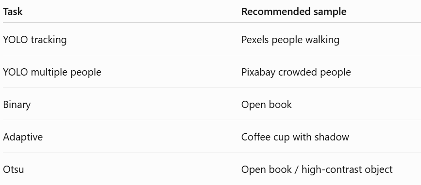

# Day-38 — Intelligent Security Monitoring & Image Segmentation

This project contains both required Day-38 tasks in one Streamlit application.

## Tasks

### 1. Coding Practice — Intelligent Security Monitoring

The application:
- Detects people using YOLO.
- Tracks multiple people with ByteTrack.
- Supports one or more custom polygon Regions of Interest (ROI).
- Detects ENTRY and EXIT events.
- Uses stable-frame hysteresis to reduce duplicate/boundary-jitter alerts.
- Records timestamps, frame number, track ID, ROI and event type.
- Saves all events to CSV.
- Displays active people inside the ROI.
- Produces a processed video with boxes, IDs, ROIs and a live analytics overlay.

### 2. Deployment Task — Image Segmentation

The Streamlit UI:
- Uploads an image.
- Lets the user select Binary, Adaptive, or Otsu thresholding.
- Shows original and segmented output side-by-side.
- Allows the processed image to be downloaded.

---



## What is image segmentation?

Image segmentation is the process of separating an image into meaningful regions. In this task, thresholding is used to separate bright/foreground pixels from dark/background pixels and produce a binary image.

## Binary vs Adaptive vs Otsu Thresholding

### Binary Thresholding
A single threshold value is manually selected.

- Pixel > threshold → white
- Pixel <= threshold → black
- Simple and fast.
- Works best when lighting/background is relatively uniform.
- In this app, the threshold can be changed with the slider.

### Adaptive Thresholding
The threshold is calculated locally for different areas of the image.

- Better when illumination changes across the image.
- Useful for documents, shadows, and uneven lighting.
- This implementation uses Gaussian adaptive thresholding.

### Otsu Thresholding
Otsu automatically chooses a global threshold from the image histogram.

- No manual threshold is required.
- Works well when foreground and background have reasonably separable intensity distributions.
- It can perform poorly when lighting is highly uneven.

## Which method worked best?

There is no universally best thresholding method; it depends on the images.

For images with fairly uniform lighting and clear foreground/background separation, **Otsu** is usually a strong first choice because it automatically selects the global threshold.

For images with uneven lighting, **Adaptive Thresholding** is often better because it makes local decisions.

For controlled images where you know a suitable threshold, **Binary Thresholding** is the simplest and most predictable.

For the evaluation, test all three methods on several images and mention which one gives the cleanest foreground/background separation for your own sample set.

---

# Project structure

```text
Day-38/
├── app.py
├── monitoring.py
├── segmentation.py
├── requirements.txt
├── README.md
├── .gitignore
├── sample_inputs/
├── sample_outputs/
└── outputs/
```

## Installation

Python 3.10–3.12 is recommended for the smoothest Ultralytics/Streamlit setup.

```bash
cd Day-38
python -m venv .venv
```

### Windows

```bash
.venv\Scripts\activate
pip install -r requirements.txt
streamlit run app.py
```

### Linux/macOS

```bash
source .venv/bin/activate
pip install -r requirements.txt
streamlit run app.py
```

The first security-monitoring run downloads the small pretrained YOLO model automatically.

## ROI configuration

The ROI is supplied as JSON. Coordinates are pixel coordinates of the original video.

Example:

```json
[
  {
    "name": "Main Entrance",
    "points": [[80,80],[1180,80],[1180,620],[80,620]]
  },
  {
    "name": "Restricted Area",
    "points": [[450,150],[800,150],[850,500],[420,500]]
  }
]
```

Use at least 3 points per polygon.

The app displays the first frame with its width and height so you can choose valid coordinates.

## Production-style pipeline

```text
Video upload
    ↓
Frame-by-frame OpenCV processing
    ↓
YOLO person detection
    ↓
ByteTrack multi-object tracking
    ↓
Person center point
    ↓
ROI point-in-polygon test
    ↓
Stable-frame event logic / duplicate-alert reduction
    ↓
ENTRY / EXIT event records
    ↓
CSV log + processed video + live metrics
```

The segmentation tab is a separate classical-computer-vision pipeline:

```text
Image upload → grayscale → selected thresholding method → binary output → download
```

## Event logic

For each tracked person and ROI:

1. YOLO detects the person.
2. ByteTrack assigns a persistent track ID.
3. The center point of the bounding box is calculated.
4. `pointPolygonTest` checks whether that center is inside the ROI.
5. A person must remain inside for the configured number of stable frames before an ENTRY is logged.
6. A person must remain outside for the same number of stable frames before an EXIT is logged.
7. This hysteresis reduces duplicate alerts caused by a person standing near an ROI boundary.
8. Events are saved in `security_events.csv`.

### Important limitation

If a person disappears because the tracker loses the object, the application cannot know with certainty that the person physically exited the ROI. An EXIT is therefore generated when the tracked person is observed outside the ROI.

---

# Deployment with ngrok

Install ngrok and authenticate it with your account.

Then run:

```bash
streamlit run app.py
```

In another terminal:

```bash
ngrok http 8501
```

Copy the HTTPS forwarding URL, for example:

```text
https://xxxx.ngrok-free.app
```

Keep both Streamlit and ngrok running while the evaluator tests the application.

---

# GitHub submission

Create a repository named `Day-38`, then:

```bash
git init
git add .
git commit -m "Day 38 intelligent security monitoring and segmentation"
git branch -M main
git remote add origin YOUR_GITHUB_REPOSITORY_URL
git push -u origin main
```

Do not commit large videos or model weights. Use GitHub only for source/configuration and small sample images.

---

# Suggested evaluation demo

### Coding Practice
1. Upload a people-walking video.
2. Show the first frame and explain the ROI coordinates.
3. Define an entrance ROI.
4. Run YOLO + ByteTrack.
5. Show person IDs moving through the ROI.
6. Demonstrate ENTRY/EXIT events.
7. Show active people count.
8. Download and open the CSV event log.

### Deployment Task
1. Upload a sample image.
2. Run Binary thresholding.
3. Run Adaptive thresholding.
4. Run Otsu thresholding.
5. Compare outputs.
6. Download the best segmented image.

### Screen recording
Keep the recording around 3–5 minutes and show both tabs, especially the actual event CSV and downloadable segmented image.

---

## Challenges

Typical challenges for this project include:
- Choosing ROI coordinates correctly for different video resolutions.
- Maintaining stable tracking IDs when people overlap.
- Preventing repeated ENTRY/EXIT alerts near ROI boundaries.
- Handling videos with different codecs.
- Choosing a thresholding method that works across images with different lighting.
- Keeping the Streamlit interface responsive during video processing.

## License / media

For sample media, follow the source website's current license and download the original file from the source page. Do not redistribute third-party media inside the GitHub repository unless the license permits it.
