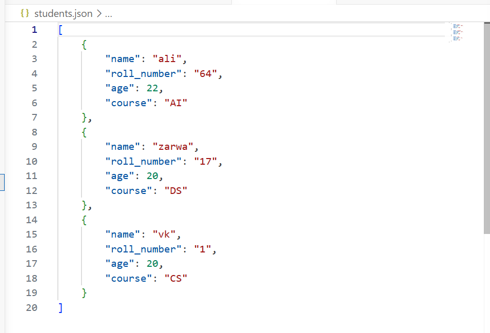
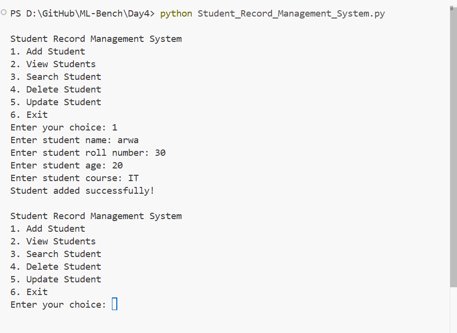
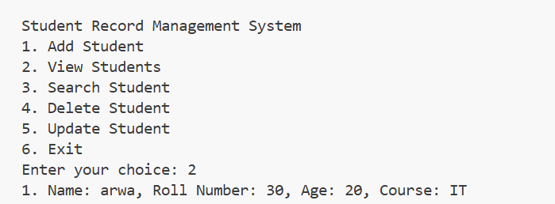
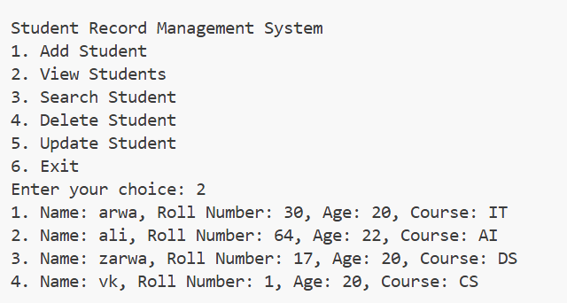
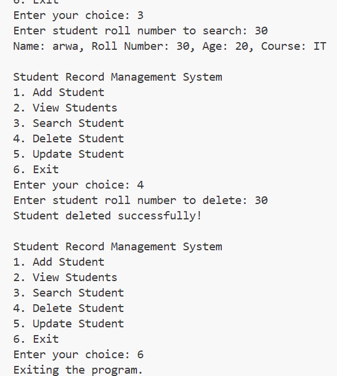

# Student Record Management System (Persistent Version)

A simple command-line program to add, view, search, update, and delete student
records. In this version the records are saved to a JSON file, so they are
**not lost when the program closes**.

## How to run

```bash
python Student_Record_Management_System.py
```

The first time you run it, a file called `students.json` is created automatically.
Every change you make is saved into that file.

## Sample JSON data


## Functionalities





## What I learned today

- How to make data **persistent** — the difference between data that lives only
  in memory (a Python list that disappears when the program ends) and data saved
  to a file that stays on disk.
- How to read from and write to a file using `open()` with `with`, which closes
  the file for me automatically.
- How to use the `json` module to save Python data and read it back.
- How to use the `os` module to check if a file exists before trying to open it.
- How to protect my program from crashing using `try` / `except`.

## How file handling and JSON work together

My student records are a **list of dictionaries** in Python. A file, though, can
only store plain **text**. So I need a way to turn my list into text to save it,
and turn that text back into a list when I load it. That is exactly what JSON does.

- **Saving:** `json.dump(Students, f, indent=4)` converts my Python list of
  dictionaries into JSON text and writes it into the file. (`indent=4` just makes
  the file neat and readable.)
- **Loading:** `json.load(f)` reads the JSON text back and rebuilds it into a
  real Python list of dictionaries that my program can use.

So the flow is:

```
Python list/dict  --json.dump-->  text in students.json  --json.load-->  Python list/dict
```

File handling (`open`, `with`) is what actually **opens the file** to read or
write, and JSON is what **translates** between my Python data and the text stored
inside that file. One handles the file, the other handles the format — together
they give me permanent storage.

## Challenges I faced

- **First-run error:** Loading the file crashed the very first time because
  `students.json` did not exist yet. I fixed it by checking `os.path.exists()`
  first and returning an empty list if the file is missing.
- **Remembering to save:** At first my changes disappeared after closing the
  program. I realised I had to call `save_students()` after *every* add, update,
  and delete — not just once at the end — so the file always matches my data.
- **Bad input crashing the program:** Typing a letter for age raised a
  `ValueError`. I wrapped the age input in a `try` / `except` loop so it politely
  asks again instead of stopping the whole program.
- **Corrupt file:** If the JSON file was empty or broken, loading failed. I added
  a `try` / `except` around `json.load` so the program starts with an empty list
  and a warning instead of crashing.
