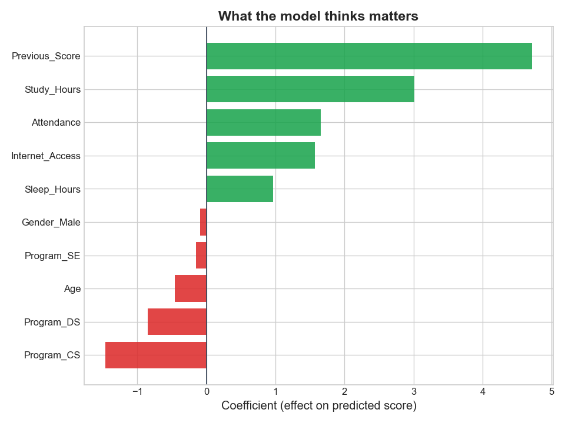
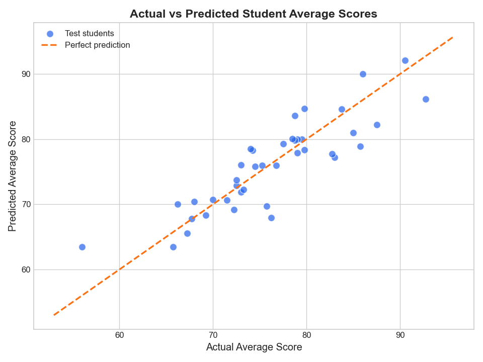
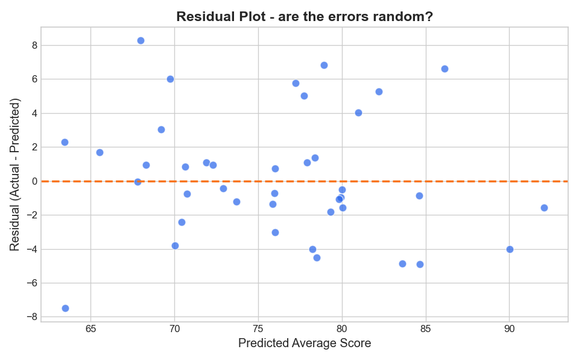
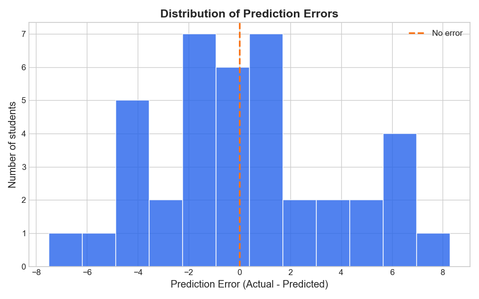

# Day 8 — Student Score Prediction System (Linear Regression)

Day 8 is my first actual machine learning model. Day 7 stopped at cleaning and charting
data; today I take that same kind of student data, prepare it properly, and train a
**Linear Regression** model with scikit-learn to predict a student's **average score**
across Python, Mathematics, Statistics and Machine Learning.

The whole day is one workflow:

```
load  →  preprocess  →  split  →  scale  →  train  →  predict  →  evaluate  →  visualise
```

---

## Live link:
([Live Link To Student Score Predictor](https://student-score-prediction-system.streamlit.app/))

## Demo-Video:


---

## What's in this folder

```
Day8/
├── generate_dataset.py               # Step 0: builds the dummy dataset
├── students_scores.csv               # the dataset (200 students + 4 duplicate rows + missing values)
├── data_preprocessing.py             # Step 1: cleaning, encoding, splitting, scaling
├── cleaned_students_scores.csv       # output of data_preprocessing.py
├── linear_regression_model.py        # Step 2: trains the model, scores it, draws the graphs
├── student_score_prediction.py       # Mini project: the whole pipeline end to end
├── app.py                            # Streamlit app (interactive predictor)
├── actual_vs_predicted.png           # scatter plot: actual vs predicted
├── residuals_plot.png                # are the errors random?
├── feature_importance.png            # what the model thinks matters
├── error_distribution.png            # histogram of prediction errors
├── student_performance_training.py   # my first rough draft, kept for reference
├── requirements.txt                  # deps for Streamlit Cloud
└── README.md                         # this file
```

**Run order** — `generate_dataset.py` writes the CSV that everything else reads:

```bash
python generate_dataset.py
python data_preprocessing.py
python linear_regression_model.py
python student_score_prediction.py
streamlit run app.py
```

`student_score_prediction.py` on its own does all four steps in one go — that's the mini
project. The other two scripts exist so each stage can be read and run separately.

---

## The dataset

Real student records are private, so I generated my own in `generate_dataset.py`. It's
not random noise: I picked a hidden formula (study hours, attendance, previous score and
sleep all push the marks up) and added random noise on top, so there's a genuine pattern
for the model to find and I know roughly what the right answer should look like.

**200 students**, and these columns:

| Column | What it is |
|---|---|
| `Student_ID`, `Name` | identifiers (dropped before training) |
| `Age` | 18–25 |
| `Gender` | Male / Female |
| `Program` | AI, DS, SE, CS |
| `Study_Hours` | hours of study per day |
| `Attendance` | class attendance % |
| `Previous_Score` | last semester's result |
| `Sleep_Hours` | hours of sleep per night |
| `Internet_Access` | 1 = has internet at home, 0 = doesn't |
| `Python`, `Mathematics`, `Statistics`, `Machine_Learning` | the four subject marks |

I also dirtied the file on purpose — **11 missing values** and **4 duplicate rows** — so
that the preprocessing step has something real to fix instead of being decorative.

**Target:** `Average_Score`, the mean of the four subject marks.

**Features:** `Age`, `Study_Hours`, `Attendance`, `Previous_Score`, `Sleep_Hours`,
`Internet_Access`, `Gender`, `Program`.

> One thing I deliberately did **not** do: predict the average from the four subject
> scores. That would just be arithmetic — the model would rediscover "divide by 4" and
> score a fake perfect 100%. Predicting from behaviour and background is the actual
> machine learning problem.

---

## What I learned about data preprocessing

This was the part that surprised me — it's most of the work, and the model is only as
good as what you feed it.

**1. Duplicates have to go first.** The raw file had the same 4 students entered twice.
If they stayed, the model would weigh those students double for no reason at all.

**2. Missing values need a decision, not a delete.** I had 5 missing `Study_Hours` and 6
missing `Attendance`. Dropping those rows would throw away everything else those 11
students told me. I filled them with the **median** rather than the mean — if one student
mistypes 40 study hours, the mean gets dragged upward but the median (the middle value)
barely moves.

**3. Some columns actively hurt.** `Student_ID` and `Name` are different for every single
row. A model "learning" from them just memorises individual students instead of learning a
rule, so they get dropped.

**4. Models can't read words.** `Gender` and `Program` hold text, and scikit-learn can't
do maths on the word "Female". **One-hot encoding** turns each category into its own 0/1
column. I used `drop_first=True`, which deletes one column per category on purpose: if
`Gender_Male` is 0 the student is obviously female, so keeping both columns adds no
information and makes the coefficients unstable — the *dummy variable trap*. The dropped
category becomes the baseline everything else gets compared against. My 8 features became
10 numeric columns this way.

**5. Scale matters.** `Age` runs 18–25 while `Previous_Score` runs 35–100. Without scaling,
the model treats a 1-unit change in each as the same size of change, which they clearly
aren't. **StandardScaler** rewrites every column to mean 0 and standard deviation 1, so
everything is compared fairly — and as a bonus the coefficients become directly readable
against each other.

**6. Order matters more than I expected.** Split **before** scaling, never after. The
scaler is fitted with `fit_transform` on the training set only, then applied to the test
set with plain `transform`. If I fitted it on all the data, the average and spread of the
test students would bleed into the training process — **data leakage**, and my test score
would be quietly optimistic and wrong.

---

## Why train-test splitting is important

I split 80/20 — **160 students to learn from, 40 the model never sees until exam time**.

The point is honesty. If I trained on all 200 students and then scored the model on those
same 200, I'd be handing a student the exam paper as homework and then being impressed by
their marks. A model can score beautifully on data it has already memorised and still be
useless on a new student, which is the only thing I actually care about.

Testing on held-out data is the only way to know whether the model learned a **real
pattern** or just memorised this particular batch — the difference between generalising
and **overfitting**. It's also why `random_state=42` is set: the split is random, but
fixing the seed means I get the same split every run, so when a metric changes I know it's
because of something I changed, not because the shuffle landed differently.

---

## The model

Linear Regression finds one straight-line equation:

```
Average_Score = intercept + (w1 × Study_Hours) + (w2 × Attendance) + ...
```

and picks the weights that make the total squared error across the 160 training students
as small as possible. `model.fit(X_train, y_train)` is where all the learning happens —
one line.

**Intercept: 74.63** — the predicted score for a completely average student (every scaled
feature sitting at 0).

Because the features were standardised, these coefficients are directly comparable. Each
one says: *if this feature goes up by one standard deviation, the predicted score moves by
this many marks.*

| Feature | Coefficient | What it means |
|---|---|---|
| **Previous_Score** | **+4.71** | The strongest signal by far. Past performance predicts future performance. |
| **Study_Hours** | **+3.01** | The strongest thing a student can actually control. |
| **Attendance** | +1.66 | Showing up helps, but less than I expected once study hours are accounted for. |
| **Internet_Access** | +1.57 | Having internet at home is worth about 1.6 marks. |
| Program_CS | −1.46 | CS students score slightly below the AI baseline. |
| Sleep_Hours | +0.97 | Real but small. |
| Program_DS | −0.85 | Slightly below the AI baseline. |
| Age | −0.45 | Almost nothing. |
| Program_SE | −0.15 | Effectively no difference from AI. |
| Gender_Male | **−0.09** | Essentially zero — gender does not predict scores in this dataset. |



---

## Evaluation metrics I used

All four are measured on the **40 test students the model had never seen**.

| Metric | Value | What it means, plainly |
|---|---|---|
| **MAE** — Mean Absolute Error | **2.85** | On average my prediction misses the real score by about **2.85 marks**. The easiest one to explain to a non-technical person. |
| **MSE** — Mean Squared Error | **13.11** | Errors are squared before averaging, so one big miss hurts far more than several small ones. The unit is "marks squared", so the number isn't directly readable — it's for comparing models, not for reporting. |
| **RMSE** — Root Mean Squared Error | **3.62** | The square root of MSE, back in marks. Comparable to MAE but harsher on big misses. |
| **R² Score** | **0.7524** | The model explains **75.24%** of the variation in students' average scores. The remaining ~25% is everything I didn't measure — motivation, teaching quality, a bad exam day. |

**MAE vs RMSE:** RMSE (3.62) is higher than MAE (2.85), and the gap tells me something.
If every error were the same size the two would match. RMSE sitting higher means a handful
of students were badly mispredicted, dragging it up. If I mind large mistakes most, RMSE
is the number to watch; if I just want the typical miss, MAE.

---

## Results: Actual vs Predicted

A sample of the comparison table the scripts print (all 40 test students appear in the
console output and in the Streamlit app):

| Actual | Predicted | Error |
|---|---|---|
| 72.50 | 72.92 | −0.42 |
| 90.50 | 92.08 | −1.58 |
| 70.00 | 70.76 | −0.76 |
| 92.75 | 86.15 | +6.60 |
| 83.00 | 77.23 | +5.77 |
| 78.75 | 83.61 | −4.86 |
| 73.00 | 71.90 | +1.10 |
| 69.25 | 68.32 | +0.93 |
| 79.50 | 80.00 | −0.50 |
| 67.75 | 67.79 | −0.04 |

A negative error means the model predicted **too high**.

- Best prediction: off by **0.04 marks**
- Worst prediction: off by **8.28 marks**
- **80% of predictions land within 5 marks** of the real score



Every dot is one test student — actual score across, predicted score up. The dashed line
is a perfect prediction. The dots sit close to it and scatter evenly on both sides, which
is what a working model looks like.



The residual plot is the sanity check. The errors form a shapeless cloud around zero with
no curve and no funnel shape, which means a straight line was a reasonable choice for this
data. If there were a clear curve here, it would be telling me Linear Regression is the
wrong tool.



The errors are centred on zero and roughly bell-shaped, so the model isn't systematically
over- or under-predicting — it just misses in both directions by a few marks.

---

## Observations

- **R² of 0.75 with a typical miss of under 3 marks** is a solid result for a first model,
  especially given I built a good chunk of pure random noise into the data on purpose. A
  model that scored 0.99 here would mean I'd made the problem too easy, not that the model
  was clever.
- **Previous_Score dominates**, which makes sense but isn't very *useful* advice — you
  can't tell a student to have done better last semester. **Study_Hours is the most
  actionable finding**: it's the second strongest predictor and the one thing entirely
  within a student's control.
- **Gender contributes essentially nothing** (−0.09). Good — it means the model isn't
  leaning on a feature it has no business leaning on.
- **Preprocessing changed the outcome more than the model choice did.** Fitting the scaler
  before the split, or leaving `Student_ID` in, both produce numbers that *look* fine and
  are quietly wrong. The metric only means something if the preparation was honest.
- **Where it struggles:** the biggest miss (8.28 marks) is a high-achieving student the
  model under-predicted. Linear Regression pulls predictions toward the middle, so the
  extremes at both ends get softened. More features — or a non-linear model — would be the
  next thing to try.

---

## What I can do now

- Prepare a messy dataset for machine learning: duplicates, missing values, encoding, scaling
- Explain *why* each preprocessing step exists, not just which function to call
- Split data properly and avoid data leakage
- Train a Linear Regression model with scikit-learn
- Evaluate it with MAE, MSE, RMSE and R², and say what each number actually means
- Read a residual plot to check whether the model type was a sensible choice
