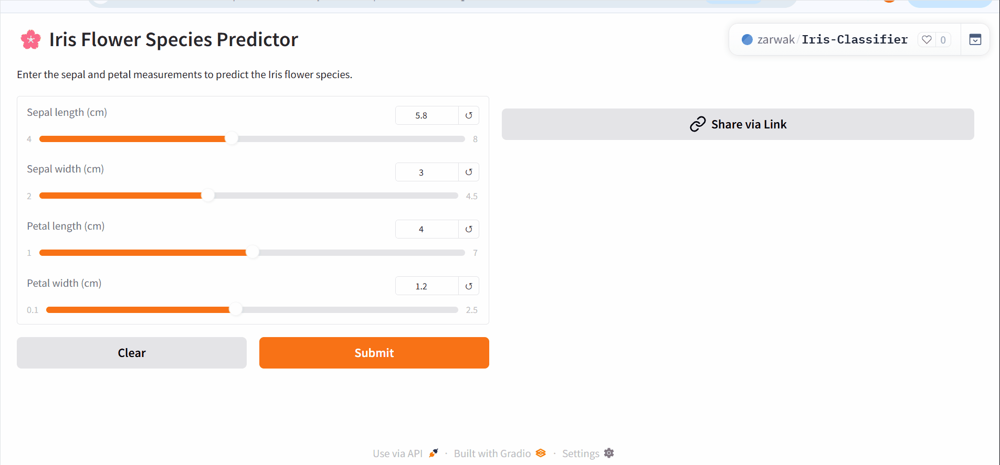

# Day-9: Classification & Iris Flower Classification System

This folder contains my work for Day 9 of the MLB Internship, covering classification concepts, evaluation metrics, and a complete project on Iris flower species prediction.

## Contents
- `iris_classifier.py` – training script: trains Logistic Regression + Decision Tree, evaluates both, saves the `.pkl` files.
- `iris_dataset_classification.ipynb` – exploratory notebook with plots and the confusion matrices.
- `app.py` – the interactive Gradio web app (this is what the Space runs).
- `logreg_iris.pkl`, `dt_iris.pkl`, `scaler_iris.pkl` – the trained models and the fitted scaler.

## Live Demo

## Key Learnings
- Understanding the difference between regression and classification.
- Implementing and evaluating classification models using scikit‑learn.
- Interpreting confusion matrices and classification metrics.
- Comparing Logistic Regression and Decision Tree on a multi‑class problem.

## How to Run
1. Install dependencies: `pip install -r requirements.txt` (if provided) or manually install `scikit‑learn`, `pandas`, `matplotlib`, `seaborn`, `streamlit`.
2. Run the practice script:

# Iris Flower Classification Project

This project demonstrates a complete classification pipeline using the famous Iris dataset. We train two models – Logistic Regression and Decision Tree – and compare their performance.

## What is Classification?
Classification is a supervised learning task where the goal is to assign a discrete class label to an input sample based on its features. In this project, we predict the species of an Iris flower (setosa, versicolor, virginica) given measurements of sepal and petal length/width.

## Regression vs. Classification
| Regression | Classification |
|------------|----------------|
| Predicts continuous values (e.g., price) | Predicts discrete classes (e.g., species) |
| Uses loss functions like MSE | Uses loss functions like cross‑entropy |
| Evaluated with R², RMSE | Evaluated with accuracy, precision, recall, F1 |

## Evaluation Metrics Used
- **Accuracy**: Overall correctness.
- **Precision (weighted)**: How many predicted positives were actually positive, averaged over classes.
- **Recall (weighted)**: How many actual positives were correctly identified, averaged.
- **F1‑Score**: Harmonic mean of precision and recall.
- **Confusion Matrix**: Shows true vs. predicted class counts, revealing misclassification patterns.

## Model Performance & Observations
- **Logistic Regression** achieved ~97% accuracy on the test set. It is fast, interpretable, and works well with scaled data.
- **Decision Tree** also achieved similar accuracy (~97%) but is more prone to overfitting if not pruned. On this small dataset, both models perform excellently.
- The confusion matrices show very few misclassifications, mostly between versicolor and virginica (which are similar in features).

## How to Run
1. Install required packages: